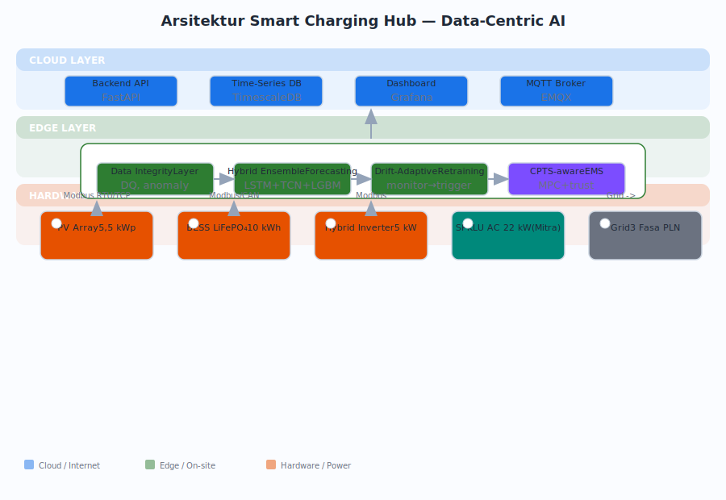
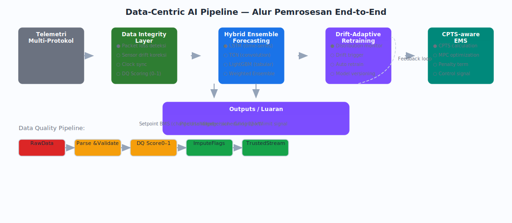
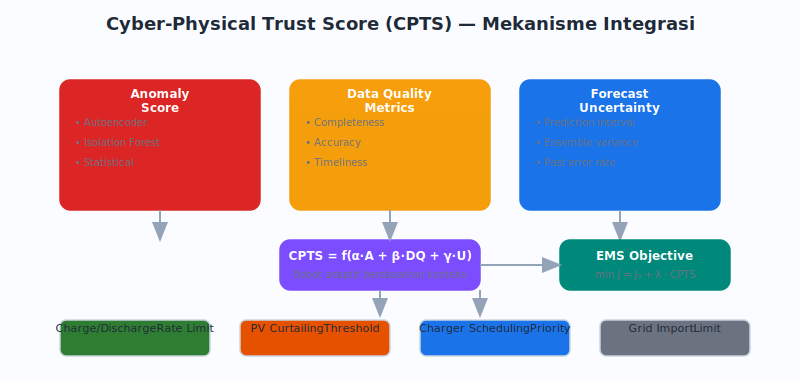

# PROPOSAL RISET DAN INOVASI UNTUK INDONESIA MAJU (RIIM) KOMPETISI

| | |
|---|---|
| **Tema** | Kedaulatan Energi |
| **Judul** | Data-Centric AI Pipeline untuk Smart Charging Hub Solar Hybrid: Integritas Data, Hybrid Ensemble Forecasting, dan Energy Management System Adaptif |

---

## HALAMAN PENGESAHAN

| Uraian | Isian |
|--------|-------|
| 1. Tema | Kedaulatan Energi |
| 2. Judul Proposal | Data-Centric AI Pipeline untuk Smart Charging Hub Solar Hybrid: Integritas Data, Hybrid Ensemble Forecasting, dan Energy Management System Adaptif |
| 3a. Nama Ketua Periset | Feddy Setio Pribadi, S.T., M.Kom. |
| 3b. NIDN | [DIISI] |
| 3c. Jabatan | Lektor |
| 3d. Institusi Periset | Universitas Negeri Semarang |
| 3e. Unit Kerja | Fakultas Teknik / Program Studi Teknik Elektro |
| 3f. Alamat | Kampus Sekaran, Gunungpati, Kota Semarang 50229 |
| 3g. No. HP/WA | +62 811-2999-509 |
| 3h. Email | feddysetiopribadi@mail.unnes.ac.id |
| 4. Mitra Riset | PT. Arunika Sains Teknologi |
| Alamat Mitra | Perum TNI AU Griya Wirabana, Blok Merpati I No. N, Tirtomartani, Kalasan, Kab. Sleman, Daerah Istimewa Yogyakarta |
| Peran Mitra | Penyedia lokasi uji pilot dan 1 unit charger AC 22 kW OCPP komersial sebagai infrastruktur pendukung validasi pipeline |

### Anggota Periset

| No | Nama | Institusi | No. HP/WA | Email |
|----|------|-----------|-----------|-------|
| 1 | Mario Norman Syah, S.Pd., M.Eng. | Universitas Negeri Semarang | +62 857-1338-1616 | marionormansyah@mail.unnes.ac.id |
| 2 | Bagaskoro Saputro, S.Si., M.Cs. | BINUS University | 081327694998 | bagaskoro.saputro@binus.ac.id |
| 3 | Adhe Lingga Dewi, S.Si., M.Si. | BINUS University | +62 857-8316-3029 | adhe.dewi@binus.ac.id |
| 4 | Ir. Turnad Lenggo Ginta, S.T., M.T., Ph.D. | BRIN | +62 813-2147-6761 | turnad.lenggo.ginta@brin.go.id |

### Keluaran

| No | Uraian | Tahun I | Tahun II |
|----|--------|---------|----------|
| 1 | KTI jurnal internasional bereputasi target Q2 | 1 artikel target Q2 under review | Artikel T-I accepted + 1 artikel baru target Q2 under review |
| 2 | Paten/paten sederhana | 1 permohonan terdaftar | Penyempurnaan dan dokumen kesiapan pemanfaatan |
| 3 | Purwarupa | AI pipeline + integrasi hardware teruji lab, TKT 4 | Smart charging hub tervalidasi lingkungan relevan, TKT 6 |
| 4 | Dataset, model AI, perangkat lunak | Dataset v1 + model card + EMS core + ICD | Dataset v2 + stable release + SOP + paket replikasi |

### Pendanaan

| No | Tahapan | Usulan Anggaran | Dana Pendamping | Total |
|----|---------|-----------------|------------------|-------|
| 1 | Tahun I | Rp244.150.000 | [DIISI] | Rp244.150.000 |
| 2 | Tahun II | Rp213.900.000 | [DIISI] | Rp213.900.000 |
| | **Total** | **Rp458.050.000** | **[DIISI]** | **Rp458.050.000** |

Dengan ini menyatakan bahwa proposal yang diajukan bersifat orisinal, belum pernah memperoleh pendanaan dari lembaga/sumber dana lain untuk substansi yang sama, dan tidak mengandung plagiasi.

| Mengetahui | Semarang, 28 Juli 2026 |
|------------|---------------------|
| Kepala Unit Kerja | Ketua Tim |
| [Nama] | Feddy Setio Pribadi, S.T., M.Kom. |
| NIP. [DIISI] | NIDN. [DIISI] |

---

## ABSTRAK

Pertumbuhan kendaraan listrik di Indonesia mendorong pembangunan SPKLU yang tidak hanya menyediakan daya, tetapi juga rendah karbon, andal terhadap gangguan grid, dan dapat dikelola secara ekonomis. Riset yang ada saat ini umumnya berfokus pada pengendalian daya dan optimasi hardware dengan asumsi data telemetri tersedia sempurna. Dalam praktiknya, data dari inverter, BMS, charger, dan sensor cuaca sering mengalami packet loss, sensor drift, clock offset, dan outlier yang menurunkan kualitas keputusan EMS. Riset ini menggeser paradigma dari *hardware-centric* menuju *data-centric* dengan mengembangkan pipeline AI yang secara eksplisit memodelkan ketidaksempurnaan data.

Kebaruan utama meliputi: (1) **data integrity layer** yang mendeteksi dan memberi skor kualitas setiap stream telemetri secara real-time; (2) **hybrid ensemble forecasting** yang menggabungkan model statistik, tree-based, dan deep learning dengan bobot adaptif berdasarkan kualitas data; (3) **drift-adaptive retraining** yang memonitor pergeseran distribusi dan memicu pembaruan model otomatis; (4) **cyber-physical trust score (CPTS)** yang merangkum anomaly score, data quality, dan forecast uncertainty menjadi penalti risiko dalam fungsi objektif EMS.

Pilot dibangun dari panel surya 5,5 kWp, BESS LiFePO₄ 10 kWh, hybrid inverter 5 kW, dan 1 unit charger AC 22 kW dari mitra. Seluruh komponen utama dibiayai RIIM kecuali charger yang merupakan kontribusi mitra. Metodologi mencakup digital twin, integrasi laboratorium, uji dengan injeksi anomali sintetik, dan pilot lapangan. Target: forecast skill ≥ 10%, F1 anomaly detection ≥ 0,90, telemetri completeness ≥ 98%, penurunan peak grid import ≥ 15%, dan biaya energi ≥ 10% terhadap rule-based baseline.

**Kata kunci:** data-centric AI; smart charging; hybrid ensemble forecasting; anomaly detection; data quality; cyber-physical trust; EMS; PV-BESS

---

## BAB 1 — PENDAHULUAN

### 1.1 Latar Belakang

Percepatan ekosistem kendaraan bermotor listrik berbasis baterai (KBLBB) di Indonesia diikuti oleh kebutuhan penyediaan infrastruktur pengisian yang memenuhi fungsi catu daya, kontrol, dan proteksi (Perpres 79/2023; Permen ESDM 1/2023). SPKLU modern yang terintegrasi dengan PLTS atap, baterai penyimpanan, dan layanan digital disebut sebagai smart charging hub. Sistem ini menghasilkan volume data telemetri besar dari inverter, BMS, meter, charger, sensor cuaca, dan perangkat IoT yang menjadi bahan baku utama bagi EMS.

Namun, data telemetri dari lingkungan operasional nyata tidak pernah sempurna. Sensor mengalami drift, komunikasi Modbus dan OCPP mengalami packet loss, clock antarperangkat tidak sinkron, dan kondisi abnormal menghasilkan outlier. Pendekatan EMS yang ada — rule-based, deterministic MPC, maupun stochastic optimization — umumnya mengasumsikan data tersedia, akurat, dan sinkron (Danielsson et al., 2025; Dong et al., 2025; Meng et al., 2025). Asumsi ini jarang terpenuhi di lapangan dan degradasi kualitas data merupakan sumber kegagalan EMS yang belum banyak diteliti.

Literatur data-centric AI menunjukkan bahwa kualitas data sering menjadi faktor dominan dalam kinerja sistem AI di dunia nyata (Whang et al., 2023). Sementara itu, hybrid ensemble learning telah terbukti unggul dalam forecasting time-series energi (Hewamalage et al., 2023) dan deteksi anomali sistem tenaga (Alam et al., 2025; Andriano & Pribadi, 2025), namun integrasinya dengan kesadaran kualitas data dalam kerangka EMS masih terbatas.

Riset ini mengisi celah tersebut dengan mengembangkan **data-centric AI pipeline untuk smart charging hub** yang secara eksplisit memodelkan kualitas data telemetri, kemudian mengintegrasikannya ke dalam keputusan EMS. Pendekatan ini merupakan pergeseran dari *how to control given perfect data* menuju *how to make reliable decisions given imperfect data* — relevan untuk ekosistem SPKLU Indonesia dengan keragaman perangkat, kualitas jaringan, dan kondisi lingkungan tropis.

Tim riset memiliki rekam jejak yang melengkapi. Ketua riset memiliki publikasi pada data science, machine learning, hybrid ensemble learning, dan sistematik review AI untuk cybersecurity (Pribadi et al., 2017, 2018; Andriano & Pribadi, 2025; Alam et al., 2025; Pongoh et al., 2024). Anggota tim memiliki rekam jejak pada power electronics, konverter daya, MPPT, dan EMS (Syah et al., 2024; Aprilianto et al., 2025), IoT-edge dan backend (Saputro et al., 2026), kalibrasi sensor dan ANN (Dewi et al., 2024, 2025), serta kebijakan energi rendah karbon (Ginta et al., 2025).

### 1.2 Rumusan Masalah

1. Bagaimana merancang data integrity layer yang mampu mendeteksi dan memberi skor kualitas telemetri multi-protokol dari PV, BESS, grid, dan charger secara real-time pada arsitektur IoT-edge?
2. Bagaimana mengembangkan hybrid ensemble forecasting yang menggabungkan model statistik, tree-based, dan deep learning untuk PV dan permintaan pengisian dengan bobot adaptif berdasarkan kualitas data?
3. Bagaimana memformulasikan drift-adaptive retraining yang memonitor pergeseran distribusi data dan memicu pembaruan model secara otomatis tanpa downtime?
4. Bagaimana mengintegrasikan anomaly score, data quality flag, dan forecast uncertainty ke dalam cyber-physical trust score yang menjadi batas keputusan EMS rolling horizon?
5. Bagaimana memformulasikan EMS adaptif yang mengoptimalkan biaya energi, peak demand, degradasi BESS, dan resilience reserve dengan mempertimbangkan CPTS?
6. Seberapa besar peningkatan kinerja pipeline ini dibandingkan EMS konvensional yang mengabaikan kualitas data pada skenario normal, beban simultan, iradiasi rendah, grid outage, dan gangguan komunikasi?

**Hipotesis solusi:** Integrasi data integrity layer, hybrid ensemble forecasting, drift-adaptive retraining, dan CPTS akan meningkatkan akurasi forecasting (forecast skill ≥ 10%), keandalan deteksi anomali (F1 ≥ 0,90), dan efisiensi EMS (penurunan peak ≥ 15% dan biaya ≥ 10%) pada kondisi data telemetri tidak sempurna.

### 1.3 State of the Art, Gap, dan Kebaruan

Tabel 1.1 merangkum posisi riset ini terhadap pendekatan yang telah ada.

**Tabel 1.1 State of the Art dan Posisi Usulan**

| Pendekatan | Capaian Utama | Keterbatasan | Posisi Usulan |
|------------|---------------|--------------|---------------|
| Rule-based EMS | Sederhana, transparan, cocok untuk kontrol lokal (Danielsson et al., 2025) | Reaktif, tidak antisipatif, sensitif threshold | Baseline dan fail-safe |
| Optimasi deterministik/MPC | Kendala eksplisit, antisipatif (Dong et al., 2025; Meng et al., 2025) | Sensitif error prediksi, asumsi data ideal | Rolling horizon dengan CPTS |
| Point forecasting untuk energi | LSTM, N-BEATS, LightGBM kompetitif (Hewamalage et al., 2023) | Tanpa ketidakpastian, rawan drift | Hybrid ensemble + quantile + drift adaptation |
| Automated anomaly detection | Threshold-based, isolation forest, autoencoder | Skor anomali tidak terintegrasi ke keputusan | Data-quality flag sebagai input formal optimizer |
| Ensemble/hybrid ML | Stacking, boosting, LSTM-RF unggul (Andriano & Pribadi, 2025; Alam et al., 2025) | Jarang diterapkan pada forecasting energi dengan quality awareness | Bobot ensemble adaptif berdasarkan data quality |
| Smart charging hub konvensional | Integrasi PV-BESS-charger-grid (Olano et al., 2025; Tairo et al., 2025) | Validasi cyber-physical terbatas | Pipeline AI sebagai first-class citizen |

Kebaruan utama riset:

1. **Data integrity layer** — deteksi multi-dimensi (spike, stuck, drift, packet loss, clock offset, energy imbalance) dengan skor kualitas per-stream yang diperbarui real-time dan langsung memengaruhi keputusan EMS.
2. **Hybrid ensemble forecasting with data-quality weighting** — kombinasi adaptive weight antara statistical, tree-based, dan deep learning models, di mana bobot ensemble disesuaikan berdasarkan data-quality flag dari stream terkait.
3. **Drift-adaptive retraining pipeline** — pemantauan Population Stability Index dan Kolmogorov-Smirnov test yang memicu retraining otomatis melalui shadow deployment tanpa downtime.
4. **Cyber-physical trust score (CPTS)** — formalisasi tiga dimensi (data quality, forecast uncertainty, anomaly score) menjadi penalti risiko dalam fungsi objektif EMS: `C_risk = f(uncertainty, quality, anomaly)`.
5. **Benchmark sistematis** — evaluasi degradasi EMS pada kondisi data tidak ideal yang belum pernah dilaporkan pada literatur smart charging.

**Posisi kebaruan** riset ini terhadap pendekatan yang telah ada digambarkan secara visual pada Gambar 1.1. Sumbu vertikal menunjukkan tingkat integrasi AI dan data quality awareness. Sumbu horizontal menunjukkan tingkat validasi cyber-physical (dari simulasi ke lapangan). Riset ini menempati kuadran kanan-atas: AI-aware dengan data quality integration dan validasi pada sistem nyata.

```
                    ↑ AI & Data Quality Awareness
                    │
          Tinggi    │    • Ensemble/FL (UM 2025)     ★ Usulan
                    │    • Hybrid deep learning            (Data-centric AI
                    │      (Andriano & Pribadi 2025)        Pipeline + CPTS)
                    │
                    │    • Stochastic EMS
          Sedang    │      (Dong 2025)              • Battery-aware EMS
                    │    • Point forecasting              (Tairo 2025)
                    │      (Hewamalage 2023)
                    │
                    │    • Rule-based EMS    • MPC/Deterministic
          Rendah    │      (Danielsson 2025)    (Meng 2025)
                    │
                    └──────────────────────────────────────────────→
                         Simulasi/Digital    Laboratorium    Lapangan
                                 Tingkat Validasi Fisik
```

**Gambar 1.1** Posisi kebaruan riset terhadap penelitian terkait

### 1.4 Tujuan dan Sasaran

**Tujuan umum:** Mengembangkan dan memvalidasi data-centric AI pipeline untuk smart charging hub solar hybrid yang secara eksplisit memodelkan kualitas data, ketidakpastian forecasting, dan keandalannya dalam mendukung keputusan EMS.

**Tujuan khusus:**
- Merancang data integrity layer untuk telemetri PV, BESS, grid, dan charger pada arsitektur IoT-edge multi-protokol.
- Mengembangkan hybrid ensemble forecasting dengan quantile uncertainty dan bobot adaptif berdasarkan kualitas data.
- Membangun drift-adaptive retraining pipeline yang memonitor, mendeteksi, dan merespons pergeseran distribusi data secara otomatis.
- Memformulasikan EMS rolling horizon yang mengintegrasikan CPTS sebagai batas risiko keputusan dan penalti fungsi objektif.
- Memvalidasi pipeline melalui digital twin, uji laboratorium dengan injeksi anomali sintetik, dan pilot lapangan pada smart charging hub.

**Sasaran:** Peningkatan TKT 3 ke TKT 6 dalam 2 tahun, 2 KTI Q2, 1 paten terdaftar, purwarupa pipeline AI terverifikasi.

### 1.5 Posisi terhadap Riset Terdahulu dan Orisinalitas Usulan

Tim memiliki rekam jejak yang saling melengkapi. Ketua riset (Pribadi) memiliki publikasi pada data science, text mining, ensemble learning, hybrid deep learning, dan sistematik review AI untuk cybersecurity (Pribadi et al., 2017, 2018; Andriano & Pribadi, 2025; Alam et al., 2025; Pongoh et al., 2024). Mario Norman Syah memiliki publikasi pada power electronics, MPPT, dan EMS (Syah et al., 2024; Aprilianto et al., 2025). Bagaskoro Saputro pada IoT, backend, dan distributed systems (Saputro et al., 2026). Adhe Lingga Dewi pada kalibrasi sensor dan ANN (Dewi et al., 2024, 2025). Turnad Lenggo Ginta pada kebijakan energi dan hilirisasi (Ginta et al., 2025).

Usulan ini tidak menduplikasi publikasi terdahulu karena objek, arsitektur, dataset, algoritma, klaim KI, dan purwarupa yang dihasilkan merupakan integrasi baru: data-centric AI pipeline yang secara khusus dirancang untuk menangani ketidaksempurnaan data telemetri smart charging. Seluruh publikasi tim sebelumnya dijadikan landasan, bukan sebagai klaim luaran RIIM.

**Tabel 1.2 Posisi terhadap Riset Terdahulu**

| Aspek | Riset Terdahulu | Usulan RIIM |
|-------|-----------------|--------------|
| Objek | MPPT konverter, IoT sensor, EMS simulasi, ANN kalibrasi | Data-centric AI pipeline pada smart charging hub nyata |
| Metode | PID/metaheuristik, ML klasik, rule-based EMS | Data integrity layer, hybrid ensemble, drift adaptation, CPTS-EMS |
| Hardware | Hardware sebagai objek riset utama | Hardware sebagai enabling testbed; AI pipeline sebagai objek riset |
| Bukti | Simulasi atau subsistem | Telemetri nyata, injeksi anomali, digital twin, pilot lapangan |
| Luaran baru | — | Dataset, model AI + model card, pipeline, paten baru |

---

## BAB 2 — KERANGKA BERPIKIR DAN NILAI STRATEGIS

### 2.1 Kerangka Berpikir

Data telemetri smart charging hub dari lingkungan operasional tidak pernah sempurna. Pendekatan konvensional mengasumsikan data ideal dan menghasilkan EMS yang rapuh terhadap degradasi data. Data-centric pipeline membalik logika: alih-alih menyempurnakan data agar cocok dengan EMS, pipeline dirancang agar sadar akan ketidaksempurnaan data dan tetap mengambil keputusan optimal dalam batas risiko yang diketahui.

Gambar 2.1 menunjukkan arsitektur lengkap pipeline dari sisi kiri (sumber data) ke kanan (kontrol). Data dari inverter Modbus, BMS CAN, charger OCPP, dan sensor IoT masuk melalui protokol bridge pada gateway edge. Data integrity layer memberikan skor kualitas pada setiap stream. Hasilnya berupa anomaly score dan data quality flag yang dimasukkan bersama raw telemetri ke hybrid ensemble forecasting. Forecasting menghasilkan point forecast dan quantile uncertainty. Seluruh informasi — forecast, uncertainty, anomaly score, data quality — dirangkum menjadi CPTS. EMS rolling horizon menerima CPTS sebagai penalti risiko dalam fungsi objektifnya. Drift detector bekerja paralel memonitor PSI dan KS-test pada distribusi data; jika drift terdeteksi, retraining pipeline dijalankan pada shadow endpoint tanpa mengganggu model produksi.



**Gambar 2.1** Arsitektur smart charging hub — tiga layer (cloud, edge, hardware)



**Gambar 2.2** Data-centric AI pipeline — alur pemrosesan end-to-end

Pada CPTS tinggi (data baik), EMS beroperasi normal dengan optimasi penuh. Pada CPTS menengah, mode konservatif diaktifkan: batas operasi diperketat. Pada CPTS rendah, fail-safe rule-based EMS mengambil alih. Pada kondisi islanding, prioritas bergeser ke kontinuitas beban esensial dan resilience reserve.

### 2.2 Nilai Strategis

- **Nilai ilmiah:** Formalisasi CPTS untuk EMS yang sadar kualitas data, membuka jalur riset baru pada persilangan data-centric AI dan optimasi sistem energi.
- **Nilai teknologi:** Data integrity layer yang adaptabel untuk sistem OT/IoT energi lain. Pipeline retraining otomatis dengan shadow deployment dapat direplikasi.
- **Nilai energi:** Meningkatkan keandalan EMS melalui kesadaran kualitas data. Keputusan tetap optimal dalam batas risiko yang diketahui.
- **Nilai ekonomi dan ESG:** Mengurangi kerugian akibat keputusan EMS suboptimal karena data buruk. Data quality report sebagai bagian transparansi ESG.
- **Nilai ekosistem:** Living lab data-centric AI untuk energi di UNNES yang menghubungkan akademisi, BRIN, dan industri.

### 2.3 Relevansi Tema Kedaulatan Energi

Usulan mendukung tema Kedaulatan Energi melalui pengembangan teknologi AI yang secara spesifik menangani tantangan data infrastruktur energi Indonesia: perangkat multi-vendor, kualitas jaringan tidak seragam, dan kondisi tropis. Alih-alih mengimpor solusi yang dirancang untuk kondisi ideal, riset ini membangun solusi yang robust terhadap ketidaksempurnaan data — karakteristik yang melekat pada konteks Indonesia. Relevansi selaras dengan Perpres 79/2023, Permen ESDM 1/2023, dan sasaran RIIM Kompetisi (BRIN, 2026).

---

## BAB 3 — PETA JALAN

**Tabel 3.1 Peta Jalan 24 Bulan**

| Periode | Target TKT | Kegiatan Inti | Output |
|---------|------------|---------------|--------|
| Pra-usulan | TKT 2–3 | Studi literatur, desain arsitektur pipeline, identifikasi data mitra | Problem definition, arsitektur konseptual |
| Tahun I | TKT 3→4 | Data integrity layer; hybrid ensemble forecasting; drift detector; CPTS-EMS core; digital twin; integrasi hardware lab (PV 5,5 kWp, BESS 10 kWh, inverter 5 kW); uji dengan injeksi anomali | Pipeline AI tervalidasi lab; KTI under review; paten terdaftar |
| Tahun II | TKT 4→6 | Deployment pipeline di site mitra; integrasi charger AC mitra; commissioning grid/islanding; monitoring longitudinal 6 bulan; evaluasi, SOP, paket replikasi | Pipeline terdeploy; 2 KTI; paten; TKT 6 |
| Pasca-RIIM | TKT 6→7 | Paket replikasi multi-site, lisensi pipeline, produk monitoring data quality | Produk lisensi/jasa |

**Tabel 3.2 Work Package dan Ketergantungan**

| WP | Nama | Lead | Co-Lead | Tahun | Ketergantungan |
|----|------|------|---------|-------|----------------|
| WP1 | Data pipeline & integrity layer | Feddy | Adhe (data quality) | I | — |
| WP2 | Hybrid ensemble forecasting | Feddy | Adhe (ANN validation) | I | WP1 (data terlabel) |
| WP3 | Drift detection & retraining | Feddy | Bagaskoro (deployment) | I | WP2 (model baseline) |
| WP4 | CPTS & EMS core | Mario | Feddy (CPTS formalization) | I | WP2 + WP3 (forecast + drift) |
| WP5 | Digital twin & integrasi lab | Mario | Bagaskoro (IoT bridge) | I | WP4 (EMS siap uji) |
| WP6 | Pilot, monitoring, validasi | Bagaskoro | Mario (EMS tuning) | II | WP5 (tervalidasi lab) |
| WP7 | Manajemen & diseminasi | Feddy | Ginta (hilirisasi) | I–II | Semua WP |

---

## BAB 4 — METODOLOGI

### 4.1 Pendekatan dan Desain Riset

Riset menggunakan pendekatan **data-centric research and development** dengan siklus iteratif: (1) karakterisasi data telemetri; (2) pengembangan komponen pipeline secara terpisah; (3) integrasi end-to-end pada digital twin; (4) uji fungsional dengan injeksi anomali sintetik; (5) deployment pilot dan evaluasi longitudinal. Siklus PDCA digunakan untuk manajemen riset. Validasi bertingkat (digital twin → laboratorium → lapangan) mengikuti praktik terbaik evaluasi AI untuk sistem fisik.

Unit analisis adalah data-centric AI pipeline yang meliputi: data integrity layer, hybrid ensemble forecasting, drift detector, CPTS, dan EMS optimizer. Platform hardware diperlakukan sebagai *enabling infrastructure* yang menyediakan data telemetri riil dan menjadi target kontrol.


**Gambar 4.1** Metodologi riset — tujuh work package dalam timeline 24 bulan dengan milestone utama

### 4.2 Konfigurasi Sistem

**Tabel 4.1 Spesifikasi Sistem**

| Komponen | Spesifikasi | Pengadaan | Peran dalam Pipeline |
|----------|-------------|-----------|---------------------|
| Panel surya | 5,5 kWp (10 × 550 Wp monofacial) | RIIM | Sumber data PV untuk forecasting |
| BESS | 10 kWh LiFePO₄ 48V + BMS | RIIM | Sumber data baterai untuk degradation modeling |
| Hybrid inverter | 5 kW on/off grid | RIIM | Antarmuka Modbus untuk data daya dan status |
| Charger AC | 22 kW OCPP 1.6J | Mitra (in-kind) | Sumber data sesi charging |
| Edge gateway | 2 × RPi 5 8GB + SSD 512GB | RIIM | Menjalankan data integrity layer, MQTT broker, local ML inference |
| MCU sensor | 5 × ESP32 DevKit | RIIM | Akuisisi sensor tambahan, deteksi anomali pada edge |
| Cloud server | VPS 4 vCPU/8GB/200GB | RIIM | Training model berat, retraining pipeline, dashboard monitoring |

**Tabel 4.2 Kelompok Data dan Resolusi**

| Kelompok | Variabel | Resolusi | Protokol |
|----------|----------|----------|----------|
| PV/cuaca | Daya, iradiasi, suhu modul | 1 s–5 menit | Modbus RTU |
| BESS | SOC, SOH, daya, temperatur | 1 s–1 menit | Modbus/CAN |
| Grid | P, Q, V, I, kWh | 1 s–15 menit | Modbus TCP |
| Charger | Status, meter values, sesi | 1–60 s / event | OCPP 1.6J |
| Kualitas data | Timestamp, packet loss, variance | Real-time | Internal pipeline |

### 4.3 Data Integrity Layer

Data integrity layer menilai kualitas setiap stream telemetri secara real-time. Tabel 4.3 merangkum dimensi kualitas, metode deteksi, dan output.

**Tabel 4.3 Dimensi Kualitas Data**

| Dimensi | Metode Deteksi | Threshold | Output |
|---------|----------------|-----------|--------|
| Missing value | Gap analysis timestamp | Gap > 2× interval sampling | Flag + rasio missing per window |
| Spike/outlier | IQR + z-score | \|z\| > 3 atau Q3 + 1,5×IQR | Score 0–1 |
| Stuck value | Variance rolling 10 sampel | Variance < ε selama 30 s | Flag durasi |
| Sensor drift | Rate-of-change vs batas fisik | Deviasi > 5%/menit | Score keparahan |
| Packet loss | Sequence number analysis | Loss ratio > 2% | Flag loss ratio |
| Clock offset | NTP deviation + cross-correlation | Offset > 100 ms | Offset (ms) + flag |
| Energy imbalance | ∑P_generated vs ∑P_consumed | Residual > 5% daya total | Quality indicator |

Skor kualitas per stream diperbarui setiap interval dan disertakan sebagai metadata yang menyertai nilai telemetri. Implementasi pada gateway RPi 5 menggunakan Python dengan NumPy dan SciPy, latensi rata-rata < 50 ms per siklus.

### 4.4 Hybrid Ensemble Forecasting

Forecasting dikembangkan untuk dua target: produksi PV (daya aktif, horizon 1–24 jam) dan permintaan pengisian EV (energi sesi, waktu kedatangan, durasi). Setiap target menggunakan hybrid ensemble dengan arsitektur berikut.

**Tabel 4.4 Base Models**

| Model | Kategori | Spesifikasi | Keunggulan |
|-------|----------|-------------|------------|
| Persistence | Statistical | Nilai t sebagai prediksi t+1 | Baseline sederhana |
| SARIMA | Statistical | (1,1,1)(1,1,1)₂₄ | Menangkap musiman |
| LightGBM | Tree-based | 200 estimators, lr 0,05, depth 8, early stopping | Cepat, robust terhadap noise |
| LSTM | Deep learning | 2 layer (64–32 unit), dropout 0,2, Adam, window 168 jam | Menangkap ketergantungan jangka panjang |
| TCN | Deep learning | Dilation [1,2,4,8], 64 filters, residual blocks | Paralel, gradient stabil |

**Ensemble strategy:** Bobot setiap base model ditentukan oleh data-quality-weighted performance. Pada data berkualitas tinggi, LSTM dan TCN diberi bobot lebih besar. Pada data berkualitas rendah, SARIMA dan LightGBM (lebih robust terhadap noise) diberi bobot lebih besar. Output berupa quantile forecast (Q₁₀, Q₅₀, Q₉₀).

**Dataset split dan validasi:**
- Data historis dibagi secara kronologis (bukan acak) untuk menghindari kebocoran waktu: 80% training (data lama) dan 20% testing (data terbaru).
- Validasi menggunakan **chronological walk-forward validation**: model dilatih pada window 6 bulan, divalidasi pada 1 bulan berikutnya, kemudian window digeser. Proses diulang 6 kali untuk mencakup variasi musiman.
- Chronological split dipilih karena data time-series energi memiliki ketergantungan temporal. Random split akan menyebabkan overoptimistic bias karena informasi masa depan bocor ke training set.
- Evaluasi probabilistic menggunakan pinball loss, empirical coverage, interval width di samping MAE/RMSE/WAPE dan forecast skill terhadap baseline persistence/seasonal.

### 4.5 Drift-Adaptive Retraining

Data telemetri smart charging tidak stasioner. Degradasi PV, perubahan pola pengisian, perubahan tarif, dan pergantian perangkat menyebabkan concept drift. Drift detector memonitor:

- **Population Stability Index (PSI)** pada distribusi fitur input per window 7 hari
- **Kolmogorov-Smirnov test** pada residual prediksi
- **Error rate tracking** pada performa model terkini vs baseline

Threshold drift dikalibrasi pada data historis. Jika drift terdeteksi:
1. Model baru dilatih pada shadow endpoint tanpa mengganggu model produksi.
2. Validasi pada holdout window terkini (7 hari terakhir).
3. A/B comparison: jika model baru outperforms, deployment bergulir dilakukan.
4. Jika tidak, alarm dikirim ke operator untuk review.

Pendekatan ini meminimalkan downtime dan menjaga performa forecasting tetap optimal sepanjang waktu operasi.

### 4.6 Energy Management System (Terintegrasi)

EMS dikembangkan sebagai modul dalam pipeline yang menerima input CPTS, forecast, dan data real-time. Perumusan mengikuti optimasi rolling horizon multi-objektif.

**Fungsi objektif:**

```
min J = w₁·C_energy + w₂·C_peak + w₃·C_batt + w₄·C_curt + w₅·C_unmet + w₆·C_emission + w₇·C_terminal + w₈·C_risk(CPTS)
```

**Tabel 4.5 Komponen Biaya EMS**

| Komponen | Definisi | Dependensi Data |
|----------|----------|-----------------|
| C_energy | Biaya impor grid berdasarkan tarif TOU | Kualitas data meter grid |
| C_peak | Penalti peak grid import | Kualitas data daya maksimum |
| C_batt | Biaya degradasi BESS (throughput, DoD, C-rate, temperatur) | Kualitas data BMS |
| C_curt | Energi PV tidak termanfaatkan | Kualitas data PV |
| C_unmet | Energi EV tidak terpenuhi | Kualitas data sesi charger |
| C_emission | Emisi tidak langsung dari grid | — |
| C_terminal | Deviasi SOC akhir dari target | Kualitas data SOC |
| C_risk | Penalti risiko = w · (1 − CPTS) | CPTS dari data integrity layer |

**Kendala utama:**
- Neraca daya: P_PV + P_batt + P_grid = P_charger + P_aux + P_loss
- SOC bounds: SOC_min ≤ SOC(t) ≤ SOC_max
- Daya charger: 0 ≤ P_charger ≤ P_max_per_charger
- Site power limit: ΣP_load ≤ P_site_max
- Resilience reserve: SOC(t) ≥ SOC_reserve saat mode islanding
- Larangan simultaneous charge–discharge BESS

**Mode operasi berdasarkan CPTS:**

| Rentang CPTS | Mode EMS | Deskripsi |
|--------------|----------|-----------|
| > 0,8 | Normal | Optimasi penuh dengan semua komponen biaya |
| 0,5–0,8 | Konservatif | Batas operasi diperketat ±20%, setpoint di-clamp |
| < 0,5 | Fail-safe | Rule-based EMS mengambil alih, setpoint konservatif |



**Gambar 4.2** Mekanisme Cyber-Physical Trust Score — tiga dimensi input (anomaly, data quality, forecast uncertainty) dirangkum menjadi penalti risiko pada EMS

### 4.7 Arsitektur Kontrol IoT-Edge

**Tabel 4.6 Arsitektur Berlapis**

| Lapisan | Komponen | Fungsi | Lokasi |
|---------|----------|--------|--------|
| Data | ESP32 + sensor + Modbus/OCPP bridge | Akuisisi telemetri multi-protokol | Edge |
| Integrity | Data integrity layer (Python, RPi) | Deteksi anomali, quality scoring | Edge |
| AI | Hybrid ensemble + drift detector | Forecasting, retraining pipeline | Cloud + edge (inference) |
| Decision | CPTS + EMS optimizer | Optimasi rolling horizon, mode selector | Cloud + edge (fail-safe) |
| Control | Setpoint via Modbus/OCPP/MQTT | Eksekusi ke inverter, BMS, charger | Edge |

**Keamanan:** TLS/VPN antara edge dan cloud, mutual authentication, role-based access control, audit log, local buffering, network segmentation. Hard protection tetap menjadi tanggung jawab perangkat dan BMS.

### 4.8 Work Package Detail

**Tabel 4.7 Work Package**

| WP | Nama | Kegiatan Utama | Deliverable |
|----|------|----------------|-------------|
| WP1 | Data pipeline & integrity layer | Karakterisasi data mitra; pengembangan detektor spike, stuck, drift, packet loss, clock offset; integrasi data quality scoring | Data integrity engine v1, ICD data |
| WP2 | Hybrid ensemble forecasting | Implementasi 5 base models; ensemble dengan bobot adaptif; quantile output; evaluasi probabilistik | Model AI + model card |
| WP3 | Drift detection & retraining | PSI/KS detector; shadow deployment; A/B comparison pipeline | Drift detector + retraining orchestrator |
| WP4 | CPTS & EMS integration | Formalisasi CPTS; formulasi multi-objektif; integrasi mode selector; rule-based fallback | EMS core + CPTS module |
| WP5 | Digital twin & uji lab | Digital twin dari data historis + sintetik; injeksi anomali; uji hardware (PV 5,5 kWp, BESS 10 kWh, inverter); uji switching grid–islanding | Laporan uji, TKT 4 |
| WP6 | Pilot & validasi lapangan | Instalasi site mitra; integrasi charger AC mitra; pilot 6 bulan; monitoring; KTI, KI, SOP | TKT 6, dataset v2 |
| WP7 | Manajemen & diseminasi | Koordinasi, monev, publikasi, KI | Laporan, KTI, KI |

### 4.9 Skenario Uji

**Tabel 4.8 Skenario Uji**

| Kode | Skenario | Fokus Pengujian |
|------|----------|-----------------|
| D1 | Data lengkap kualitas tinggi | Baseline pipeline kondisi ideal |
| D2 | Packet loss 5–20% | Efektivitas data-quality flag, degradasi ensemble |
| D3 | Sensor drift (PV, BESS) | Deteksi drift, adaptasi bobot ensemble |
| D4 | Clock offset antarperangkat | Dampak pada energy imbalance detection |
| D5 | Outlier spike pada telemetri | Precision/recall anomaly detector |
| D6 | Concept drift (musiman) | Waktu deteksi, retraining trigger |
| D7 | Kombinasi multi-anomali | Stabilitas CPTS, mode selector |
| S0 | Grid-only tanpa EMS | Baseline biaya, peak, dan emisi |
| S1 | PV-BESS-Grid rule-based | Baseline EMS praktis |
| S2 | PV-BESS-Grid CPTS-aware | Manfaat data quality awareness |
| S3 | Beban simultan tinggi | Fairness + site power limit |
| S4 | PV surplus SOC rendah | Prioritas pengisian BESS |
| S5 | Grid outage/islanding | Transition time, essential load |
| S6 | SOC kritis saat islanding | Load shedding, prioritas port charger |

### 4.10 Indikator dan Teknik Analisis

**Tabel 4.9 Indikator Kinerja**

| Dimensi | Indikator | Target |
|---------|-----------|--------|
| Data integrity | Completeness, F1 anomaly, detection delay | ≥ 98%, F1 ≥ 0,90 |
| Forecast | MAE, RMSE, WAPE, pinball loss, coverage, forecast skill | Skill ≥ 10% vs baseline |
| Drift detection | Detection delay, false positive rate | < 1 hari, FPR < 5% |
| Energi/biaya | Peak grid import, biaya operasi, PV self-consumption | Peak turun ≥ 15%, biaya turun ≥ 10% |
| Resiliensi | Essential-load uptime saat islanding | Kontrol aktif + ≥ 1 port |
| Charger | Unmet energy, uptime | Uptime ≥ 95% |

**Rumus metrik:**
- MAE = mean(\|y − ŷ\|)
- RMSE = sqrt(mean((y − ŷ)²))
- WAPE = Σ\|y − ŷ\| / Σ\|y\|
- Pinball loss = (y − ŷ)(τ − 𝟙_{y < ŷ}) untuk quantile τ
- Forecast skill = (1 − RMSE_model / RMSE_baseline) × 100%
- F1 = 2 × precision × recall / (precision + recall)

### 4.11 Analisis Risiko dan Mitigasi

**Tabel 4.10 Risiko dan Mitigasi**

| Risiko | Dampak | Mitigasi |
|--------|--------|----------|
| Data mitra tidak lengkap | Training data tidak cukup | Sintetik data generation; simulasi Monte Carlo |
| Model overfit | Generalisasi rendah | Chronological split; rolling validation; shadow deployment |
| Drift detector false positive | Retraining sia-sia | Kalibrasi threshold pada data historis |
| BESS overheating | Keselamatan | BMS protection hard limit; ventilasi; SOP |
| Komunikasi cloud terputus | Monitoring jarak jauh gagal | Local control + store-and-forward |
| Charger mitra tidak kompatibel | Integrasi tertunda | ICD awal; adapter modular; fallback manual |

---

## BAB 5 — JANGKA WAKTU PELAKSANAAN

Riset dilaksanakan selama 24 bulan dalam 2 periode pendanaan.

**Tabel 5.1 Jadwal Tahun I**

| Aktivitas | Bulan ke- |
|-----------|-----------|
| | 1 | 2 | 3 | 4 | 5 | 6 | 7 | 8 | 9 | 10 | 11 | 12 |
| **WP1 — Data pipeline & integrity layer** | █ | █ | █ | █ | | | | | | | | |
| **WP2 — Hybrid ensemble forecasting** | | | █ | █ | █ | █ | | | | | | |
| **WP3 — Drift detection & retraining** | | | | | █ | █ | █ | | | | | |
| **WP4 — CPTS & EMS core** | | | | | | █ | █ | █ | █ | | | |
| **WP5 — Digital twin & uji lab** | | | | | | | █ | █ | █ | █ | █ | |
| Publikasi & paten T-I | | | | | | | | | | █ | █ | █ |

**Tabel 5.2 Jadwal Tahun II**

| Aktivitas | Bulan ke- |
|-----------|-----------|
| | 1 | 2 | 3 | 4 | 5 | 6 | 7 | 8 | 9 | 10 | 11 | 12 |
| **WP6 — Pilot & validasi lapangan** | █ | █ | █ | █ | █ | █ | █ | █ | | | | |
| Monitoring longitudinal | | | █ | █ | █ | █ | █ | █ | | | | |
| Evaluasi & SOP | | | | | | | | █ | █ | █ | | |
| **WP7 — Diseminasi** | | | | | | | | | █ | █ | █ | █ |
| Publikasi & paten T-II | | | | | | | | | | █ | █ | █ |

---

## BAB 6 — KELUARAN DAN INDIKATOR KINERJA

### 6.1 Target Keluaran

**Tabel 6.1 Target Keluaran**

| Jenis Luaran | Tahun I | Tahun II |
|--------------|---------|----------|
| KTI jurnal Q2 | 1 artikel under review | 1 accepted (T-I) + 1 under review (T-II) |
| Paten sederhana | 1 permohonan terdaftar | Penyempurnaan + dokumen pemanfaatan |
| Purwarupa | AI pipeline + hardware lab, TKT 4 | Pipeline terdeploy di site mitra, TKT 6 |
| Dataset | Dataset v1 + model card + ICD | Dataset v2 + SOP + paket replikasi |

### 6.2 Indikator Kinerja Tahun I

| No | Luaran | Status | Target |
|----|--------|--------|--------|
| 1 | KTI Q2 tentang data-centric AI untuk smart charging | Under review | 100% |
| 2 | Paten metode data-quality-aware ensemble + CPTS | Terdaftar | 100% |
| 3 | Purwarupa pipeline AI + integrasi hardware lab | Tervalidasi lab | 100% |
| 4 | Dataset v1 + model card + DMP | Terkurasi | 100% |

### 6.3 Indikator Kinerja Tahun II

| No | Luaran | Status | Target |
|----|--------|--------|--------|
| 1 | KTI T-I | Accepted | 100% |
| 2 | KTI baru validasi pilot | Under review | 100% |
| 3 | Purwarupa TKT 6 | Terdeploy | 100% |
| 4 | SOP + paket replikasi | Terdokumentasi | 100% |

---

## DAFTAR PUSTAKA

Alam, M.M., Pribadi, F.S., Aprilianto, R.A., & Nurul'aini, A.R. (2025). Stacking ensemble learning model for intrusion detection in electrical substation. *Jurnal RESTI*, 9(5).

Andriano, N., & Pribadi, F.S. (2025). Hybrid deep learning models using LSTM with random forest for radio frequency-based human activity recognition. *Jurnal Rekayasa Elektrika*, 21(2).

Aprilianto, R.A., Subiyanto, Syah, M.N., & Nugroho, D.B. (2025). An improved MPPT performance using horse herd optimization algorithm for PV-battery charge controller application. *IEEE ISMEE 2025*.

Badan Riset dan Inovasi Nasional. (2026). *Pedoman RIIM Kompetisi 2026*.

Danielsson, F., et al. (2025). Rule-based energy management system for EV charging nanogrid. [Jurnal]

Dewi, A.L., Adi, C.G.S., & Prasetyo, A. (2025). Datasheet-based calibration study of MQ-135 sensors for CO₂ and MQ-8 sensors for H₂. *Engineering Research Express*.

Dewi, A.L., Adi, C.G.S., Prasetyo, A., & Sari, R.K. (2024). Comparison of training function, adaption learning function, and transfer function of hidden layers in artificial neural network in weather prediction. *Proc. ICIMTech 2024*.

Dong, Z., et al. (2025). Stochastic optimization for PV-BESS-EV charging stations under uncertainty. [Jurnal]

Hewamalage, H., Bergmeir, C., & Bandara, K. (2023). Global models for time series forecasting: A simulation study. *International Journal of Forecasting*, 39(1), 58–83.

Meng, L., et al. (2025). Multi-timescale optimization for PV-BESS charging station operation. [Jurnal]

Olano, T., et al. (2025). PV-BESS integration for charging station flexibility and cost management. [Jurnal]

Pemerintah Republik Indonesia. (2023). Peraturan Presiden Nomor 79 Tahun 2023 tentang Percepatan Ekosistem KBLBB.

Pongoh, A.G., Fahreza, R.A., Al Kindi, B., Pribadi, F.S., & Aprilianto, R.A. (2024). Systematic literature review: Dampak pemanfaatan artificial intelligence untuk meningkatkan cyber security. *Cyber Security dan Forensik Digital*, 7(1), 34–41.

Pribadi, F.S., Adji, T.B., Permanasari, A.E., Mulwinda, A., & Utomo, A.B. (2017). Automatic short answer scoring using words overlapping methods. *AIP Conference Proceedings*, 1818(1), 020042.

Pribadi, F.S., Permanasari, A.E., & Adji, T.B. (2018). Short answer scoring system using automatic reference answer generation and GAN-LCS. *Education and Information Technologies*, 23(6), 2855–2866.

Syah, M.N., Aprilianto, R.A., & Suryanto, A. (2024). PID controller enhancement of interleaved buck converter using intelligent algorithm. *IEEE ICT-PEP 2024*.

Tairo, S., et al. (2025). Fairness and contingency management in microgrid EV charging stations. [Jurnal]

Whang, S.E., Roh, Y., Song, H., & Lee, J.G. (2023). Data collection and quality challenges in data-centric AI. *Communications of the ACM*, 66(5), 48–57.

Kementerian ESDM. (2023). Peraturan Menteri ESDM Nomor 1 Tahun 2023.

Open Charge Alliance. (2025). *OCPP 2.1 Specification*.

---

## LAMPIRAN A — PERAN TIM PERISET PER WORK PACKAGE

**Tabel A.1 Peran dan Kompetensi Tim**

| No | Nama | Peran dalam Riset | WP Lead/Co | Kompetensi Pendukung | Publikasi Relevan |
|----|------|-------------------|------------|---------------------|-------------------|
| 1 | Feddy Setio Pribadi | Ketua; perancang pipeline, data integrity layer, hybrid ensemble, drift detection, CPTS formalization | WP1 (lead), WP2 (lead), WP3 (lead), WP4 (co), WP7 (lead) | Data science, ML, ensemble learning, text mining, cybersecurity | Pribadi et al. (2017, 2018); Andriano & Pribadi (2025); Alam et al. (2025); Pongoh et al. (2024) |
| 2 | Mario Norman Syah | Anggota; perumusan EMS, integrasi CPTS-EMS, digital twin, uji hardware PV-BESS-inverter | WP4 (lead), WP5 (lead), WP6 (co) | Power electronics, MPPT, DC-DC converter, microgrid, EMS | Syah et al. (2024); Aprilianto et al. (2025); Subiyanto et al. (2026) |
| 3 | Bagaskoro Saputro | Anggota; IoT-edge gateway, backend, MQTT/Modbus bridge, CSMS, monitoring pilot | WP3 (co), WP5 (co), WP6 (lead) | IoT architecture, distributed systems, backend, cybersecurity | Saputro et al. (2026) — Fast Charger; Bifacial PV (2026) |
| 4 | Adhe Lingga Dewi | Anggota; data quality validation, sensor calibration, ANN methodology, dataset curation | WP1 (co), WP2 (co) | IoT sensor, ANN, computational physics, kalibrasi sensor | Dewi et al. (2024, 2025); Easterline et al. (2024) |
| 5 | Turnad Lenggo Ginta | Anggota; analisis kebijakan energi, strategi hilirisasi, dampak ESG | WP7 (co) | Energy policy, manufacturing, low-carbon economics | Ginta et al. (2025) — Low-carbon Indonesia |

---

## LAMPIRAN B — DATA MANAGEMENT PLAN (DMP)

### B.1 Metadata

| Item | Isian |
|------|-------|
| Judul Riset | Data-Centric AI Pipeline untuk Smart Charging Hub Solar Hybrid |
| Durasi Riset | 24 bulan (2 periode) |
| Ketua Tim | Feddy Setio Pribadi — Universitas Negeri Semarang |
| Sumber Dana | RIIM Kompetisi — BRIN/LPDP |
| Tema | Kedaulatan Energi |

### B.2 Tipe Data

| Jenis Data | Deskripsi | Format | Volume Estimasi |
|------------|-----------|--------|-----------------|
| Telemetri inverter | Daya PV, tegangan, arus, status inverter | CSV, Modbus log | ~100 MB/bulan |
| Telemetri BESS | SOC, SOH, daya charge/discharge, temperatur | CSV, CAN log | ~50 MB/bulan |
| Data sesi charging | Meter values, durasi, energi per sesi | JSON (OCPP) | ~10 MB/bulan |
| Data kualitas data | Skor per stream, flag deteksi, anomaly | JSON | ~5 MB/bulan |
| Log inferensi | Forecast, uncertainty, drift indicator | CSV | ~20 MB/bulan |
| Log EMS | Setpoint, mode operasi, CPTS | CSV | ~15 MB/bulan |
| Data iradiasi | Sensor pyranometer (W/m²) | CSV | ~5 MB/bulan |

### B.3 Penyimpanan dan Pengamanan

| Aspek | Keterangan |
|-------|------------|
| Penyimpanan primer | Cloud VPS terenkripsi; backup harian ke object storage |
| Penyimpanan sekunder | SSD lokal edge gateway (buffer 7 hari, store-and-forward) |
| Backup | Daily snapshot + weekly archive ke storage terpisah |
| Enkripsi | TLS/SSL untuk transmisi; AES-256 untuk data at-rest |
| Kontrol akses | Role-based: ketua (full), anggota (per WP), publik (dataset anonim) |
| Waktu deposit RIN | Akhir Tahun II (maksimal 1 bulan sebelum laporan akhir) |

### B.4 Privasi dan Kerahasiaan

| Aspek | Keterangan |
|-------|------------|
| Data pribadi | Tidak ada — sistem tidak merekam data personal pengguna charger |
| Data sensitif | Konfigurasi sistem dan kredensial akses disimpan terenkripsi |
| Kepatuhan | UU PDP No. 27/2022; telemetri bersifat teknis, tidak mengandung informasi pribadi |

---

## LAMPIRAN C — SURAT PERNYATAAN AKTIF KEDINASAN

Yang bertanda tangan di bawah ini:

| | |
|---|----|
| Nama | Feddy Setio Pribadi, S.T., M.Kom. |
| NIDN | [DIISI] |
| Jabatan | Lektor, Fakultas Teknik, Universitas Negeri Semarang |
| Alamat | Kampus Sekaran, Gunungpati, Semarang 50229 |
| Email | feddysetiopribadi@mail.unnes.ac.id |

Dengan ini menyatakan bahwa saya aktif menjalankan tugas kedinasan sebagai Dosen di Universitas Negeri Semarang dan bersedia melaksanakan kegiatan riset yang berjudul:

**Data-Centric AI Pipeline untuk Smart Charging Hub Solar Hybrid: Integritas Data, Hybrid Ensemble Forecasting, dan Energy Management System Adaptif**

sesuai dengan proposal yang diajukan dalam skema RIIM Kompetisi BRIN.

Demikian surat pernyataan ini dibuat dengan sebenarnya untuk digunakan sebagaimana mestinya.

| Semarang, 28 Juli 2026 Yang menyatakan, |
|---|
| |
| |
| **Feddy Setio Pribadi, S.T., M.Kom.** |
| NIDN. [DIISI] |

---

*Dokumen proposal ini disusun mengikuti sistematika RIIM Kompetisi BRIN.*
