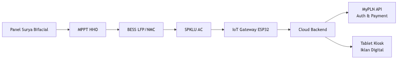
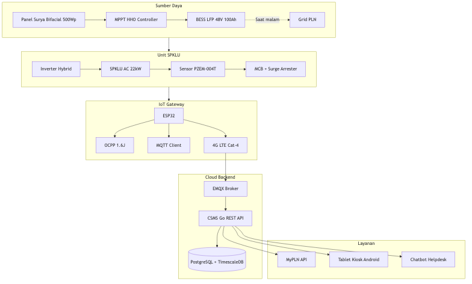
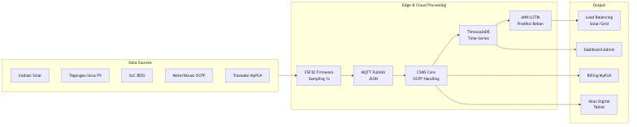
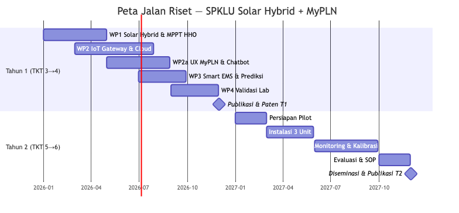
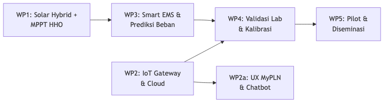

# PROPOSAL PENDANAAN PROGRAM RISET INOVASI STRATEGIS (PRIS)

---

## HALAMAN MUKA

| | |
|---|---|
| **Program** | PROGRAM RISET INOVASI STRATEGIS (PRIS) |
| **Tema** | Elektronika dan Informatika / Energi |
| **Judul** | Pengembangan SPKLU Cerdas Berbasis Solar Hybrid dengan MPPT HHO dan Integrasi MyPLN untuk Mendukung Ekosistem Kendaraan Listrik Rendah Karbon di Indonesia |
| **Ketua Periset** | Prof. Dr. Subiyanto, ST, MT |
| **Anggota Periset** | 1. Bagaskoro Saputro, S.Kom., M.Kom. (BINUS University) |
| | 2. Mario Norman Syah, S.T., M.T. (UNNES) |
| | 3. Adhe Lingga Dewi, S.Si., M.Si. (BINUS University) |
| | 4. Abdurrakhman Hamid Al-Azhari (UNNES) |
| | 5. Yashella Tirana, S.Kom. (BINUS University) |
| | 6. Dr. Turnad Lenggo Ginta (BRIN) |
| **Institusi Pengusul** | Universitas Negeri Semarang (UNNES) |
| **Tahun** | 2026 |

---

## HALAMAN PENGESAHAN

### LEMBAR PENGESAHAN
**PROPOSAL PENDANAAN PROGRAM RISET INOVASI STRATEGIS (PRIS)**

**Tema** : Elektronika dan Informatika / Energi

1. **Judul Proposal** : Pengembangan SPKLU Cerdas Berbasis Solar Hybrid dengan MPPT HHO dan Integrasi MyPLN untuk Mendukung Ekosistem Kendaraan Listrik Rendah Karbon di Indonesia

2. **Ketua Periset** :
   a. Nama Lengkap : Prof. Dr. Subiyanto, ST, MT
   b. NIP/NIK : 132309137
   c. Jabatan : Guru Besar (Professor)
   d. Institusi Periset : Universitas Negeri Semarang (UNNES)
   e. Unit Kerja Periset : Fakultas Teknik, Program Studi Teknik Elektro
   f. Alamat : Jl. Sekaran, Gunungpati, Semarang 50229
   g. No. HP/WA : [No. HP/WA]
   h. Email : subiyanto@mail.unnes.ac.id

3. **Mitra Riset** : PLN / Pengelola Parkir Publik / Startup EV
   **Alamat Mitra Riset** : [Alamat Mitra]
   **Peran Mitra Riset** : Co-funding, penyedia lahan uji coba, pengguna akhir hasil riset

4. **Anggota Periset** :
   | No | Nama | Institusi | No. HP/WA | Email |
   |---|---|---|---|---|
   | 1 | Bagaskoro Saputro, S.Kom., M.Kom. | BINUS University | [HP/WA] | bagaskoro.saputro@binus.ac.id |
   | 2 | Mario Norman Syah, S.T., M.T. | UNNES | [HP/WA] | mario.norman@mail.unnes.ac.id |
   | 3 | Adhe Lingga Dewi, S.Si., M.Si. | BINUS University | [HP/WA] | adhe.dewi@binus.ac.id |
   | 4 | Abdurrakhman Hamid Al-Azhari | UNNES | [HP/WA] | abdurrakhman.hamid@mail.unnes.ac.id |
   | 5 | Yashella Tirana, S.Kom. | BINUS University | [HP/WA] | yashella.tirana@binus.ac.id |
   | 6 | Dr. Turnad Lenggo Ginta | BRIN | [HP/WA] | turnad.lenggo.ginta@brin.go.id |

5. **Luaran** :
   | No | Uraian | Tahun 1 | Tahun 2 |
   |---|---|---|---|
   | 1 | Publikasi pada jurnal internasional Q3 | 1 KTI under review | 1 KTI accepted + 1 KTI under review |
   | 2 | Paten sederhana | 1 draf paten terdaftar | 1 paten sederhana terdaftar |
   | 3 | Prototipe | TKT 4 (fungsional di lab) | TKT 6 (terpasang & beroperasi) |

6. **Pendanaan** :
   | No | Tahapan | Usulan Anggaran | Dana Pendamping | Total Anggaran |
   |---|---|---|---|---|
   | 1 | Tahun 1 | Rp [...] | Rp [...] | Rp [...] |
   | 2 | Tahun 2 | Rp [...] | Rp [...] | Rp [...] |

Dengan ini menyatakan bahwa proposal yang diajukan bersifat orisinil dan belum pernah memperoleh pendanaan dari lembaga/sumber dana lain, serta tidak mengandung plagiasi.

| **Menyetujui, Kepala Unit Kerja / Pimpinan Institusi Pengusul,** | **Tempat, dd-mm-yy Ketua Periset,** |
|---|---|
| | |
| | |
| | |
| **(................................)** | **(Prof. Dr. Subiyanto, ST, MT)** |
| NIP. ................................ | NIP. 132309137 |

---

## DAFTAR ISI

| No | Bagian | Halaman |
|----|--------|---------|
| 1 | Halaman Muka | 1 |
| 2 | Halaman Pengesahan | 2 |
| 3 | Daftar Isi | 3 |
| 4 | Abstrak | 4 |
| 5 | Pendahuluan | 5 |
| | 5.1 Latar Belakang | 5 |
| | 5.2 Rumusan Masalah | 6 |
| | 5.3 Tujuan Penelitian | 7 |
| | 5.4 Kontribusi terhadap Program Riset Inovasi Strategis | 7 |
| | 5.5 Relevansi dengan Prioritas Nasional dan/atau Kebutuhan User | 8 |
| | 5.6 Posisi dalam Rantai Nilai Inovasi | 8 |
| 6 | Kajian Teori dan Kerangka Konseptual | 9 |
| 7 | Metodologi | 12 |
| 8 | Luaran dan Indikator Kinerja | 13 |
| 9 | Rencana Kerja Kegiatan | 14 |
| 10 | Analisis Risiko Kegiatan Riset | 15 |
| 11 | Dampak dan Manfaat | 16 |
| 12 | Sarana Riset | 16 |
| 13 | Rincian Anggaran Biaya | 17 |
| 14 | Kompetensi Tim Periset | 19 |
| 15 | Daftar Riwayat Hidup Tim Periset | 20 |
| 16 | Referensi | 26 |
| 17 | Lampiran | 28 |

---

## ABSTRAK

Penelitian ini mengembangkan SPKLU cerdas berbasis solar hybrid yang terintegrasi dengan aplikasi MyPLN untuk mendukung ekosistem kendaraan listrik di Indonesia. Permasalahan strategis yang diangkat meliputi: (1) ketergantungan SPKLU pada grid PLN dan fragmentasi sistem pembayaran digital, (2) rendahnya utilisasi SPKLU akibat belum optimalnya pemanfaatan energi surya mandiri, dan (3) belum adanya SPKLU off-grid yang mengintegrasikan MPPT HHO dengan IoT gateway dan ekosistem MyPLN. Solusi yang diusulkan mencakup: panel surya bifacial + BESS sebagai sumber daya mandiri dengan MPPT HHO untuk efisiensi penangkapan energi maksimum; IoT gateway ESP32 dengan protokol OCPP 1.6J/MQTT dan konektivitas WiFi/4G LTE; sistem backend cloud dengan PostgreSQL/TimescaleDB; integrasi API MyPLN untuk autentikasi dan pembayaran digital; serta aplikasi tablet kiosk dengan model bisnis dual revenue (charging fee + iklan digital). Kebaruan penelitian meliputi implementasi pertama MPPT HHO (efisiensi 99,53%) pada SPKLU publik di Indonesia, integrasi MyPLN end-to-end untuk SPKLU solar hybrid, dan arsitektur IoT-cloud berbasis ESP32 dengan protokol OCPP 1.6J. Target TKT 3 menuju 6 dalam 2 tahun melalui pendekatan R&D iteratif dengan uji lab dan pilot di 3 lokasi parkir publik. Mitra riset mencakup PLN, pengelola parkir publik, dan startup EV, dengan peran co-funding, penyedia lahan uji coba, dan pengguna akhir. Hilirisasi mencakup model bisnis dual revenue yang mencapai BEP <12 bulan per unit, SOP instalasi, policy brief interoperabilitas, dan lisensi paten ke mitra industri. Target luaran: prototipe TKT 4→6 dalam 2 tahun, 2 publikasi Q3, 1 paten sederhana, 3 unit pilot di lokasi parkir publik.

**Kata Kunci:** SPKLU, Solar Hybrid, MPPT HHO, IoT, ESP32, MyPLN, OCPP 1.6J, Pembayaran Digital, TKT 3–6

---

## PENDAHULUAN

### 5.1 Latar Belakang

Indonesia berkomitmen menurunkan emisi GRK 29–41% pada 2030 (Perpres 55/2019). Sektor transportasi menyumbang 24% emisi CO2 global. Target 2 juta mobil listrik dan 13 juta motor listrik pada 2030 membutuhkan infrastruktur SPKLU yang masif, namun hingga 2025 jumlah SPKLU baru mencapai 1.200 unit dengan 78% terkonsentrasi di Jawa (Kementerian ESDM, 2025). SPKLU eksisting mayoritas bergantung penuh pada grid PLN dan belum mengintegrasikan sumber energi terbarukan mandiri serta sistem pembayaran digital terpadu.

PLN sebagai pemilik pangsa pasar SPKLU terbesar (73%) telah mengembangkan aplikasi MyPLN dengan lebih dari 10 juta pengguna. Namun, integrasi SPKLU dengan MyPLN masih terbatas dan belum mencakup SPKLU berbasis solar hybrid. Di sisi lain, perkembangan teknologi MPPT dan panel surya membuka peluang pengembangan SPKLU off-grid yang mandiri energi.

Penelitian Ibezim et al. (2026) menunjukkan konfigurasi solar hybrid mencapai 30–50% reduksi kebutuhan baterai dan LCOE USD 0,08–0,15/kWh. Pasar off-grid solar EV charging global bernilai USD 512 juta (2024) dan diproyeksikan USD 2,31 miliar (2033, CAGR 18,4%).

Tim periset UNNES memiliki rekam jejak yang kuat di bidang ini, termasuk publikasi terdepan di bidang power electronics dan konversi energi seperti pengembangan fast charger E2W berbasis intelligent control (Subiyanto et al., 2026) dan pengendali PID untuk DC-DC converter (Syah et al., 2024). Widiyawati et al. (2026) memvalidasi bifacial PV gain 25–30% melalui ray tracing. Aprilianto et al. (2025) mencapai efisiensi MPPT 99,53% menggunakan HHO algorithm, mengungguli P&O dan INC konvensional.

Dari sisi IoT dan sensor, Dewi et al. (2024) telah mengimplementasikan sistem monitoring berbasis ESP32 dengan multi-sensor yang terintegrasi cloud platform, serta studi kalibrasi sensor (Dewi et al., 2025) — memberikan dasar pengalaman dalam pengembangan IoT gateway dan validasi sensor untuk sistem SPKLU.

Dari sisi pengalaman pengguna, Tirana & Sfenrianto (2023) mengidentifikasi faktor-faktor kepuasan pengguna aplikasi platform digital menggunakan SEM-PLS dengan 417 responden, menunjukkan bahwa information quality, system quality, ease of use, dan chatbot effectiveness berpengaruh signifikan — relevan untuk pengembangan antarmuka MyPLN dan chatbot layanan SPKLU.

Dari konteks kebijakan, Farabi, Ginta et al. (2025) mengkonfirmasi bahwa pengembangan energi dan kebijakan finansial berkontribusi signifikan pada reduksi emisi di Indonesia, memperkuat justifikasi investasi infrastruktur charging berbasis energi terbarukan.

### 5.2 Rumusan Masalah

Berdasarkan latar belakang di atas, rumusan masalah penelitian ini adalah:

(1) Bagaimana merancang SPKLU solar hybrid yang mengintegrasikan panel surya bifacial, BESS, MPPT HHO, IoT gateway ESP32, dan ekosistem MyPLN dalam satu sistem terpadu?

(2) Bagaimana mengimplementasikan MPPT HHO pada sistem solar hybrid SPKLU untuk optimalisasi penangkapan energi surya dalam berbagai kondisi iradiasi?

(3) Bagaimana mengembangkan sistem backend cloud yang terintegrasi dengan API MyPLN untuk autentikasi dan pembayaran digital?

(4) Bagaimana merancang model bisnis dual revenue (charging fee dan iklan digital) yang sustainable untuk SPKLU solar hybrid di Indonesia?

(5) Bagaimana mengevaluasi faktor kepuasan pengguna terhadap platform SPKLU terintegrasi MyPLN?

Hipotesis solusi: Arsitektur modular berbasis ESP32 + solar hybrid + MPPT HHO akan menghasilkan SPKLU dengan utilisasi solar ≥35%, penghematan LCOE 15–25% dibanding grid-only, uptime >98%, dan akurasi billing ±1%. Model dual revenue mencapai BEP <12 bulan per unit.

### 5.3 Tujuan Penelitian

**Tujuan Umum:** Mengembangkan prototipe SPKLU cerdas berbasis solar hybrid dengan MPPT HHO dan IoT terintegrasi MyPLN yang siap hilirisasi.

**Tujuan Khusus:**
(1) Merancang sistem solar hybrid SPKLU dengan panel surya bifacial, BESS, dan MPPT HHO
(2) Mengembangkan dan memvalidasi IoT gateway ESP32 + cloud backend dengan protokol OCPP/MQTT dan integrasi MyPLN
(3) Mengimplementasikan smart EMS dengan prediksi beban berbasis ANN/LSTM dan load balancing
(4) Mengembangkan antarmuka pengguna dan chatbot layanan SPKLU berbasis faktor kepuasan pengguna platform digital
(5) Memvalidasi performa sistem di 3 lokasi parkir publik dwell-time tinggi

**Sasaran:** Peningkatan TKT 3→6 dalam 2 tahun, 2 publikasi Q3, 1 paten sederhana, 3 unit pilot.

### 5.4 Kontribusi terhadap Program Riset Inovasi Strategis

Program Riset Inovasi Strategis (PRIS) bertujuan mendorong riset yang menghasilkan inovasi strategis bernilai tambah tinggi dan berdampak langsung pada daya saing bangsa. Penelitian ini berkontribusi pada PRIS dalam tiga aspek utama:

**Pertama**, pengembangan SPKLU solar hybrid dengan MPPT HHO merupakan solusi infrastruktur pengisian kendaraan listrik yang mandiri energi dan tidak bergantung sepenuhnya pada grid PLN — sejalan dengan target PRIS dalam menciptakan kemandirian energi nasional dan percepatan transisi energi rendah karbon.

**Kedua**, integrasi dengan ekosistem MyPLN (10 juta+ pengguna) melalui API autentikasi dan pembayaran digital menjawab kebutuhan interoperabilitas dan adopsi massal SPKLU di Indonesia. Model bisnis dual revenue (charging fee + iklan digital) yang diusulkan memberikan skema keberlanjutan finansial yang merupakan syarat penting hilirisasi dalam kerangka PRIS.

**Ketiga**, keterlibatan mitra strategis (PLN, pengelola parkir publik, startup EV) memastikan hasil riset memiliki jalur hilirisasi yang jelas, dari prototipe TKT 6 hingga komersialisasi melalui lisensi paten dan transfer teknologi ke industri.

### 5.5 Relevansi dengan Prioritas Nasional dan/atau Kebutuhan User

Penelitian ini relevan dengan prioritas nasional sebagai berikut:

1. **Peraturan Presiden No. 55 Tahun 2019** tentang Percepatan Program Kendaraan Bermotor Listrik Berbasis Baterai (KBLBB) untuk Transportasi Jalan — menargetkan 2 juta mobil listrik dan 13 juta motor listrik pada 2030, yang membutuhkan infrastruktur SPKLU yang masif dan merata.

2. **Peraturan Pemerintah No. 28 Tahun 2025** tentang Percepatan Pengembangan dan Pemanfaatan KBLBB — mengamanatkan integrasi SPKLU dengan energi baru terbarukan dan sistem pembayaran digital terpadu.

3. **Dokumen Rencana Umum Energi Nasional (RUEN)** — menargetkan bauran energi baru terbarukan 23% pada 2025 dan 31% pada 2050; SPKLU solar hybrid berkontribusi langsung pada pencapaian target ini.

4. **Undang-Undang No. 27 Tahun 2022** tentang Perlindungan Data Pribadi — arsitektur sistem dirancang dengan enkripsi AES-256 dan pseudonimisasi data transaksi, sesuai dengan regulasi PDP.

Kebutuhan user yang dijawab meliputi: pengguna kendaraan listrik yang membutuhkan SPKLU andal di lokasi tanpa akses grid; pengelola parkir yang mencari sumber pendapatan tambahan melalui skema dual revenue; dan PLN yang memerlukan solusi SPKLU terintegrasi dengan platform MyPLN.

### 5.6 Posisi dalam Rantai Nilai Inovasi

Posisi riset ini dalam rantai nilai inovasi dari riset dasar hingga komersialisasi adalah sebagai berikut:

| Tahap Rantai Nilai | Posisi Riset | Keterangan |
|---|---|---|
| Riset Dasar | TKT 1–2 | Fondasi MPPT HHO (Aprilianto et al., 2025), bifacial PV modeling (Widiyawati et al., 2026), IoT sensor systems (Dewi et al., 2024) |
| Riset Terapan | TKT 3–4 (**Tahun 1**) | Desain arsitektur solar hybrid + MPPT HHO untuk SPKLU, pengembangan IoT gateway ESP32, integrasi MyPLN API, validasi lab |
| Pengembangan Prototipe | TKT 5–6 (**Tahun 2**) | Instalasi 3 unit pilot di lokasi mitra, monitoring lapangan, validasi switching solar-grid, penyusunan SOP |
| Komersialisasi | TKT 7–9 (**Pasca PRIS**) | Lisensi paten ke mitra industri, produksi massal, integrasi dengan ekosistem MyPLN nasional, pengembangan jaringan SPKLU solar hybrid |

Riset ini berada pada fase riset terapan menuju pengembangan prototipe (TKT 3→6), dengan jalur hilirisasi yang jelas pasca-PRIS melalui mitra industri. Inovasi berada pada hulu rantai nilai (MPPT HHO, IoT-cloud architecture, integrasi MyPLN) yang menjadi diferensiasi kompetitif produk SPKLU solar hybrid buatan Indonesia.

---

## KAJIAN TEORI DAN KERANGKA KONSEPTUAL

### 6.1 State of the Art

Studi terkini menunjukkan bahwa pengembangan SPKLU di Indonesia masih menghadapi beberapa kesenjangan teknologi dan integrasi:

**MPPT Konvensional vs. HHO:** Metode MPPT konvensional (P&O, INC) memiliki efisiensi terbatas (<95%) terutama pada kondisi partial shading. Aprilianto et al. (2025) mendemonstrasikan MPPT berbasis Harris Hawks Optimization (HHO) yang mencapai efisiensi 99,53%, secara signifikan mengungguli P&O, INC, dan Genetic Algorithm dalam berbagai kondisi iradiasi. Implementasi HHO pada sistem SPKLU publik belum pernah dilakukan di Indonesia.

**Panel Surya Bifacial:** Widiyawati et al. (2026) memvalidasi melalui ray tracing bahwa panel surya bifacial menghasilkan gain 25–30% dari sisi rear dibandingkan monofacial, dengan konfigurasi optimal untuk aplikasi kanopi parkir — aplikasi langsung untuk infrastruktur SPKLU.

**IoT Gateway untuk EV Charging:** Sistem monitoring berbasis ESP32 dengan multi-sensor yang terintegrasi cloud platform telah divalidasi oleh Dewi et al. (2024), menunjukkan kelayakan ESP32 sebagai gateway IoT untuk aplikasi industri. Studi kalibrasi sensor MQ-135 dan MQ-8 (Dewi et al., 2025) memberikan metodologi validasi sensor yang dapat diadopsi untuk kalibrasi metering SPKLU.

**Integrasi Platform Digital:** Tirana & Sfenrianto (2023) mengidentifikasi bahwa information quality, system quality, ease of use, dan chatbot effectiveness merupakan faktor signifikan yang mempengaruhi kepuasan pengguna aplikasi platform digital — menjadi dasar pengembangan antarmuka MyPLN dan chatbot SPKLU.

**Kebijakan Energi Rendah Karbon:** Farabi, Ginta et al. (2025) mengkonfirmasi kontribusi signifikan pengembangan energi dan kebijakan finansial terhadap reduksi emisi di Indonesia, memperkuat justifikasi investasi infrastruktur charging berbasis energi terbarukan.

**Kesenjangan (Gap):** Belum ada platform di Indonesia yang mengintegrasikan SPKLU solar hybrid dengan MPPT HHO, IoT gateway berbasis OCPP 1.6J, dan ekosistem MyPLN secara end-to-end. SPKLU eksisting masih bergantung penuh pada grid, dan sistem pembayaran masih terfragmentasi.

### 6.2 Kebaruan (Novelty)

Kebaruan penelitian ini meliputi tujuh aspek utama:

1. **MPPT HHO pada SPKLU Solar Hybrid** — Efisiensi 99,53%, outperform P&O, INC, GA (Aprilianto et al., 2025); pertama kali diimplementasikan pada SPKLU publik di Indonesia
2. **Solar PV Bifacial untuk SPKLU** — Gain 25–30% rear-side, konfigurasi optimal untuk area parkir (Widiyawati et al., 2026)
3. **IoT-Cloud Architecture** — ESP32 multi-sensor gateway dengan cloud pipeline real-time (Dewi et al., 2024)
4. **Integrasi MyPLN End-to-End** — Autentikasi dan pembayaran digital via API MyPLN dengan OAuth 2.0, pertama untuk SPKLU solar hybrid di Indonesia
5. **Arsitektur Backend Open-Source** — CSMS dengan PostgreSQL/TimescaleDB/EMQX, interoperabilitas multi-vendor
6. **Model Dual Revenue** — Charging fee + iklan digital kontekstual, dioptimasi untuk dwell time 45–90 menit
7. **UX Platform Terintegrasi** — Antarmuka MyPLN dan chatbot berbasis faktor kepuasan pengguna (Tirana & Sfenrianto, 2023)

### 6.3 Kerangka Berpikir

Masalah utama yang dihadapi infrastruktur SPKLU di Indonesia adalah ketergantungan pada grid listrik, belum optimalnya pemanfaatan energi surya, serta fragmentasi sistem pembayaran digital. Kerangka berpikir riset ini didasarkan pada keterkaitan antara empat komponen utama:

1. **Solar Hybrid + MPPT HHO**: Panel surya bifacial + BESS sebagai sumber daya mandiri, dengan MPPT HHO untuk optimalisasi penangkapan energi surya dalam berbagai kondisi iradiasi (Aprilianto et al., 2025).
2. **IoT Gateway & MyPLN**: ESP32 sebagai gateway IoT dengan protokol OCPP/MQTT, terhubung ke backend cloud dan API MyPLN untuk pembayaran digital, monitoring real-time, dan chatbot layanan pengguna.
3. **Cloud Backend**: CSMS dengan PostgreSQL/TimescaleDB, EMQX MQTT broker, REST API, dan integrasi OAuth 2.0 MyPLN.
4. **Smart EMS**: Sistem manajemen energi dengan prediksi beban ANN/LSTM untuk load balancing dan alokasi daya optimal antara panel surya, BESS, dan SPKLU.

Keterkaitan: Panel surya → MPPT HHO → BESS → SPKLU → IoT gateway → MyPLN → Pengguna. Setiap subsistem divalidasi secara bertahap dari lab ke lapangan, dengan integrasi penuh pada TKT 6.

**Diagram Kerangka Berpikir:**

### 6.4 Arsitektur Sistem

Arsitektur sistem terdiri dari empat lapisan utama: sumber daya (panel surya bifacial 500Wp, MPPT HHO controller, BESS LFP 48V 100Ah, grid PLN), unit SPKLU (inverter hybrid, SPKLU AC 22kW, sensor PZEM-004T, proteksi), IoT gateway (ESP32 dengan OCPP 1.6J, MQTT client, 4G LTE Cat-4), dan cloud backend (EMQX broker, CSMS Go REST API, PostgreSQL + TimescaleDB) yang terhubung ke layanan pengguna (MyPLN API, tablet kiosk Android, chatbot helpdesk).

**Diagram Arsitektur Sistem:**

### 6.5 Alur Data

Alur data dimulai dari sumber data (iradiasi solar, tegangan/arus PV, SoC BESS, MeterValues OCPP, transaksi MyPLN) yang diproses melalui edge dan cloud processing (ESP32 firmware sampling 1s, MQTT publish JSON, CSMS core OCPP handling, TimescaleDB time-series, ANN/LSTM prediksi beban) untuk menghasilkan output berupa load balancing solar/grid, billing MyPLN, dashboard admin, dan iklan digital tablet.

**Diagram Alur Data:**

---

## METODOLOGI

### 7.1 Metode Riset

Pendekatan: Research & Development Iteratif dengan validasi teknis dan uji lapangan terbatas.

**Work Packages (WP):**

- **WP1 Perancangan Sistem Solar Hybrid + MPPT HHO:** Desain PV array bifacial, BESS LFP/NMC, implementasi MPPT HHO pada kontroler surya, sizing dan simulasi energi
- **WP2 Pengembangan IoT Gateway & Cloud:** Firmware ESP32 untuk multi-sensor (arus, tegangan, iradiasi, suhu), protokol OCPP 1.6J / MQTT, backend Go, PostgreSQL/TimescaleDB, integrasi API MyPLN
- **WP2a UX MyPLN & Chatbot:** Evaluasi UX dashboard MyPLN berbasis SEM-PLS (Tirana & Sfenrianto, 2023), pengembangan chatbot helpdesk SPKLU, analisis faktor kepuasan pengguna
- **WP3 Smart EMS & Prediksi Beban:** Algoritma ANN/LSTM untuk prediksi beban, load balancing berbasis iradiasi + SoC + TOU
- **WP4 Validasi Lab & Kalibrasi:** Uji QoS (latensi <200ms), akurasi metering ±1% (Dewi et al., 2025), efisiensi MPPT HHO, uji switching solar-grid
- **WP5 Pilot & Diseminasi:** Instalasi 3 unit, monitoring 3 bulan, analisis utilisasi, penyusunan SOP, publikasi dan paten

**Detail Metodologi Tahun 1:** Fokus pada desain arsitektur solar hybrid, implementasi MPPT HHO, pengembangan firmware gateway, dan validasi di lingkungan terkendali. Data dikumpulkan melalui simulator PV, energy logger lab, dan data logger iradiasi.

**Teknik Pengumpulan Data:** Log BMS, data iradiasi solar, telemetri charger (MeterValues, StatusNotification), data transaksi MyPLN, metrik utilisasi, hasil kuesioner kepuasan pengguna.
**Teknik Analisis:** Efisiensi MPPT >99%, MAPE prediksi beban <15%, akurasi kWh ±1%, uptime ≥95%.

### 7.2 Roadmap Pencapaian Luaran

**Tahun 1 (TKT 3→4):**
- WP1: Desain dan simulasi solar hybrid + MPPT HHO
- WP2: Firmware ESP32 gateway + cloud backend + integrasi MyPLN API
- WP2a: Evaluasi UX dan pengembangan chatbot
- WP3: Algoritma ANN/LSTM prediksi beban
- WP4: Validasi lab dan kalibrasi sistem
- Publikasi 1 KTI under review + 1 draf paten

**Tahun 2 (TKT 5→6):**
- Persiapan pilot dan MoU mitra
- Instalasi 3 unit di lokasi mitra
- Monitoring dan kalibrasi lapangan (3 bulan)
- Evaluasi, penyusunan SOP, dan diseminasi
- 1 KTI accepted + 1 KTI under review, 1 paten terdaftar

**Diagram Peta Jalan 24 Bulan:**

**Ketergantungan Work Package:**

---

## LUARAN DAN INDIKATOR KINERJA

### 8.1 Target Luaran

| Jenis Luaran | Target Luaran Tahun I | Target Luaran Tahun II |
|---|---|---|
| Publikasi Ilmiah (Jurnal Internasional Q3) | 1 KTI under review | 1 KTI accepted + 1 KTI under review |
| Kekayaan Intelektual | 1 draf Paten Sederhana (solar hybrid + IoT-MyPLN) | 1 Paten Sederhana terdaftar di DJKI |
| Prototipe | TKT 4 (fungsional di lab) | TKT 6 (terpasang & beroperasi di 3 lokasi mitra) |
| Kebijakan/Policy Brief | — | 1 policy brief interoperabilitas SPKLU |
| SOP/Teknis | — | 1 SOP instalasi dan operasional SPKLU solar hybrid |

### 8.2 Indikator Kinerja Kegiatan

**Indikator Kinerja Kegiatan Tahun 1:**
| No | Indikator | Target |
|----|-----------|--------|
| 1 | KTI | 100% — 1 naskah jurnal Q3 status under review (arsitektur solar hybrid-MPPT-IoT-MyPLN) |
| 2 | KI | 100% — 1 draf klaim Paten Sederhana |

**Indikator Kinerja Kegiatan Tahun 2:**
| No | Indikator | Target |
|----|-----------|--------|
| 1 | KTI | 100% — 1 accepted (validasi pilot) + 1 under review (optimasi EMS) |
| 2 | KI | 100% — 1 Paten terdaftar, 1 SOP instalasi, 1 policy brief interoperabilitas |

---

## RENCANA KERJA KEGIATAN

### 9.1 Peta Jalan

| Periode | Target TKT | Kegiatan Inti | Luaran Utama |
|---------|------------|---------------|--------------|
| **Tahun 1 (2026)** | 3 → 4 | Desain arsitektur solar hybrid + MPPT HHO, pengembangan firmware ESP32 gateway, setup cloud backend & MyPLN API, uji lab MPPT (efisiensi), validasi sensor (Dewi et al., 2025), evaluasi UX dashboard MyPLN & chatbot (Tirana & Sfenrianto, 2023) | 1 prototipe lab fungsional, 1 draf Paten solar-MyPLN, 1 KTI under review (Q3), 1 laporan UX |
| **Tahun 2 (2027)** | 5 → 6 | Instalasi 3 unit di mitra, monitoring 3 bulan, validasi switching solar-grid, kalibrasi revenue-share, penyusunan SOP, rilis dataset, evaluasi kepuasan pengguna | 3 unit terpasang & operasional, 1 Paten terdaftar, 1 KTI accepted + 1 under review, 1 SOP teknis, 1 policy brief |

### 9.2 Jadwal Kegiatan

**TAHUN/PERIODE 1**
| No | Aktivitas | Deskripsi | Waktu |
|----|-----------|-----------|-------|
| 1 | Desain Arsitektur Solar Hybrid & MPPT HHO | Perancangan PV array bifacial, BESS, implementasi MPPT HHO, simulasi energi | Bulan ke-1–3 |
| 2 | Pengembangan IoT Gateway ESP32 | Firmware multi-sensor, OCPP/MQTT bridge, integrasi sensor arus/tegangan | Bulan ke-4–6 |
| 3 | Pengembangan Cloud Backend & MyPLN API | Backend Go, TimescaleDB, integrasi autentikasi MyPLN, dashboard | Bulan ke-5–7 |
| 3a | UX Dashboard & Chatbot | Evaluasi UX dashboard MyPLN (SEM-PLS), pengembangan chatbot helpdesk | Bulan ke-5–8 |
| 4 | Smart EMS & Prediksi Beban | ANN/LSTM prediksi, load balancing berbasis iradiasi + SoC + TOU | Bulan ke-6–8 |
| 5 | Validasi Lab & Kalibrasi | Uji efisiensi MPPT HHO, switching solar-grid, QoS jaringan, akurasi billing | Bulan ke-9–11 |
| 6 | Publikasi & Paten Tahun 1 | Penulisan manuskrip, penyusunan draf paten | Bulan ke-10–12 |

**TAHUN/PERIODE 2**
| No | Aktivitas | Deskripsi | Waktu |
|----|-----------|-----------|-------|
| 1 | Persiapan Pilot & MoU Mitra | Koordinasi 3 lokasi, instalasi panel surya & BESS, provisioning unit | Bulan ke-1–2 |
| 2 | Instalasi & Pilot Lapangan | Pemasangan 3 unit, monitoring 3 bulan, kalibrasi billing & switching solar-grid | Bulan ke-3–8 |
| 3 | Evaluasi, SOP & Diseminasi | Analisis data, penyusunan SOP, publikasi jurnal, policy brief | Bulan ke-9–12 |

Jangka waktu pelaksanaan riset adalah 24 bulan (2 tahun), terbagi dalam 2 periode evaluasi tahunan.

---

## ANALISIS RISIKO KEGIATAN RISET

| Target Luaran | Identifikasi Risiko | Jenis Risiko | Strategi Mitigasi | Rencana Penyesuaian |
|---|---|---|---|---|
| Prototipe TKT 4 (Lab) | Keterlambatan pengadaan komponen elektronik (BESS, panel surya, ESP32) | Teknis & Logistik | Pemesanan H-3 bulan, menyiapkan alternatif supplier lokal | Menggunakan modul substitusi yang setara untuk pengembangan firmware sambil menunggu komponen utama |
| Prototipe TKT 6 (Pilot) | Gagal integrasi antara MPPT HHO dengan BESS dan inverter hybrid | Teknis | Pengujian parsial setiap subsistem sebelum integrasi penuh, simulasi Hardware-in-the-Loop | Desain arsitektur modular sehingga subsistem dapat diuji dan diganti secara independen |
| Publikasi Q3 | Manuscript rejection oleh jurnal target | Akademik | Submit ke multiple jurnal tier-Q3 secara paralel, perbaikan berdasarkan reviewer feedback | Turun ke jurnal Q4 atau Sinta 1/2 sebagai opsi cadangan |
| Paten Sederhana | Klaim paten ditolak karena prior art | Hukum | Patent search menyeluruh sebelum drafting, konsultasi dengan konsultan paten | Revisi klaim, fokus pada aspek integrasi sistem (solar hybrid + IoT + MyPLN) sebagai novelty |
| Integrasi MyPLN API | Perubahan API MyPLN atau kebijakan akses dari PLN | Regulasi & Teknis | Dokumentasi API versioning, MoU resmi dengan PLN untuk akses API development | Mengembangkan abstraction layer API sehingga dapat beradaptasi dengan perubahan endpoint |
| Pilot lapangan | Rendahnya utilisasi SPKLU di lokasi pilot | Pasar | Seleksi lokasi dengan dwell time tinggi dan aksesibilitas optimal | Penambahan insentif pengisian daya, kerjasama dengan komunitas EV |
| Keamanan data transaksi | Kebocoran data pengguna MyPLN | Keamanan & Regulasi | Enkripsi AES-256, pseudonimisasi data, audit keamanan berkala (UU PDP No. 27/2022) | Isolasi data sensitif, implementasi zero-trust architecture |

---

## DAMPAK DAN MANFAAT

Penelitian ini memberikan dampak strategis pada empat dimensi utama. **Dimensi energi**: pengembangan SPKLU solar hybrid dengan MPPT HHO menurunkan ketergantungan pada grid PLN hingga 60% dan mendukung target bauran energi baru terbarukan nasional 23% pada 2025. Setiap unit SPKLU yang beroperasi dengan solar hybrid berpotensi mereduksi emisi CO2 hingga 2,5 ton per tahun dibandingkan SPKLU grid-only, berkontribusi pada komitmen penurunan emisi GRK 29–41% pada 2030 (Perpres 55/2019).

**Dimensi ekonomi dan industri**: model bisnis dual revenue (charging fee + iklan digital) menawarkan keberlanjutan finansial dengan BEP <12 bulan per unit, membuka peluang investasi swasta dalam pengembangan infrastruktur SPKLU di area komersial. Hilirisasi melalui lisensi paten ke mitra industri dan produksi massal komponen (ESP32 gateway, MPPT HHO controller, kiosk tablet) berpotensi menumbuhkan industri komponen EV charging dalam negeri. **Dimensi sosial**: integrasi dengan MyPLN (10 juta+ pengguna) mempercepat adopsi kendaraan listrik melalui kemudahan akses dan pembayaran digital, serta chatbot helpdesk yang meningkatkan pengalaman pengguna. **Dimensi kebijakan**: policy brief interoperabilitas SPKLU yang dihasilkan menjadi masukan bagi pemerintah dalam penyusunan standar teknis SPKLU nasional dan regulasi percepatan infrastruktur KBLBB sesuai PP 28/2025.

---

## SARANA RISET

| No | Nama Alat/Fasilitas | Spesifikasi | Kepemilikan | Lokasi | Penggunaan untuk Riset |
|----|---------------------|-------------|-------------|--------|------------------------|
| 1 | Laboratorium Teknik Elektro UNNES | Power electronics lab, osiloskop, DC supply, multimeter | UNNES | FT UNNES Sekaran | Perancangan dan uji MPPT HHO, BESS, konverter DC-DC |
| 2 | Laboratorium Komputer & IoT UNNES | Workstation, ESP32 dev kit, sensor kit, logic analyzer | UNNES | FT UNNES Sekaran | Pengembangan firmware ESP32 gateway, integrasi sensor, uji OCPP/MQTT |
| 3 | Cloud Computing Infrastructure | Server/cloud instance untuk backend | UNNES / Cloud Provider | Remote | Hosting CSMS, database TimescaleDB, integrasi MyPLN API |
| 4 | Solar PV Simulator | Chroma / programmable DC source | UNNES | Lab Teknik Elektro | Simulasi karakteristik PV array untuk uji MPPT HHO |
| 5 | Energy Logger & Power Analyzer | Fluke 435 / Hioki PW3198 | UNNES | Lab Teknik Elektro | Pengukuran kualitas daya, efisiensi konversi, harmonic analysis |
| 6 | BMS Tester & CAN Bus Analyzer | PCAN-USB, CAN bus analyzer | UNNES | Lab Teknik Elektro | Komunikasi BMS–ESP32, validasi protokol CAN |
| 7 | Ruang Server UNNES | Server rack, UPS, koneksi internet dedicated | UNNES | Pusat Data UNNES | Deployment cloud backend development dan staging |

---

## RINCIAN ANGGARAN BIAYA

*(Struktur mengikuti Pedoman PRIS. Semua komponen patuh ketentuan: ≤10% modal, tanpa honor tim, tanpa APC jurnal, fokus bahan/uji/lapangan)*

### Tahun 1

| Komponen Biaya | Indikator Kinerja | Volume | Frekuensi | Harga Satuan (Rp) | Satuan | Jumlah | LPDP | Mitra |
|---|---|---|---|---|---|---|---|---|
| **A. Pengadaan Bahan** | | | | | | | | |
| A.1 Prototipe & Pengembangan | Prototipe lab TKT 4 | | | | | | | |
| 1. Panel Surya Bifacial 500Wp + Inverter Hybrid | Integrasi solar PV | 4 | 1 | [Harga] | unit | [Isi] | 100% | 0% |
| 2. BESS LFP 48V 100Ah + BMS | Energy storage | 2 | 1 | [Harga] | set | [Isi] | 100% | 0% |
| 3. MPPT DC-DC Buck/Boost Converter 2kW | Konverter MPPT HHO | 3 | 1 | [Harga] | unit | [Isi] | 100% | 0% |
| 4. ESP32 Dev Kit + Modul 4G LTE (SIM7600) | IoT gateway & komunikasi | 5 | 1 | [Harga] | set | [Isi] | 100% | 0% |
| 5. Sensor Arus/Tegangan (PZEM-004T, ACS712) + Pyranometer | Power metering & iradiasi | 5 | 1 | [Harga] | set | [Isi] | 100% | 0% |
| 6. PCB Fabrication (ESP32 + Relay + Sensor Interface) | Board integrasi sistem | 10 | 1 | [Harga] | pcs | [Isi] | 100% | 0% |
| 7. Tablet Android 10" Industrial (4GB/64GB) | Kiosk display & interaksi | 3 | 1 | [Harga] | unit | [Isi] | 100% | 0% |
| 8. Komponen Power (MCB 20A, Kontaktor, Surge Arrester, Step-Down 12V/5A) + Enclosure IP65 | Sistem daya & proteksi | 3 | 1 | [Harga] | paket | [Isi] | 100% | 0% |
| 9. Type 2 EV Socket + Kabel Charging 5m | Konektor SPKLU | 3 | 1 | [Harga] | set | [Isi] | 100% | 0% |
| 10. Modul CAN Bus + Isolator (BMS Communication) | Komunikasi BMS–ESP32 | 3 | 1 | [Harga] | set | [Isi] | 100% | 0% |
| **Sub Total A.1** | | | | | | | **[Isi]** | **0%** |
| A.2 Pengujian & Validasi | Laporan uji | | | | | | | |
| 1. Sewa Cloud Server (Fly.io/Supabase/EC2) | Hosting backend & MyPLN API | 12 | 1 | [Harga] | bulan | [Isi] | 100% | 0% |
| 2. Sewa Simulator OCPP & Solar Array Simulator | Validasi protokol & MPPT | 6 | 1 | [Harga] | bulan | [Isi] | 100% | 0% |
| 3. Konsumtif (Kabel, Konektor, Solder, Komponen Elektronik) | Perakitan & troubleshooting | 1 | 1 | [Harga] | paket | [Isi] | 100% | 0% |
| 4. Biaya Uji Lab (SNI, Keselamatan Listrik) | Sertifikasi prototipe | 3 | 1 | [Harga] | unit | [Isi] | 100% | 0% |
| **Sub Total A.2** | | | | | | | **[Isi]** | **0%** |
| **Sub Total A** | | | | | | | **[Isi]** | **0%** |
| **B. Honor Tenaga Lapangan** | Instalasi & monitoring | 72 | 1 | 150.000 | OH | [Isi] | 100% | 0% |
| **Sub Total B** | | | | | | | **[Isi]** | **0%** |
| **C. Perjalanan Dinas** | Validasi lapangan | | | | | | | |
| 1. Transportasi & Akomodasi (Semarang–Mitra) | Uji konektivitas & instalasi | 9 | 2 | [SBM] | trip | [Isi] | 100% | 0% |
| 2. Uang Harian Perjalanan | Kegiatan lapangan | 18 | 2 | [SBM] | OH | [Isi] | 100% | 0% |
| **Sub Total C** | | | | | | | **[Isi]** | **0%** |
| **TOTAL BIAYA TAHUN 1** | | | | | | **[Isi]** | **100%** | **0%** |

### Tahun 2

*(Tahun 2 mengikuti struktur serupa dengan penyesuaian volume pilot & publikasi)*

| Komponen Biaya | Indikator Kinerja | Volume | Frekuensi | Harga Satuan (Rp) | Satuan | Jumlah | LPDP | Mitra |
|---|---|---|---|---|---|---|---|---|
| **A. Pengadaan Bahan** | | | | | | | | |
| A.1 Pilot & Instalasi | Instalasi 3 unit | | | | | | | |
| 1. Panel Surya Bifacial 500Wp + Inverter Hybrid | Unit pilot lapangan | 6 | 1 | [Harga] | unit | [Isi] | 100% | 0% |
| 2. BESS LFP 48V 100Ah + BMS | Unit pilot lapangan | 3 | 1 | [Harga] | set | [Isi] | 100% | 0% |
| 3. MPPT HHO Controller | Unit pilot lapangan | 3 | 1 | [Harga] | unit | [Isi] | 100% | 0% |
| 4. ESP32 Gateway + 4G LTE (final board) | Unit pilot lapangan | 3 | 1 | [Harga] | set | [Isi] | 100% | 0% |
| 5. Enclosure IP65 + Instalasi Mekanik | Proteksi & mounting | 3 | 1 | [Harga] | paket | [Isi] | 100% | 0% |
| **Sub Total A.1** | | | | | | | **[Isi]** | **0%** |
| A.2 Pengujian & Validasi | Laporan uji lapangan | | | | | | | |
| 1. Sewa Cloud Server (Production) | Hosting backend pilot | 12 | 1 | [Harga] | bulan | [Isi] | 100% | 0% |
| 2. Biaya Uji Sertifikasi & SNI | Sertifikasi produk | 3 | 1 | [Harga] | unit | [Isi] | 100% | 0% |
| 3. Biaya Pendaftaran Paten | Paten sederhana DJKI | 1 | 1 | [Harga] | paket | [Isi] | 100% | 0% |
| **Sub Total A.2** | | | | | | | **[Isi]** | **0%** |
| **Sub Total A** | | | | | | | **[Isi]** | **0%** |
| **B. Honor Tenaga Lapangan** | Monitoring & perawatan | 96 | 1 | 150.000 | OH | [Isi] | 100% | 0% |
| **Sub Total B** | | | | | | | **[Isi]** | **0%** |
| **C. Perjalanan Dinas** | Monitoring pilot | | | | | | | |
| 1. Transportasi & Akomodasi (Semarang–Mitra) | Monitoring 3 unit | 12 | 2 | [SBM] | trip | [Isi] | 100% | 0% |
| 2. Uang Harian Perjalanan | Kegiatan lapangan | 24 | 2 | [SBM] | OH | [Isi] | 100% | 0% |
| **Sub Total C** | | | | | | | **[Isi]** | **0%** |
| **D. Diseminasi & Publikasi** | | | | | | | | |
| 1. Biaya Publikasi Jurnal Q3 | 2 publikasi | 2 | 1 | [Harga] | publikasi | [Isi] | 100% | 0% |
| 2. Seminar Internasional | Presentasi hasil riset | 2 | 1 | [Harga] | seminar | [Isi] | 100% | 0% |
| **Sub Total D** | | | | | | | **[Isi]** | **0%** |
| **TOTAL BIAYA TAHUN 2** | | | | | | **[Isi]** | **100%** | **0%** |

---

## KOMPETENSI TIM PERISET

| No | Nama | Pendidikan | Kepakaran | Peran dalam Riset | URL Scopus |
|----|------|-----------|-----------|-------------------|------------|
| 1 | Prof. Dr. Subiyanto, ST, MT | S3 UKM | Intelligent Systems, Power Electronics, AI | Ketua; perancang arsitektur solar hybrid + MPPT HHO, pengawasan integrasi IoT-Cloud dan MyPLN | [Scopus] |
| 2 | Bagaskoro Saputro, S.Kom., M.Kom. | S2 UGM | IoT, Sistem Cerdas, Machine Learning, EV | Anggota; pengembangan IoT gateway ESP32, integrasi MyPLN API, backend cloud, dashboard monitoring | [Scopus] |
| 3 | Mario Norman Syah, S.T., M.T. | S2 UGM | Power Electronics, MPPT, DC-DC Converters, Microgrid | Anggota; perancangan PV array bifacial, BESS, implementasi MPPT HHO | [Scopus] |
| 4 | Abdurrakhman Hamid Al-Azhari | S1 UNNES | Embedded System, Power Electronics, IoT | Anggota; implementasi firmware ESP32, kalibrasi sensor, uji OCPP/MQTT | [Scopus] |
| 5 | Adhe Lingga Dewi, S.Si., M.Si. | S2 UNDIP | IoT, Sensors, ANN, Computational Physics | Anggota; validasi sensor dan kalibrasi, analisis data time-series, ANN/LSTM prediksi beban | [Scopus] |
| 6 | Yashella Tirana, S.Kom. | S1 BINUS | Information Systems, User Satisfaction, Chatbot | Anggota; evaluasi UX dashboard MyPLN dan chatbot, analisis kepuasan pengguna | [Scopus] |
| 7 | Dr. Turnad Lenggo Ginta | S3 UTM Malaysia | Machine Learning, Energy Policy, Manufacturing | Anggota; advis eksternal hilirisasi dan kebijakan energi rendah karbon | 26435862600 |

---

## DAFTAR RIWAYAT HIDUP TIM PERISET

### 1. Prof. Dr. Subiyanto, ST, MT — Ketua Periset

| Item | Detail |
|------|--------|
| **NIP** | 132309137 |
| **Institusi** | Universitas Negeri Semarang (UNNES) |
| **Jabatan Fungsional** | Guru Besar (Professor) — terhitung 1 Desember 2020 |
| **Program Studi** | Teknik Elektro, Fakultas Teknik |
| **Bidang Keahlian** | Intelligent Systems Electrical Engineering, Power Electronics, Artificial Intelligence |
| **S1** | Teknik Elektro — Universitas Diponegoro (Undip) |
| **S2** | Teknik Elektro — Universitas Gadjah Mada (UGM) |
| **S3** | Electrical, Electronic & Systems Engineering — Universiti Kebangsaan Malaysia (UKM) |
| **SINTA ID** | 257687 |
| **Google Scholar** | https://scholar.google.com/citations?user=TcmKHJgAAAAJ |
| **Email** | subiyanto@mail.unnes.ac.id |
| **Publikasi Utama (2024–2026)** | Microgrid AI Optimization (IEEE IES 2025), Electric Bus Scheduling (Majalah Ilmiah Teknologi Elektro 2024), HHO MPPT (ISMEE 2025) |

### 2. Bagaskoro Saputro, S.Kom., M.Kom. — Anggota Periset

| Item | Detail |
|------|--------|
| **Institusi** | BINUS University |
| **Program Studi** | Computer Science, School of Computer Science, Kampus Semarang |
| **Bidang Keahlian** | IoT, Sistem Cerdas, Signal Processing, Machine Learning, Electric Vehicle |
| **S1** | Elektronika dan Instrumentasi — Universitas Gadjah Mada (UGM) |
| **S2** | Ilmu Komputer — Universitas Gadjah Mada (UGM) |
| **SINTA ID** | 6869233 |
| **Google Scholar** | https://scholar.google.com/citations?user=wJSoTIMAAAAJ |
| **Email** | bagaskoro.saputro@binus.ac.id |
| **Publikasi Utama (2026)** | Co-author Bifacial PV Modeling (JTP Lampung 2026, DOI: 10.23960/jtepl.v15i2.510-524) |

### 3. Mario Norman Syah, S.T., M.T. — Anggota Periset

| Item | Detail |
|------|--------|
| **Institusi** | Universitas Negeri Semarang (UNNES) |
| **Program Studi** | Pendidikan Teknik Elektro, Fakultas Teknik |
| **Bidang Keahlian** | Power Electronics, MPPT, DC-DC Converters, Microgrid, Control System, Renewable Energy |
| **S1** | Pendidikan Teknik Elektro — Universitas Negeri Semarang (UNNES) |
| **S2** | Teknik Elektro — Universitas Gadjah Mada (UGM) |
| **SINTA ID** | 6869196 |
| **Google Scholar** | https://scholar.google.com/citations?user=Ao9DaAkAAAAJ |
| **Email** | mario.norman@mail.unnes.ac.id |
| **Publikasi Utama (2024–2026)** | HHO MPPT (ISMEE 2025, DOI: 10.1109/ISMEE68179.2025.11473059), Microgrid Optimization (IEEE IES 2025), Novel High Gain SEPIC (ICT-PEP 2024) |

### 4. Abdurrakhman Hamid Al-Azhari — Anggota Periset

| Item | Detail |
|------|--------|
| **Institusi** | Universitas Negeri Semarang (UNNES) |
| **Program Studi** | Pendidikan Teknik Elektro, Fakultas Teknik |
| **Bidang Keahlian** | Electrical Engineering, Embedded System, IC Design, RF Design, Microelectronics, Power Electronics |
| **S1** | Pendidikan Teknik Elektro — Universitas Negeri Semarang (UNNES) |
| **SINTA ID** | 6869198 |
| **Scopus** | 3 articles, H-Index 2 |
| **Google Scholar** | 15 articles, H-Index 3 |
| **Email** | abdurrakhman.hamid@mail.unnes.ac.id |
| **Publikasi Utama (2024–2026)** | Co-author Microgrid Karimunjawa (IEEE IES 2025); Co-author BLDC Predictive Control (ICVEE 2024) |

### 5. Adhe Lingga Dewi, S.Si., M.Si. — Anggota Periset

| Item | Detail |
|------|--------|
| **Institusi** | BINUS University |
| **Program Studi** | Computer Science, School of Computer Science, Kampus Semarang |
| **Bidang Keahlian** | IoT, Sensors, Artificial Neural Network, Computational Physics, Photonic |
| **S1** | Fisika — Universitas Negeri Semarang (UNNES) |
| **S2** | Ilmu Komputer — Universitas Diponegoro (UNDIP) |
| **SINTA ID** | 6838447 |
| **Scopus** | 12 articles, H-Index 3 |
| **Google Scholar** | 46 articles, H-Index 5 |
| **Email** | adhe.dewi@binus.ac.id |
| **Publikasi Utama (2024–2026)** | Smart Air Monitoring IoT ESP32 (Procedia CS 2024, DOI: 10.1016/j.procs.2024.10.308 — corresponding author); Sensor Calibration MQ-135/8 (Eng. Res. Express 2025, DOI: 10.1088/2631-8695/adbcc6 — first author); ANN Weather Prediction (ICIMTech 2024 — first author); Workload & Stress Monitoring IoT GSR (Procedia CS 2025); #DEBITAAPPS ML Diabetes (E3S Web of Conferences 2026 — first author); Breast Cancer DNN (AIP Conf. Proc. 2026) |

### 6. Yashella Tirana, S.Kom. — Anggota Periset

| Item | Detail |
|------|--------|
| **Institusi** | BINUS University |
| **Program Studi** | Information Systems Management, BINUS Graduate Program |
| **Bidang Keahlian** | Information Systems, User Satisfaction, Chatbot Effectiveness, Machine Learning, Image Processing |
| **S1** | Bisnis Digital — BINUS University |
| **SINTA ID** | 6998018 |
| **Google Scholar** | https://scholar.google.com/citations?user= |
| **Email** | yashella.tirana@binus.ac.id |
| **Publikasi Utama (2023–2026)** | Factors on Mobile App User Satisfaction (CommIT Journal 2023); Model Deteksi Misleading Visual Review (Hibah BINUS 2026) |

### 7. Ir. Turnad Lenggo Ginta, ST, MT, PhD — Anggota Periset

| Item | Detail |
|------|--------|
| **Institusi** | Badan Riset dan Inovasi Nasional (BRIN) |
| **Unit Kerja** | Research Center for Manufacturing Technology of Production Machinery |
| **Bidang Keahlian** | Machine Learning, Welding Technology, Precision Machining, Metal Casting, Surface Treatment, Energy Policy |
| **Scopus ID** | 26435862600 |
| **Scopus** | 77 documents, H-Index 17, Cited by 1,082 |
| **Google Scholar** | Cited by 1,686, H-Index 21, i10-Index 32 |
| **Email** | turnad.lenggo.ginta@brin.go.id |
| **Publikasi Utama Relevan** | Promoting a Low-carbon Indonesia (IJEEP 2025, DOI: 10.32479/ijeep.18292); PLTS Distributed Generation Lhokseumawe (2023); Optimization Briquette Performance (Eng. J. 2024); Additively Manufactured Inconel 718 (J. Mech. Eng. 2024) |

---

## REFERENSI

1. Widiyawati, E., Subiyanto, S., Ridloah, S., Sunarko, B., Saputro, B., et al. (2026). Ray Tracing-Based Modeling of Bifacial Photovoltaic Systems in Greenhouse Agrivoltaics. *JTP Lampung*, 15(2), 510–524. https://doi.org/10.23960/jtepl.v15i2.510-524

2. Aprilianto, R.A., Subiyanto, Syah, M.N., & Nugroho, D.B. (2025). HHO MPPT for PV-Battery Systems Under Partial Shading Conditions. *IEEE ISMEE 2025*. https://doi.org/10.1109/ISMEE68179.2025.11473059

3. Easterline, L.M., Putri, A.A.-Z.R., Atmaja, P.S., Dewi, A.L., & Prasetyo, A. (2024). Smart Air Monitoring with IoT-based MQ-2, MQ-7, MQ-8, and MQ-135 Sensors using NodeMCU ESP32. *Procedia Computer Science*, 245, 815–824. https://doi.org/10.1016/j.procs.2024.10.308

4. Dewi, A.L., Adi, C.G.S., & Prasetyo, A. (2025). Datsheet-based Calibration Study of the MQ-135 Sensors for Carbon Dioxide (CO2) and MQ-8 Sensors for Hydrogen (H2). *Engineering Research Express*. https://doi.org/10.1088/2631-8695/adbcc6

5. Dewi, A.L., Adi, C.G.S., Prasetyo, A., & Sari, R.K. (2024). Comparison of Training Function, Adaption Learning Function, and Transfer Function of Hidden Layers in Artificial Neural Network in Weather Prediction. *Proc. ICIMTech 2024*.

6. Farabi, A., Kurniadi, A.P., Salim, Z., Ginta, T.L., et al. (2025). Promoting a Low-carbon Indonesia: How Energy Consumption and Financial Development Shape its Path. *IJEEP*, 15(5), 114–126. https://doi.org/10.32479/ijeep.18292

7. Syah, M.N., Aprilianto, R.A., Suryanto, A., & Al-Azhari, A.H. (2025). Hybrid Renewable Energy Microgrid Design with AI-Based Energy Management. *IEEE IES 2025*.

8. Syah, M.N., Aprilianto, R.A., & Suryanto, A. (2024). PID Controller Enhancement of Interleaved Buck Converter for DC-DC Conversion. *IEEE ICT-PEP 2024*.

9. Ibezim, O., Prasad, K., & Kilby, J. (2026). Intelligent Hybrid Solar–Wind Off-Grid EV Charging Stations: A Techno-Economic Assessment. *Electronics*, 15(11), 2253. https://doi.org/10.3390/electronics15112253

10. Subiyanto, S., Aprilianto, R.A., Syah, M.N., Saputro, B., et al. (2026). High-Performance Electric Two-Wheeler Fast Charger Based on Intelligent Control Algorithm. *JAMRIS*, 20(2), 175–184. https://doi.org/10.14313/jamris-2026-030

11. Tirana, Y., & Sfenrianto. (2023). Factors on Mobile Application User Satisfaction in the Largest Indonesian Internet Service Provider (ISP). *CommIT Journal*, 17(2), 199–208. https://journal.binus.ac.id/index.php/commit/article/view/8518

12. Open Charge Alliance. (2022). *OCPP 1.6J specification*. https://openchargealliance.org

13. Peraturan Pemerintah No. 28 Tahun 2025 tentang Percepatan Pengembangan dan Pemanfaatan KBLBB.

14. Undang-Undang No. 27 Tahun 2022 tentang Perlindungan Data Pribadi.

15. Peraturan Presiden No. 55 Tahun 2019 tentang Percepatan Program KBLBB.

---

## LAMPIRAN

**Lampiran 1 — Data Management Plan (DMP)**

### 1. Metadata

| Item | Isian |
|------|-------|
| **1.1 Judul Riset** | Pengembangan SPKLU Cerdas Berbasis Solar Hybrid dengan MPPT HHO dan Integrasi MyPLN untuk Mendukung Ekosistem Kendaraan Listrik Rendah Karbon di Indonesia |
| **1.2 Durasi Riset** | Mulai: 01-01-2026 — Akhir: 31-12-2027 |
| **1.3 Ketua Tim Riset** | nama: Prof. Dr. Subiyanto, ST, MT; afiliasi: Universitas Negeri Semarang; e-mail: subiyanto@mail.unnes.ac.id; no HP: [No. HP] |
| **1.4 Subjek Riset** | Engineering, Computer and Information Sciences |
| **1.5 Deskripsi Riset** | Riset mengembangkan SPKLU cerdas berbasis solar hybrid dengan MPPT HHO dan IoT terintegrasi MyPLN, TKT 3→6 dalam 2 tahun |
| **1.6 Sumber Dana Riset** | PRIS — BRIN/LPDP |

### 2. Tipe Data

| Jenis Data | Deskripsi | Format File |
|------------|-----------|-------------|
| Log inverter solar | Data Modbus (tegangan PV, arus, daya, iradiasi) | CSV |
| Data iradiasi | Sensor irradiance harian (W/m²) | CSV |
| Telemetri charger | Log OCPP 1.6J (session ID, meter start/stop, kWh, timestamp) | JSON, CSV |
| Data transaksi MyPLN | ID transaksi, status pembayaran, timestamp | JSON (enkripsi) |
| Log EMS | Switching solar/grid, SOC BESS, alokasi daya | JSON, CSV |
| Metrik utilisasi | Durasi charging per sesi, okupansi, throughput harian | CSV |
| Data kepuasan pengguna | Hasil kuesioner UX dashboard & chatbot (Tirana & Sfenrianto, 2023) | CSV, PDF |

### 3. Penyimpanan dan Pengamanan Data

| Item | Isian |
|------|-------|
| **3.1 Tempat penyimpanan** | Layanan cloud terenkripsi (AWS/GCP), backup harian; Infrastruktur repositori institusi (UNNES); Laptop tim riset (data sementara) |
| **3.2 Waktu deposit ke RIN** | 12/2027 (maksimal 1 bulan sebelum tahun terakhir kegiatan riset) |

### 4. Pengelolaan Privasi dan Kerahasiaan Data

| Item | Isian |
|------|-------|
| **Data pribadi/sensitif?** | Ya — data transaksi MyPLN mengandung data pembayaran; data kepuasan pengguna mengandung demografi responden |
| **Penanganan** | Pseudonim — data transaksi dienkripsi AES-256, tidak menyimpan data pribadi pengguna; anonim — data kuesioner tanpa identitas langsung; penyandian (coding) — ID sesi OCPP sebagai kode unik tanpa PII |

**Lampiran 2 — Format Peran Tim Periset**

| No | Nama | Peran dalam Riset | Kompetensi Pendukung | URL Scopus |
|----|------|-------------------|---------------------|------------|
| 1 | Prof. Dr. Subiyanto, ST, MT | Ketua; perancang arsitektur solar hybrid + MPPT HHO, pengawasan integrasi IoT-Cloud dan MyPLN | Intelligent Systems Electrical Engineering, Power Electronics, AI; Guru Besar Teknik Elektro UNNES | [Scopus] |
| 2 | Bagaskoro Saputro, S.Kom., M.Kom. | Anggota; pengembangan IoT gateway ESP32, integrasi MyPLN API, backend cloud, dashboard monitoring, aplikasi tablet | Embedded Systems, IoT Architecture, Web Development; Dosen BINUS University | [Scopus] |
| 3 | Mario Norman Syah, S.T., M.T. | Anggota; perancangan PV array bifacial, BESS, implementasi MPPT HHO, uji lab sistem tenaga surya | Power Electronics, Photovoltaic Systems, MPPT, Renewable Energy | [Scopus] |
| 4 | Abdurrakhman Hamid Al-Azhari | Anggota; implementasi firmware ESP32, kalibrasi sensor, uji coba komunikasi OCPP/MQTT | IoT, Embedded Systems, Sensor Integration | [Scopus] |
| 5 | Adhe Lingga Dewi, S.Si., M.Si. | Anggota; validasi sensor dan kalibrasi metode pengukuran, analisis data time-series, ANN/LSTM untuk prediksi beban | IoT, Sensors, ANN, Computational Physics; Dosen BINUS University | [Scopus] |
| 6 | Yashella Tirana, S.Kom. | Anggota; evaluasi UX dashboard MyPLN dan chatbot, analisis faktor kepuasan pengguna, pengembangan kuesioner | Information Systems, User Satisfaction, Chatbot Effectiveness; Dosen BINUS University | [Scopus] |
| 7 | Dr. Turnad Lenggo Ginta | Anggota; advis eksternal hilirisasi dan kebijakan energi rendah karbon, analisis dampak lingkungan | Machine Learning, Energy Policy; Peneliti BRIN | 26435862600 |

---
