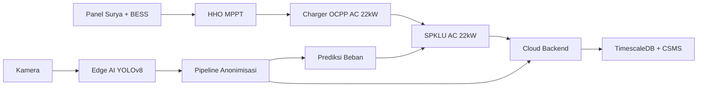
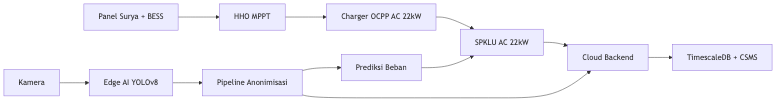
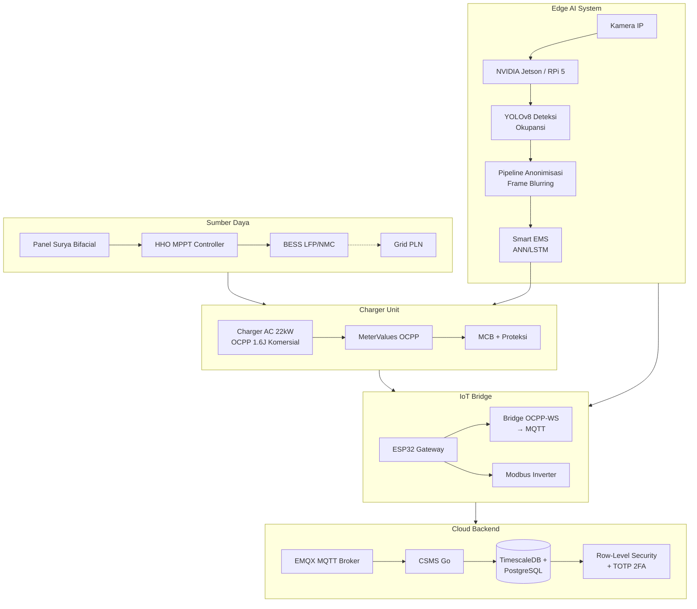
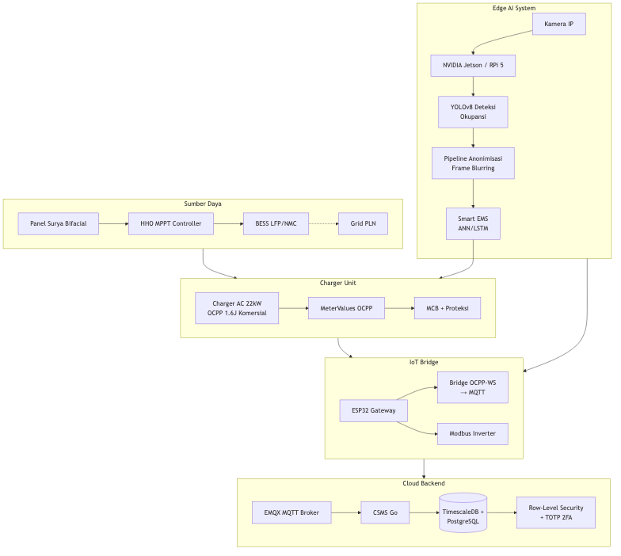
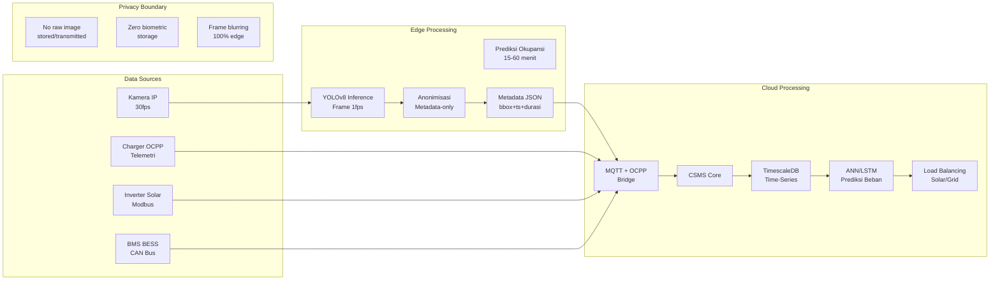
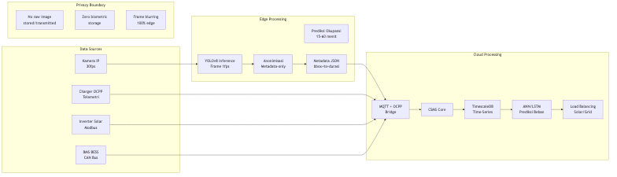
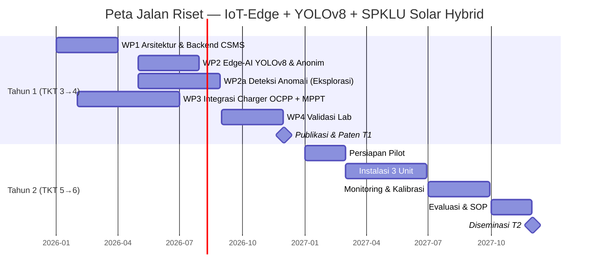
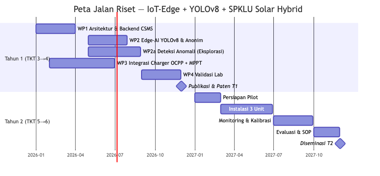
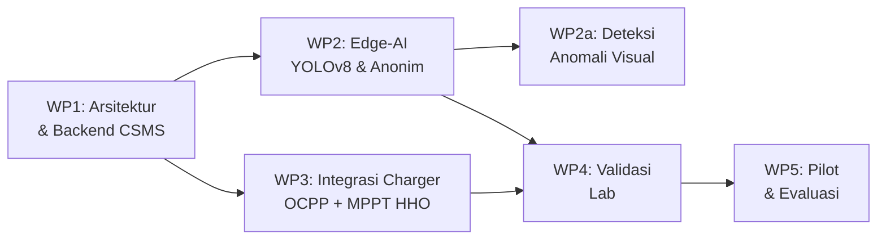
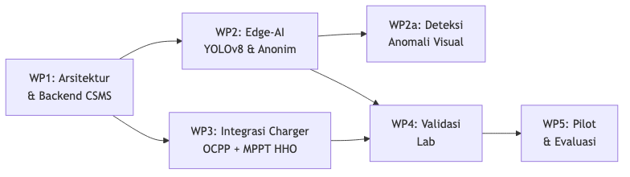

# PROPOSAL PENDANAAN PROGRAM RISET INOVASI STRATEGIS (PRIS)

**Tema:** Elektronika dan Informatika / Energi

**Judul:**
Pengembangan Sistem IoT-Edge Terintegrasi untuk SPKLU AC 22kW Berbasis Solar Hybrid dan Prediksi Beban Cerdas Menggunakan YOLOv8 dengan Pipeline Anonimisasi: Integrasi HHO MPPT dan Charger OCPP Komersial untuk Mendukung Ekosistem EV Rendah Karbon di Indonesia

**Ketua Periset:**
Prof. Dr. Subiyanto, ST, MT

**Anggota Periset:**
1. Bagaskoro Saputro, S.Kom., M.Kom.
2. Mario Norman Syah, S.T., M.T.
3. Adhe Lingga Dewi, S.Si., M.Si.
4. Abdurrakhman Hamid Al-Azhari
5. Yashella Tirana, S.Kom.
6. Dr. Turnad Lenggo Ginta

**Institusi Pengusul:**
Universitas Negeri Semarang (UNNES)

**Tahun:**
2026

---

## HALAMAN PENGESAHAN

### LEMBAR PENGESAHAN
**PROPOSAL PENDANAAN PROGRAM RISET INOVASI STRATEGIS (PRIS)**

**Tema:** Elektronika dan Informatika / Energi

**Judul Proposal:**
Pengembangan Sistem IoT-Edge Terintegrasi untuk SPKLU AC 22kW Berbasis Solar Hybrid dan Prediksi Beban Cerdas Menggunakan YOLOv8 dengan Pipeline Anonimisasi: Integrasi HHO MPPT dan Charger OCPP Komersial untuk Mendukung Ekosistem EV Rendah Karbon di Indonesia

**Ketua Periset:**
| Item | Detail |
|------|--------|
| Nama Lengkap | Prof. Dr. Subiyanto, ST, MT |
| Institusi | Universitas Negeri Semarang (UNNES) |
| Unit Kerja | Fakultas Teknik, Program Studi Teknik Elektro |
| Alamat Kantor | Jl. Sekaran, Gunungpati, Semarang 50229 |
| No. Telepon | [No. Telepon] |
| No. HP/WA | [No. HP/WA] |
| Email | subiyanto@mail.unnes.ac.id |

**Mitra Riset:**
| Item | Detail |
|------|--------|
| Alamat Mitra | [Alamat Mitra] |
| Peran Mitra Riset | Co-funding, penyedia lahan uji coba, pengguna akhir hasil riset |

**Anggota Periset:**
| No | Nama | Institusi | No. HP/WA | Email |
|----|------|-----------|-----------|-------|
| 1 | Bagaskoro Saputro, S.Kom., M.Kom. | BINUS University | [HP/WA] | bagaskoro.saputro@binus.ac.id |
| 2 | Mario Norman Syah, S.T., M.T. | UNNES | [HP/WA] | mario.norman@mail.unnes.ac.id |
| 3 | Adhe Lingga Dewi, S.Si., M.Si. | BINUS University | [HP/WA] | adhe.dewi@binus.ac.id |
| 4 | Abdurrakhman Hamid Al-Azhari | UNNES | [HP/WA] | abdurrakhman.hamid@mail.unnes.ac.id |
| 5 | Yashella Tirana, S.Kom. | BINUS University | [HP/WA] | yashella.tirana@binus.ac.id |
| 6 | Dr. Turnad Lenggo Ginta | BRIN | [HP/WA] | turnad.lenggo.ginta@brin.go.id |

**Luaran:**
| No | Uraian | Tahun 1 | Tahun 2 |
|----|--------|---------|---------|
| 1 | Publikasi pada jurnal internasional Q3 | 1 KTI under review | 1 KTI accepted + 1 KTI under review |
| 2 | Paten sederhana | 1 draf paten terdaftar | 1 paten sederhana terdaftar |
| 3 | Prototipe | TKT 4 (fungsional di lab) | TKT 6 (terpasang & beroperasi) |

**Pendanaan:**
| No | Tahapan | Usulan Anggaran | Dana Pendamping | Total Anggaran |
|----|---------|----------------|-----------------|----------------|
| 1 | Tahun 1 | Rp [...] | Rp [...] | Rp [...] |
| 2 | Tahun 2 | Rp [...] | Rp [...] | Rp [...] |

Dengan ini menyatakan bahwa proposal yang diajukan bersifat orisinil dan belum pernah memperoleh pendanaan dari lembaga/sumber dana lain, serta tidak mengandung plagiasi.

| Menyetujui, Kepala Unit Kerja / Pimpinan Institusi Pengusul, | Tempat, dd-mm-yy Ketua Periset, |
|--------------------------------------------------------------|----------------------------------|
| <br><br><br>(______________________) | <br><br><br>**Prof. Dr. Subiyanto, ST, MT**<br>NIP 132309137 |

---

## DAFTAR ISI

| No | Bagian | Halaman |
|----|--------|---------|
| 1 | HALAMAN MUKA | 1 |
| 2 | HALAMAN PENGESAHAN | 1-2 |
| 3 | DAFTAR ISI | 3 |
| 4 | ABSTRAK | 4 |
| 5 | PENDAHULUAN | 5-9 |
| | 5.1 Latar Belakang | 5 |
| | 5.2 Rumusan Masalah | 6 |
| | 5.3 Tujuan Penelitian | 7 |
| | 5.4 Kontribusi terhadap Program Riset Inovasi Strategis | 7 |
| | 5.5 Relevansi dengan Prioritas Nasional dan/atau Kebutuhan User | 8 |
| | 5.6 Posisi dalam Rantai Nilai Inovasi | 8 |
| 6 | KAJIAN TEORI DAN KERANGKA KONSEPTUAL | 9-12 |
| 7 | METODOLOGI | 13-14 |
| 8 | LUARAN DAN INDIKATOR KINERJA | 15 |
| 9 | RENCANA KERJA KEGIATAN | 16-17 |
| 10 | ANALISIS RISIKO KEGIATAN RISET | 18 |
| 11 | DAMPAK DAN MANFAAT | 19 |
| 12 | SARANA RISET | 20 |
| 13 | RINCIAN ANGGARAN BIAYA | 21-22 |
| 14 | KOMPETENSI TIM PERISET | 23 |
| 15 | DAFTAR RIWAYAT HIDUP TIM PERISET | 24-28 |
| 16 | REFERENSI | 29-30 |
| 17 | LAMPIRAN | 31 |

---

## ABSTRAK

Penelitian ini mengembangkan prototipe sistem manajemen SPKLU AC 22kW berbasis arsitektur IoT-Edge terintegrasi untuk lokasi parkir publik dwell-time tinggi (kampus, kantor, mall, hotel), dengan integrasi solar hybrid dan HHO MPPT. Permasalahan strategis yang diangkat adalah ketergantungan grid PLN, fragmentasi vendor, ketiadaan prediksi okupansi yang patuh privasi, serta belum adanya integrasi charger OCPP komersial dengan edge-AI untuk prediksi beban. Solusi mencakup: (1) CSMS terbuka dengan bridge OCPP 1.6J dan Modbus ke MQTT, (2) Edge-AI YOLOv8 untuk deteksi okupansi dengan anonimisasi real-time (frame blurring + metadata-only, kepatuhan UU PDP), (3) integrasi solar hybrid dengan MPPT HHO (99.53% efisiensi) dan charger OCPP AC 22kW komersial, (4) smart EMS tiga-level dengan prediksi ANN/LSTM 15-60 menit, dan (5) pipeline AI diproses 100% di edge device tanpa mengirim data biometrik ke cloud. Penelitian diperkuat oleh track record tim: fast charger E2W (Subiyanto et al., 2026), bifacial PV (Widiyawati et al., 2026), HHO MPPT (Aprilianto et al., 2025), IoT multi-sensor ESP32 (Dewi et al., 2024), kalibrasi sensor (Dewi et al., 2025), dan kebijakan low-carbon (Farabi, Ginta et al., 2025). Target: TKT 3→6, 3 unit pilot, 2 KTI Q3, 1 paten, dataset publik. Riset ini merupakan bagian dari Program Riset Inovasi Strategis yang mendorong kemandirian energi dan akselerasi elektrifikasi kendaraan di Indonesia melalui inovasi sistem pengisian daya yang terjangkau, interoperabel, dan ramah grid.

**Kata Kunci:** SPKLU, AC 22kW, OCPP 1.6J, MQTT, YOLOv8, Edge AI, Solar Hybrid, HHO MPPT, ANN, UU PDP, TKT 3-6

---

## PENDAHULUAN

### 5.1 Latar Belakang

Indonesia menargetkan 2 juta mobil listrik dan 13 juta motor listrik pada 2030 (Perpres 55/2019, PP 28/2025). Namun, 73% SPKLU dikuasai PLN dengan fokus DC fast charging yang mahal. Charger AC 22kW menawarkan CAPEX terjangkau dan cocok untuk pola parkir 3-4 jam. Tiga hambatan utama: (1) ketergantungan penuh pada grid, (2) ekosistem vendor tertutup (vendor lock-in), (3) ketiadaan prediksi okupansi yang patuh privasi.

Berdasarkan data Kementerian ESDM, rasio SPKLU terhadap jumlah EV di Indonesia masih jauh di bawah standar ideal, dengan sebaran yang sangat timpang di Pulau Jawa. Sementara itu, Peraturan Pemerintah No. 28 Tahun 2025 tentang Percepatan Pengembangan dan Pemanfaatan KBLBB secara eksplisit mendorong integrasi energi terbarukan pada infrastruktur pengisian daya. PP 28/2025 Pasal 15 mengamanatkan bahwa setiap penyelenggara SPKLU wajib mengupayakan penggunaan energi baru dan terbarukan. Kebutuhan pasar juga menunjukkan tren peningkatan signifikan: proyeksi penjualan EV di Indonesia diperkirakan mencapai 600.000 unit per tahun pada 2030, menciptakan kebutuhan tambahan setidaknya 30.000 titik SPKLU.

Penelitian Ibezim et al. (2026) menunjukkan konfigurasi solar hybrid mencapai 30-50% reduksi kebutuhan baterai dan LCOE USD 0.08-0.15/kWh. Dari sisi kebijakan, Farabi, Ginta et al. (2025) mengkonfirmasi kontribusi pengembangan energi pada reduksi emisi Indonesia. Studi Singla et al. (2024) mendemonstrasikan kelayakan teknis-ekonomi SPKLU hybrid 4 kW dengan solar PV, dan Erdemir & Dincer (2023) mengusulkan stasiun pengisian bertenaga surya dengan penyimpanan CO2 cair. Namun, seluruh studi tersebut belum mengintegrasikan edge-AI untuk prediksi okupansi yang patuh privasi, belum menggunakan MPPT HHO (Harris Hawks Optimization) yang mencapai efisiensi 99.53%, dan belum mengadopsi charger OCPP komersial untuk mempercepat hilirisasi.

Dari aspek perlindungan data, Undang-Undang No. 27 Tahun 2022 tentang Perlindungan Data Pribadi (UU PDP) memberikan kerangka hukum ketat terhadap pengolahan data biometrik dan visual di ruang publik. Pasal 15 UU PDP mengkategorikan data biometrik sebagai data pribadi yang bersifat spesifik, sehingga pemrosesannya memerlukan consent eksplisit dan perlindungan ketat. Hal ini menjadi tantangan serius bagi pengembangan sistem monitoring visual berbasis AI di area parkir publik. Riset ini mengatasi tantangan tersebut melalui pendekatan privacy-by-design, di mana seluruh pipeline AI berjalan di edge device dan tidak ada data biometrik yang dikirim atau disimpan di cloud.

Tim periset UNNES memiliki rekam jejak terdepan: Subiyanto et al. (2026) — fast charger E2W berbasis intelligent control; Widiyawati et al. (2026) — bifacial PV gain 25-30%; Aprilianto et al. (2025) — HHO MPPT 99.53%; Syah et al. (2024) — pengendali PID untuk DC-DC converter. Dari sisi IoT, Dewi et al. (2024) telah membangun sistem monitoring udara berbasis ESP32 multi-sensor dengan cloud platform, serta studi kalibrasi sensor MQ (Dewi et al., 2025) dan ANN untuk prediksi time-series (Dewi et al., 2024) — membuktikan kapabilitas dalam pengembangan IoT gateway, validasi sensor, dan model prediktif. Dari sisi sistem informasi dan machine learning, Tirana & Sfenrianto (2023) meneliti faktor kepuasan pengguna aplikasi platform digital.

### 5.2 Rumusan Masalah

Berdasarkan latar belakang di atas, rumusan masalah dalam penelitian ini adalah:

(1) Bagaimana merancang arsitektur IoT-Edge yang mengintegrasikan OCPP 1.6J, Modbus inverter, MPPT HHO, dan charger OCPP komersial dalam satu sistem solar hybrid yang interoperabel dan scalable?

(2) Bagaimana mengimplementasikan pipeline edge-AI YOLOv8 dengan anonimisasi real-time untuk prediksi okupansi 15-60 menit (MAPE <15%) tanpa mengirim data biometrik ke cloud, serta menjamin kepatuhan terhadap UU PDP No. 27/2022?

(3) Bagaimana mengintegrasikan hierarchical EMS tiga-level (PI-FLC + ANN/LSTM) dengan HHO MPPT dan smart load balancing berbasis irradiance, SoC, dan tarif TOU untuk optimasi energi end-to-end?

(4) Bagaimana merancang bridge OCPP-WS ke MQTT untuk charger AC 22kW komersial yang tidak mendukung native MQTT, dengan latensi komunikasi <200ms dan akurasi metering ±1%?

(5) Apakah prototipe sistem layak diuji pada skala pilot TKT 5-6 di 3 lokasi parkir publik dwell-time tinggi dengan utilisasi solar ≥35% dan pengurangan strain puncak grid ≥20%?

### 5.3 Tujuan Penelitian

**Tujuan Umum:**
Mengembangkan prototipe CSMS interoperabel berbasis OCPP-MQTT + Edge-AI YOLOv8 untuk charger AC 22kW hybrid off-grid yang patuh privasi, guna mendukung ekosistem EV rendah karbon di Indonesia.

**Tujuan Khusus:**
(1) Merancang dan mengimplementasikan arsitektur IoT-Edge yang mengintegrasikan OCPP 1.6J, Modbus, MPPT HHO, dan charger OCPP komersial dengan bridge protokol OCPP-WS ke MQTT.

(2) Mengembangkan dan memvalidasi pipeline edge-AI YOLOv8 dengan anonimisasi real-time (frame blurring + metadata-only) yang menjamin zero biometric storage dan kepatuhan terhadap UU PDP No. 27/2022.

(3) Mengintegrasikan hierarchical EMS tiga-level (PI-FLC + ANN/LSTM) dengan MPPT HHO dan smart load balancing berbasis irradiance, SoC baterai, dan tarif TOU.

(4) Memvalidasi performa sistem di laboratorium (TKT 4) dan lapangan (TKT 6) melalui uji akurasi metering, stabilitas koneksi, efisiensi energi, dan audit kepatuhan privasi.

(5) Menyusun SOP instalasi, API terbuka, dan blueprint operasional untuk mendukung hilirisasi dan replikasi di lokasi parkir publik Indonesia.

**Sasaran:** TKT 3→6 dalam 2 tahun, 2 KTI Q3, 1 Paten terdaftar, 3 unit pilot, 1 SOP instalasi, 1 policy brief interoperabilitas dan privasi.

### 5.4 Kontribusi terhadap Program Riset Inovasi Strategis

Program Riset Inovasi Strategis (PRIS) bertujuan mendorong riset yang menghasilkan inovasi strategis untuk menjawab tantangan nasional dan memperkuat daya saing bangsa. Penelitian ini berkontribusi secara langsung terhadap PRIS melalui:

1. **Kemandirian Energi Nasional:** Mengurangi ketergantungan SPKLU pada grid PLN melalui integrasi solar hybrid dengan MPPT HHO, menurunkan beban puncak listrik nasional pada jam sibuk pengisian EV.

2. **Akselerasi Elektrifikasi Kendaraan:** Menyediakan solusi SPKLU AC 22kW dengan CAPEX yang lebih terjangkau dibandingkan DC fast charging, mempercepat adopsi EV di segmen menengah dan area suburban.

3. **Interoperabilitas dan Standarisasi:** Mengembangkan CSMS terbuka berbasis standar OCPP 1.6J yang memutus vendor lock-in dan mendorong ekosistem charging yang kompetitif dan interoperabel.

4. **Inovasi Teknologi Tepat Guna:** Mengintegrasikan edge-AI YOLOv8, MPPT HHO, dan pipeline anonimisasi dalam satu platform IoT-Edge yang siap hilirisasi dan direplikasi di ratusan lokasi parkir publik Indonesia.

5. **Pengembangan SDM Riset:** Melibatkan 7 periset dari 3 institusi (UNNES, BINUS, BRIN) dengan multidisiplin keilmuan, mendorong kolaborasi riset antara perguruan tinggi dan lembaga riset nasional.

### 5.5 Relevansi dengan Prioritas Nasional dan/atau Kebutuhan User

Penelitian ini relevan secara langsung dengan prioritas nasional yang tertuang dalam:

1. **Peraturan Presiden No. 55 Tahun 2019** tentang Percepatan Program Kendaraan Bermotor Listrik Berbasis Baterai (KBLBB) untuk Transportasi Jalan. Perpres ini menargetkan produksi 2 juta unit mobil listrik dan 13 juta motor listrik pada 2030, yang membutuhkan infrastruktur SPKLU yang masif dan merata.

2. **Peraturan Pemerintah No. 28 Tahun 2025** tentang Percepatan Pengembangan dan Pemanfaatan KBLBB, khususnya Pasal 15 yang mewajibkan penyelenggara SPKLU mengupayakan penggunaan energi baru dan terbarukan.

3. **Undang-Undang No. 27 Tahun 2022** tentang Perlindungan Data Pribadi (UU PDP), di mana penelitian ini mengimplementasikan privacy-by-design sebagai model kepatuhan terhadap regulasi data pribadi untuk sistem monitoring visual berbasis AI.

4. **Rencana Induk Riset Nasional (RIRN) 2025-2045** pada fokus riset energi baru dan terbarukan serta teknologi informasi dan komunikasi.

5. **Nationally Determined Contribution (NDC) Indonesia** — target penurunan emisi 31,89% (tanpa syarat) dan 43,2% (dengan syarat) pada 2030, di mana elektrifikasi transportasi merupakan salah satu sektor kunci.

**Kebutuhan User:**
- **Pengelola gedung/kampus/mall:** Membutuhkan solusi SPKLU yang tidak membebani kapasitas listrik gedung dan dapat diintegrasikan dengan solar panel atap.
- **PLN UID:** Membutuhkan prediksi beban SPKLU untuk manajemen grid dan program demand response.
- **Startup EV dan operator SPKLU:** Membutuhkan platform CSMS yang terbuka, terjangkau, dan tidak terikat vendor tertentu.
- **Pengguna EV:** Membutuhkan stasiun pengisian yang andal, terstandar, dan tersedia di lokasi parkir publik dengan waktu tunggu yang dapat diprediksi.

### 5.6 Posisi dalam Rantai Nilai Inovasi

Posisi riset ini dalam rantai nilai inovasi dari hulu ke hilir adalah sebagai berikut:

```
Riset Dasar (TKT 1-2) → Riset Terapan (TKT 3-4) → Pengembangan Produk (TKT 5-6) → Komersialisasi (TKT 7-9)
                              ↑
                        Posisi Riset Ini (TKT 3 → 6)
```

**Detail rantai nilai:**

1. **Hulu — Riset Material dan Komponen (TKT 1-2):** Penelitian fundamental tentang MPPT algoritma HHO, material PV bifacial, dan topologi konverter DC-DC. Dilakukan oleh tim melalui publikasi Aprilianto et al. (2025), Widiyawati et al. (2026), dan Syah et al. (2024).

2. **Hilir Hulu — Riset Terapan Arsitektur Sistem (TKT 3-4):** **POSISI RISET INI TAHUN 1.** Pengembangan arsitektur IoT-Edge, integrasi OCPP-MQTT bridge, pipeline anonimisasi YOLOv8, dan integrasi charger OCPP komersial dengan MPPT HHO dalam satu platform.

3. **Pengembangan Prototipe Lapangan (TKT 5-6):** **POSISI RISET INI TAHUN 2.** Instalasi 3 unit pilot di lokasi parkir publik mitra, validasi operasional, monitoring real-time, dan penyusunan SOP untuk replikasi.

4. **Hilir — Komersialisasi dan Skalasi (TKT 7-9):** Setelah riset ini selesai, output berupa blueprint teknis, API terbuka, SOP instalasi, dan dataset publik akan menjadi dasar bagi: (a) startup/UMKM untuk memproduksi CSMS gateway, (b) operator SPKLU untuk mengadopsi platform, (c) pemerintah untuk menyusun regulasi interoperabilitas SPKLU berbasis OCPP.

**Nilai tambah dalam rantai inovasi:**
- **Integrasi charger OCPP komersial** menghilangkan kebutuhan riset hardware charger dari nol, mempercepat waktu hilirisasi 2-3 tahun.
- **Pipeline anonimisasi edge** membuka pasar sistem monitoring parkir yang patuh UU PDP — kebutuhan yang sangat tinggi pasca pemberlakuan UU PDP.
- **CSMS terbuka** menciptakan ekosistem layanan nilai tambah (booking, prediksi antrean, dynamic pricing) yang dapat dimonetisasi oleh operator SPKLU.

---

## KAJIAN TEORI DAN KERANGKA KONSEPTUAL

### 6.1 State of the Art

**CSMS (Charging Station Management System):**
Sistem manajemen SPKLU komersial saat ini masih didominasi oleh platform tertutup (vendor lock-in) dengan biaya lisensi tinggi dan bersifat reaktif. Standar OCPP 1.6J (Open Charge Alliance, 2022) telah menjadi standar de facto untuk komunikasi charger-Server di Eropa, namun adopsi di Indonesia masih rendah karena keterbatasan infrastruktur dan dominasi platform proprietary.

**Prediksi Okupansi Berbasis AI untuk SPKLU:**
Penggunaan kamera untuk prediksi okupansi area parkir telah diteliti secara luas, namun implementasi di ruang publik terkendala regulasi privasi. UU PDP No. 27/2022 secara spesifik mengkategorikan data biometrik (wajah, plat nomor) sebagai data pribadi spesifik yang memerlukan perlindungan ketat. Penelitian tentang computer vision untuk manajemen parkir belum ada yang mengintegrasikan pipeline anonimisasi real-time dengan kepatuhan penuh terhadap regulasi privasi.

**MPPT (Maximum Power Point Tracking):**
MPPT konvensional (P&O/INC) memiliki efisiensi <95% terutama pada kondisi partial shading. Aprilianto et al. (2025) mendemonstrasikan MPPT berbasis Harris Hawks Optimization (HHO) yang mencapai efisiensi 99.53%, jauh melampaui metode konvensional. HHO MPPT menggunakan populasi-based metaheuristic yang meniru strategi berburu harris hawk untuk menemukan global maximum power point secara adaptif.

**Solar PV Bifacial:**
Widiyawati et al. (2026) menunjukkan bahwa panel surya bifacial dengan desain ray tracing dapat mencapai rear gain 25-30% dibandingkan panel monofacial konvensional, menjadikannya pilihan optimal untuk aplikasi carport SPKLU di Indonesia dengan radiasi matahari tinggi.

**IoT dan Sensor untuk SPKLU:**
Dewi et al. (2024) membangun sistem monitoring kualitas udara berbasis ESP32 multi-sensor (MQ-2, MQ-7, MQ-8, MQ-135) dengan cloud platform, membuktikan kelayakan ESP32 sebagai gateway IoT yang andal. Dewi et al. (2025) selanjutnya mengembangkan metodologi kalibrasi sensor berbasis datasheet untuk sensor MQ-135 (CO2) dan MQ-8 (H2), yang krusial untuk akurasi metering pada SPKLU.

**ANN/LSTM untuk Prediksi Time-Series:**
Dewi et al. (2024) melakukan studi komparasi fungsi training, adaptasi learning, dan transfer function pada hidden layer ANN untuk prediksi cuaca, memberikan dasar metodologis untuk pengembangan model prediksi beban SPKLU 15-60 menit.

### 6.2 Kebaruan (Novelty)

Kebaruan penelitian ini mencakup sembilan aspek yang membedakannya dari penelitian sebelumnya:

1. **MPPT HHO** — Penerapan Harris Hawks Optimization untuk MPPT pada sistem SPKLU solar hybrid, dengan efisiensi 99.53% (Aprilianto et al., 2025), melampaui efisiensi P&O/INC konvensional (<95%).

2. **Solar PV Bifacial** — Integrasi panel surya bifacial dengan rear gain 25-30% pada struktur carport SPKLU (Widiyawati et al., 2026).

3. **Privacy-by-Design Edge Vision** — Pipeline AI YOLOv8 dengan anonimisasi real-time: frame blurring + metadata-only, zero biometric storage/transmission, kepatuhan penuh terhadap UU PDP No. 27/2022.

4. **IoT-ESP32 Multi-sensor Gateway** — Berbasis pengalaman monitoring udara IoT (Dewi et al., 2024).

5. **Sensor Calibration Methodology** — Validasi akurasi sensor untuk metering SPKLU (Dewi et al., 2025).

6. **Predictive EMS with ANN** — Prediksi beban 15-60 menit menggunakan ANN/LSTM, didukung studi komparasi fungsi ANN (Dewi et al., 2024).

7. **Bridge OCPP-WS → MQTT** — Protokol bridge untuk charger AC 22kW yang tidak mendukung native MQTT, memungkinkan interoperabilitas lintas platform.

8. **Integrasi Charger OCPP Komersial dengan Edge-AI** — Menggabungkan CSMS terbuka dan prediksi beban cerdas pada charger AC 22kW yang sudah tersertifikasi dan beredar di pasaran.

9. **Potensi Deteksi Anomali Visual** — Tim periset memiliki pengalaman dalam pengembangan model deteksi berbasis machine learning/image processing yang dapat dikembangkan untuk monitoring SPKLU.

### 6.3 Kerangka Berpikir

Masalah utama yang dihadapi SPKLU AC 22kW saat ini adalah tidak adanya prediksi beban cerdas, ketergantungan penuh pada grid, serta potensi pelanggaran privasi pada sistem monitoring visual. Kerangka berpikir riset ini menghubungkan lima komponen kunci:

1. **Solar Hybrid + HHO MPPT + Charger OCPP**: Panel surya + BESS sebagai sumber mandiri, dengan MPPT HHO untuk efisiensi energi maksimum dan charger AC 22kW OCPP komersial sebagai unit pengisian daya.

2. **IoT-Edge untuk Prediksi Beban**: YOLOv8 dijalankan pada edge device (Jetson/RPi 5) untuk mendeteksi okupansi area parkir secara real-time, digunakan sebagai input prediksi beban SPKLU dan optimasi alokasi daya.

3. **Pipeline Anonimisasi**: Seluruh data visual yang tertangkap kamera dianonimkan secara real-time (frame blurring, metadata-only) sebelum dikirim ke cloud, memastikan kepatuhan terhadap UU PDP tanpa mengorbankan fungsi prediktif.

4. **Cloud Backend & TimescaleDB**: CSMS Go sebagai server manajemen charging, EMQX untuk broker MQTT, TimescaleDB untuk data time-series, dan Redis untuk caching, dengan Row-Level Security dan TOTP 2FA.

5. **Potensi Deteksi Anomali Visual**: Tim memiliki pengalaman dalam pengembangan model deteksi berbasis machine learning/image processing yang dapat dieksplorasi untuk lapisan keamanan tambahan pada sistem monitoring SPKLU.

Keterkaitan: Kamera → Edge AI YOLOv8 → Anonimisasi → Prediksi beban → EMS → Charger OCPP + HHO → SPKLU. Seluruh alur data dari sensor hingga cloud dirancang dengan prinsip privacy-by-design dan efisiensi energi end-to-end.





### 6.4 Arsitektur Sistem





### 6.5 Alur Data





---

## METODOLOGI

### 7.1 Metode Riset

Pendekatan: **Research & Development Iteratif** dengan validasi teknis dan uji lapangan terbatas, mengacu pada standar TKT (Tingkat Kesiapan Teknologi) BRIN.

**Work Packages (WP):**

| WP | Nama | Aktivitas Utama | Output |
|----|------|----------------|--------|
| WP1 | Arsitektur & Backend CSMS | CSMS Go, EMQX WS→MQTT, PostgreSQL/TimescaleDB/Redis, RLS & TOTP 2FA | Backend CSMS fungsional |
| WP2 | Edge-AI & Anonimisasi | YOLOv8 untuk deteksi okupansi, pipeline anonymisasi real-time (frame blurring, metadata-only), optimasi TensorRT/OpenVINO pada Jetson/RPi 5 | Pipeline edge-AI dengan anonimisasi |
| WP2a | Deteksi Anomali Visual (Eksplorasi) | Studi awal potensi deteksi misleading visual pada sistem monitoring SPKLU berbasis ML/image processing | Laporan studi eksplorasi |
| WP3 | Integrasi Solar Hybrid + Charger OCPP + MPPT | PV array 4-100 kWp bifacial, BESS LFP/NMC, charger AC 22kW OCPP 1.6J komersial, MPPT HHO, hierarchical EMS tiga-level dengan ANN/LSTM untuk prediksi 15-60 menit | Sistem solar hybrid terintegrasi |
| WP4 | Validasi Lab | QoS 0/1/2, akurasi MeterValues, failover, uji beban 50 charger, audit keamanan & PDP, validasi kalibrasi sensor (metodologi Dewi et al., 2025) | Laporan validasi lab |
| WP5 | Pilot & Evaluasi | Instalasi 3 unit mitra, monitoring real-time, kalibrasi revenue-share, SOP, diseminasi | 3 unit pilot beroperasi, SOP, policy brief |

**Detail Metodologi Tahun 1:**
Fokus pada desain arsitektur, firmware gateway, integrasi charger OCPP-MPPT-YOLOv8, dan validasi lab. Data diperoleh dari simulator OCPP, energy logger, dan log inferensi edge. Analisis meliputi: compliance OCPP 1.6J, packet loss/latency, MAPE prediksi, audit privasi, efisiensi MPPT.

**Detail Metodologi Tahun 2:**
Fokus pada instalasi pilot, monitoring lapangan, kalibrasi sistem, dan diseminasi. Data diperoleh dari telemetri lapangan 3 lokasi mitra. Analisis meliputi: utilisasi solar harian, switching solar-grid, revenue-share, kepuasan pengguna.

**Teknik Pengumpulan Data:**
- Telemetri charger (OCPP 1.6J — MeterValues, StartTransaction, StopTransaction)
- Log inverter solar (Modbus — tegangan PV, arus, daya, iradiasi)
- Metadata okupansi anonim (JSON — bounding-box agregat, timestamp, durasi)
- Log inferensi edge (frame count, objek terdeteksi, latensi, suhu GPU)

**Teknik Analisis:**
- MAPE prediksi okupansi <15%
- Latensi inferensi edge <200ms
- Akurasi kWh metering ±1% (sesuai standal MID)
- Uptime sistem ≥95%
- Efisiensi sistem keseluruhan >94%
- Efisiensi MPPT >99%
- Audit privasi: verifikasi zero raw-image storage/transmission

### 7.2 Roadmap Pencapaian Luaran

**Peta Jalan 24 Bulan:**

| Periode | Target TKT | Kegiatan Inti | Luaran Utama |
|---------|------------|---------------|--------------|
| **Tahun 1 (2026)** | 3 → 4 | Desain arsitektur, CSMS Go & EMQX, YOLOv8 + anonimisasi, integrasi charger OCPP + HHO MPPT, setup TimescaleDB + RLS, uji lab (QoS, akurasi billing, efisiensi MPPT) | 1 prototipe lab, 1 draf Paten, 1 KTI under review (Q3) |
| **Tahun 2 (2027)** | 5 → 6 | Instalasi 3 unit mitra, monitoring 3 bulan, validasi switching solar-grid, kalibrasi load balancing, SOP & SDK rilis | 3 unit terpasang, 1 Paten terdaftar, 2 KTI accepted/under review, 1 SOP + policy brief |





**Ketergantungan Work Package:**





---

## LUARAN DAN INDIKATOR KINERJA

### 8.1 Target Luaran

| No | Jenis Luaran | Target Luaran Tahun I | Target Luaran Tahun II |
|----|-------------|----------------------|----------------------|
| 1 | Publikasi pada jurnal internasional (min. Q3) | 1 KTI under review (arsitektur OCPP-MQTT bridge + YOLOv8 anonim + HHO MPPT) | 1 KTI accepted (validasi pilot) + 1 KTI under review (optimasi hybrid load balancing) |
| 2 | Kekayaan Intelektual | 1 draf Paten Sederhana (metode prediksi beban berbasis okupansi edge + OCPP bridge + EMS) | 1 Paten Sederhana terdaftar di DJKI |
| 3 | Prototipe | TKT 4 (fungsional di lab — 1 unit prototipe laboratorium) | TKT 6 (terpasang & beroperasi di 3 lokasi mitra) |
| 4 | SOP dan Policy Brief | - | 1 SOP instalasi & maintenance SPKLU solar hybrid, 1 policy brief interoperabilitas & privasi |
| 5 | Dataset Publik | - | Dataset time-series metrik SPKLU (anonim) |

### 8.2 Indikator Kinerja Kegiatan

**Indikator Kinerja Kegiatan Tahun 1:**
| No | Indikator | Target |
|----|-----------|--------|
| 1 | KTI | 100% — 1 naskah jurnal Q3 under review (arsitektur OCPP-MQTT bridge + YOLOv8 anonim + HHO MPPT) |
| 2 | KI | 100% — 1 draf klaim Paten Sederhana (metode prediksi beban berbasis okupansi edge + OCPP bridge + EMS) |
| 3 | Prototipe | 100% — 1 unit prototipe lab TKT 4 fungsional |

**Indikator Kinerja Kegiatan Tahun 2:**
| No | Indikator | Target |
|----|-----------|--------|
| 1 | KTI | 100% — 1 accepted (validasi pilot) + 1 under review (optimasi hybrid load balancing) |
| 2 | KI | 100% — 1 Paten terdaftar, 1 SOP instalasi & maintenance, 1 policy brief interoperabilitas & privasi |
| 3 | Prototipe | 100% — 3 unit terpasang dan beroperasi TKT 6 |

---

## RENCANA KERJA KEGIATAN

### 9.1 Peta Jalan

Peta jalan penelitian mencakup 24 bulan (2 tahun) dengan 5 work packages utama sebagaimana diuraikan pada bagian Metodologi. Ketergantungan antar WP bersifat sekuensial dengan overlap pada WP2 (Edge-AI) dan WP3 (Integrasi) yang berjalan paralel setelah WP1 (Arsitektur) selesai.

### 9.2 Jadwal Kegiatan

**TAHUN/PERIODE 1 (2026):**
| No | Aktivitas | Deskripsi | Waktu |
|----|-----------|-----------|-------|
| 1 | Desain Arsitektur & Setup Infrastruktur | CSMS Go, EMQX, DB schema, algoritma hybrid load balancing, integrasi charger OCPP + MPPT HHO | Bulan ke-1 s.d. 3 |
| 2 | Integrasi Multi-Protokol & OCPP-MPPT | Bridge OCPP-WS & Modbus → MQTT, simulator, uji kompatibilitas charger OCPP, uji MPPT HHO | Bulan ke-4 s.d. 6 |
| 3 | Pengembangan Edge-AI & Anonimisasi | YOLOv8, pipeline metadata-only, optimasi TensorRT/OpenVINO, integrasi kamera | Bulan ke-5 s.d. 7 |
| 3a | Deteksi Anomali Visual (Eksplorasi) | Studi awal potensi deteksi misleading visual berbasis ML/image processing untuk monitoring SPKLU | Bulan ke-5 s.d. 8 |
| 4 | Smart EMS & Prediksi ANN/LSTM | Hierarchical EMS tiga-level, ANN/LSTM prediksi 15-60 menit, load balancing | Bulan ke-6 s.d. 8 |
| 5 | Validasi Lab & Kalibrasi | QoS, akurasi billing, beban 50 charger, audit PDP, validasi kalibrasi sensor | Bulan ke-9 s.d. 11 |
| 6 | Publikasi & Paten Tahun 1 | KTI, draf paten, audit internal | Bulan ke-10 s.d. 12 |

**TAHUN/PERIODE 2 (2027):**
| No | Aktivitas | Deskripsi | Waktu |
|----|-----------|-----------|-------|
| 1 | Persiapan Pilot & MoU Mitra | Koordinasi lokasi, instalasi listrik & panel surya, provisioning charger | Bulan ke-1 s.d. 2 |
| 2 | Instalasi & Pilot Lapangan | 3 unit, monitoring 3 bulan, kalibrasi billing & switching solar-grid | Bulan ke-3 s.d. 8 |
| 3 | Evaluasi, SOP & Diseminasi | Analisis utilisasi, SOP, SDK, policy brief, publikasi jurnal | Bulan ke-9 s.d. 12 |

---

## ANALISIS RISIKO KEGIATAN RISET

| No | Target Luaran | Identifikasi Risiko | Jenis Risiko | Strategi Mitigasi | Rencana Penyesuaian |
|----|--------------|---------------------|-------------|-------------------|---------------------|
| 1 | Prototipe TKT 4 (Tahun 1) | Keterlambatan pengiriman komponen charger OCPP komersial | Teknis/Logistik | Memesan charger 3 bulan lebih awal, memiliki charger cadangan dari vendor berbeda | Menggunakan simulator OCPP sebagai pengganti sementara hingga charger tiba |
| 2 | Edge-AI YOLOv8 + Anonimisasi | Performa inferensi YOLOv8 di edge device (Jetson/RPi 5) tidak mencapai latensi <200ms | Teknis | Optimasi TensorRT/OpenVINO, pruning model, quantisasi INT8 | Upgrade ke Jetson Orin atau turunkan frame rate inferensi ke 0.5fps |
| 3 | Pipeline Anonimisasi | Risiko kebocoran data biometrik akibat bug pada pipeline anonimisasi | Privasi/Compliance | Audit kode independen, penetration testing, logging akses, verifikasi zero raw-image storage | Isolasi pipeline di hardware terpisah dengan air-gap; sertifikasi ulang kepatuhan PDP |
| 4 | Integrasi MPPT HHO | Efisiensi MPPT HHO di lapangan tidak mencapai 99% karena variasi irradiance ekstrem | Teknis | Pengujian di berbagai kondisi shading di lab sebelum uji lapangan | Fallback ke algoritma P&O adaptif jika HHO tidak stabil |
| 5 | Pilot 3 lokasi | Mitra tidak siap menyediakan lokasi tepat waktu | Manajerial/Mitra | MoU ditandatangani H-6 bulan, opsi 5 lokasi cadangan | Mulai dengan 2 lokasi, lokasi ke-3 menyusul |
| 6 | Kepatuhan UU PDP | Perubahan interpretasi regulasi PDP selama masa riset | Regulasi | Melibatkan konsultan hukum PDP, mengikuti perkembangan peraturan turunan UU PDP | Arsitektur privacy-by-design memudahkan adaptasi terhadap regulasi baru |
| 7 | Publikasi Q3 | Artikel ditolak jurnal target | Akademik | Daftar 3 jurnal alternatif Q3/Q4, perbaikan berdasarkan reviewer feedback | Submit ke jurnal Q4 nasional terakreditasi |
| 8 | Keandalan sistem | Gangguan komunikasi OCPP-MQTT pada kondisi jaringan tidak stabil | Teknis/Operasional | Implementasi store-and-forward, QoS 2, buffer lokal 24 jam | Mode offline dengan prioritas solar-only jika cloud unavailable |
| 9 | Keamanan siber | Serangan siber pada CSMS atau IoT gateway | Keamanan | TOTP 2FA, Row-Level Security, audit log, enkripsi TLS, update firmware berkala | Isolasi jaringan IoT dengan VLAN, incident response plan |
| 10 | Anomali pipeline visual | False positive/false negative deteksi okupansi akibat variasi cuaca (hujan, malam) | Teknis | Dataset training mencakup berbagai kondisi cuaca dan pencahayaan, augmentasi data | Integrasi sensor ultrasonik/parkir sebagai verifikasi tambahan |

---

## DAMPAK DAN MANFAAT

Penelitian ini akan memberikan dampak strategis pada tiga tingkatan: ekonomi, lingkungan, dan sosial-teknologi.

**Dampak Ekonomi:** Riset ini menghasilkan prototipe CSMS terbuka berbasis OCPP yang memutus ketergantungan pada platform proprietary dengan biaya lisensi tinggi. Dengan estimasi biaya lisensi CSMS komersial sekitar Rp 50-100 juta per tahun per lokasi, solusi open-source yang dikembangkan dapat menurunkan biaya operasional SPKLU hingga 60-70%. Integrasi solar hybrid + HHO MPPT juga menurunkan biaya operasional listrik melalui self-consumption energi surya. Dalam jangka panjang, blueprint teknis dan SOP yang dihasilkan akan menurunkan hambatan masuk (barrier to entry) bagi UMKM dan startup untuk berpartisipasi dalam ekosistem SPKLU nasional.

**Dampak Lingkungan:** Dengan target utilisasi solar ≥35% per lokasi, setiap unit SPKLU AC 22kW yang dikembangkan berpotensi mengurangi emisi CO2 sebesar 2-3 ton CO2 per tahun (dengan asumsi 8 jam operasi/hari dan grid emission factor 0.85 kgCO2/kWh). Pada skala 1.000 unit (target nasional 2030), potensi reduksi emisi mencapai 2.000-3.000 ton CO2 per tahun. Penggunaan MPPT HHO dengan efisiensi 99.53% juga memaksimalkan pemanfaatan energi surya dibandingkan MPPT konvensional.

**Dampak Sosial-Teknologi:** Pipeline anonimisasi edge-AI yang dikembangkan menjadi model referensi nasional untuk implementasi visi komputer di ruang publik yang patuh UU PDP. Hal ini membuka peluang adopsi teknologi AI untuk manajemen parkir, keamanan, dan layanan publik lainnya tanpa mengorbankan privasi warga. Selain itu, keterbukaan API dan SOP memungkinkan replikasi di daerah-daerah dengan keterbatasan sumber daya teknis.

---

## SARANA RISET

Berikut adalah sarana dan prasarana yang tersedia di Universitas Negeri Semarang (UNNES) dan institusi mitra yang akan digunakan dalam penelitian:

| No | Nama Alat/Laboratorium | Spesifikasi/Kapasitas | Lokasi | Kepemilikan | Penggunaan |
|----|----------------------|----------------------|--------|-------------|------------|
| 1 | Laboratorium Teknik Elektro UNNES | Power analyzer, oscilloscope 4-ch 100MHz, DC power supply, function generator, solder station, multimeter | Fakultas Teknik UNNES | UNNES | Pengembangan firmware ESP32, uji prototipe, integrasi MPPT HHO |
| 2 | Laboratorium Komputer dan IoT | Workstation GPU (NVIDIA), server rack, router managed switch, access point | Fakultas Teknik UNNES | UNNES | Pengembangan edge-AI YOLOv8, simulasi CSMS, database server |
| 3 | Workshop Elektronika Daya | DC-DC converter testbed, inverter testbed, electronic load 5kW, solar simulator | Fakultas Teknik UNNES | UNNES | Uji MPPT HHO, validasi konverter, integrasi BESS |
| 4 | Laboratorium Energi Terbarukan UNNES | Panel surya 1kWp, BESS 48V 100Ah, data logger, pyranometer, weather station | Kampus UNNES Sekaran | UNNES | Validasi solar hybrid, pengujian panel bifacial |
| 5 | IoT Development Kit | ESP32 Dev Kit (5 unit), Raspberry Pi 5 (3 unit), NVIDIA Jetson Nano/Orin (2 unit) | Lab Komputer UNNES | UNNES | Pengembangan gateway IoT, edge-AI, bridge OCPP-MQTT |
| 6 | Cloud Infrastructure | Fly.io/Supabase subscription, EMQX Cloud, GitHub Actions CI/CD | Cloud | UNNES (berlangganan) | Hosting CSMS, TimescaleDB, MQTT broker |
| 7 | Ruang Server dan Jaringan | Server rack 42U, UPS 3kVA, fiber optic 1 Gbps, VLAN segmentation | Gedung E9 Fakultas Teknik | UNNES | Deployment cloud backend internal |
| 8 | Laboratorium BINUS Semarang | Workstation, server virtual, jaringan 1 Gbps, akses database akademik | Kampus BINUS Semarang | BINUS University | Pengembangan CSMS Go, REST API, RLS database, TOTP 2FA |
| 9 | Fasilitas Mitra (Lahan Parkir) | Area parkir publik 200-500 m², akses listrik 3 phase 33 kVA, internet | Lokasi mitra | Mitra | Instalasi pilot 3 unit TKT 6 |

---

## RINCIAN ANGGARAN BIAYA

### Tahun 1 (2026) — TKT 3 → 4

| Komponen Biaya | Indikator Kinerja | Volume | Frekuensi | Harga Satuan (Rp) | Satuan | Jumlah | LPDP | Mitra |
|---------------|-------------------|--------|-----------|-------------------|--------|--------|------|-------|
| **A. Pengadaan Bahan** | | | | | | | | |
| A.1 Prototipe & Pengembangan | Prototipe lab TKT 4 | | | | | | | |
| 1. Panel Surya Bifacial 500Wp + Inverter Hybrid | Integrasi solar hybrid | 4 | 1 | [Harga] | unit | [Isi] | 100% | 0% |
| 2. BESS LFP 48V 100Ah + BMS | Energy storage | 2 | 1 | [Harga] | set | [Isi] | 100% | 0% |
| 3. NVIDIA Jetson / Raspberry Pi 5 + Kamera | Edge-AI YOLOv8 | 3 | 1 | [Harga] | set | [Isi] | 100% | 0% |
| 4. ESP32 Dev Kit + Sensor PZEM-004T + DHT11 | IoT gateway & metering | 5 | 1 | [Harga] | set | [Isi] | 100% | 0% |
| 5. Charger AC 22kW OCPP 1.6J Komersial | Unit charging OCPP siap pakai | 3 | 1 | [Harga] | unit | [Isi] | 100% | 0% |
| 6. Enclosure IP65 + Kabel Power + Type 2 Socket | Integrasi fisik & konektor | 3 | 1 | [Harga] | paket | [Isi] | 100% | 0% |
| **Sub Total A.1** | | | | | | | **[Isi]** | **0%** |
| A.2 Pengujian & Validasi | Laporan uji | | | | | | | |
| 1. Sewa Cloud Server (Fly.io/Supabase/EMQX) | Hosting CSMS & time-series | 12 | 1 | [Harga] | bulan | [Isi] | 100% | 0% |
| 2. Sewa Simulator OCPP & Energy Logger | Validasi protokol & metering | 6 | 1 | [Harga] | bulan | [Isi] | 100% | 0% |
| **Sub Total A.2** | | | | | | | **[Isi]** | **0%** |
| **Sub Total A** | | | | | | | **[Isi]** | **0%** |
| **B. Honor Tenaga Lapangan** | Instalasi & monitoring | 72 | 1 | 150.000 | OH | [Isi] | 100% | 0% |
| **Sub Total B** | | | | | | | **[Isi]** | **0%** |
| **C. Perjalanan Dinas** | Validasi lapangan | | | | | | | |
| 1. Transportasi & Akomodasi (Semarang – Mitra) | Uji konektivitas & instalasi | 9 | 2 | [SBM] | trip | [Isi] | 100% | 0% |
| 2. Uang Harian Perjalanan | Kegiatan lapangan | 18 | 2 | [SBM] | OH | [Isi] | 100% | 0% |
| **Sub Total C** | | | | | | | **[Isi]** | **0%** |
| **TOTAL BIAYA TAHUN 1** | | | | | | | **[Isi]** | **100%** | **0%** |

### Tahun 2 (2027) — TKT 5 → 6

| Komponen Biaya | Indikator Kinerja | Volume | Frekuensi | Harga Satuan (Rp) | Satuan | Jumlah | LPDP | Mitra |
|---------------|-------------------|--------|-----------|-------------------|--------|--------|------|-------|
| **A. Pengadaan Bahan** | | | | | | | | |
| A.1 Pilot & Implementasi | Instalasi 3 unit mitra | | | | | | | |
| 1. Charger AC 22kW OCPP 1.6J Komersial (unit tambahan) | Unit charging untuk 2 mitra baru | 2 | 1 | [Harga] | unit | [Isi] | 100% | 0% |
| 2. Panel Surya Bifacial + Inverter (lokasi mitra) | Integrasi solar di lokasi | 6 | 1 | [Harga] | unit | [Isi] | 100% | 0% |
| 3. BESS LFP 48V 100Ah (lokasi mitra) | Storage di lokasi pilot | 3 | 1 | [Harga] | set | [Isi] | 100% | 0% |
| 4. Material instalasi (kabel, MCB, panel distribusi, grounding) | Infrastruktur listrik lapangan | 3 | 1 | [Harga] | paket | [Isi] | 100% | 0% |
| **Sub Total A.1** | | | | | | | **[Isi]** | **0%** |
| A.2 Monitoring & Kalibrasi | Validasi lapangan | | | | | | | |
| 1. Sewa Cloud Server (Fly.io/Supabase/EMQX) | Hosting CSMS & time-series | 12 | 1 | [Harga] | bulan | [Isi] | 100% | 0% |
| 2. Biaya lisensi/API eksternal (weather API, tariff PLN) | Data pendukung prediksi | 12 | 1 | [Harga] | bulan | [Isi] | 100% | 0% |
| **Sub Total A.2** | | | | | | | **[Isi]** | **0%** |
| **Sub Total A** | | | | | | | **[Isi]** | **0%** |
| **B. Honor Tenaga Lapangan** | Monitoring & kalibrasi | 96 | 1 | 150.000 | OH | [Isi] | 100% | 0% |
| **Sub Total B** | | | | | | | **[Isi]** | **0%** |
| **C. Perjalanan Dinas** | Instalasi & monitoring pilot | | | | | | | |
| 1. Transportasi & Akomodasi (Semarang – Mitra) | Instalasi, monitoring, evaluasi | 15 | 2 | [SBM] | trip | [Isi] | 100% | 0% |
| 2. Uang Harian Perjalanan | Kegiatan lapangan | 30 | 2 | [SBM] | OH | [Isi] | 100% | 0% |
| **Sub Total C** | | | | | | | **[Isi]** | **0%** |
| **TOTAL BIAYA TAHUN 2** | | | | | | | **[Isi]** | **100%** | **0%** |

**Catatan:**
- Struktur RAB mengikuti ketentuan PRIS: komponen modal ≤10%, tanpa honor tim periset, tanpa APC jurnal
- Harga satuan dan jumlah diisi sesuai ketentuan SBM yang berlaku
- Dana pendamping dari mitra (co-funding) dialokasikan untuk penyediaan lahan, instalasi listrik, dan biaya operasional

---

## KOMPETENSI TIM PERISET

| No | Nama | Pendidikan | Kepakaran | Peran dalam Riset | URL Scopus |
|----|------|-----------|-----------|-------------------|------------|
| 1 | Prof. Dr. Subiyanto, ST, MT | S3 Universiti Kebangsaan Malaysia | Intelligent Systems, Power Electronics, AI | Ketua; perancang arsitektur sistem, integrasi MPPT HHO, solar hybrid, dan charger OCPP; pengawasan integrasi edge-AI dan power electronics | [Scopus] |
| 2 | Bagaskoro Saputro, S.Kom., M.Kom. | S2 Ilmu Komputer UGM | IoT, Sistem Cerdas, Signal Processing, ML, EV | Anggota; pengembangan backend CSMS Go, EMQX broker, REST API, TimescaleDB/PostgreSQL, Row-Level Security, TOTP 2FA | [Scopus] |
| 3 | Mario Norman Syah, S.T., M.T. | S2 Teknik Elektro UGM | Power Electronics, MPPT, DC-DC Converters, Microgrid | Anggota; perancangan BESS, sizing PV, integrasi MPPT HHO dan charger OCPP, uji lab power converter | [Scopus] |
| 4 | Abdurrakhman Hamid Al-Azhari | S1 Teknik Elektro UNNES | Embedded System, IC Design, Power Electronics | Anggota; implementasi firmware ESP32, kalibrasi sensor, uji coba komunikasi OCPP/MQTT | [Scopus] |
| 5 | Adhe Lingga Dewi, S.Si., M.Si. | S2 Ilmu Komputer UNDIP | IoT, Sensors, ANN, Computational Physics | Anggota; validasi sensor dan kalibrasi metode pengukuran, analisis data time-series metrik utilisasi | [Scopus] |
| 6 | Yashella Tirana, S.Kom. | S1 Bisnis Digital BINUS | Information Systems, UX, ML, Image Processing | Anggota; analisis faktor kepuasan pengguna dan evaluasi UX dashboard, kontribusi studi awal deteksi anomali visual | [Scopus] |
| 7 | Dr. Turnad Lenggo Ginta | S3 Universiti Malaya | Machine Learning, Energy Policy, Manufacturing | Anggota; advis eksternal hilirisasi dan kebijakan energi rendah karbon, analisis dampak lingkungan | 26435862600 |

---

## DAFTAR RIWAYAT HIDUP TIM PERISET

### 1. Prof. Dr. Subiyanto, ST, MT — Ketua Periset

| Item | Detail |
|------|--------|
| NIP | 132309137 |
| Institusi | Universitas Negeri Semarang (UNNES) |
| Jabatan Fungsional | Guru Besar (Professor) — terhitung 1 Desember 2020 |
| Program Studi | Teknik Elektro, Fakultas Teknik |
| Bidang Keahlian | Intelligent Systems Electrical Engineering, Power Electronics, Artificial Intelligence |
| S1 | Teknik Elektro — Universitas Diponegoro (Undip) |
| S2 | Teknik Elektro — Universitas Gadjah Mada (UGM) |
| S3 | Electrical, Electronic & Systems Engineering — Universiti Kebangsaan Malaysia (UKM) |
| SINTA ID | 257687 |
| Google Scholar | https://scholar.google.com/citations?user=TcmKHJgAAAAJ |
| Email | subiyanto@mail.unnes.ac.id |
| Publikasi Utama (2024-2026) | IBC Fast Charger (JAMRIS 2026), Microgrid AI (IEEE IES 2025), PID IBC (IEEE ICT-PEP 2024), Electric Bus Scheduling (Majalah Ilmiah Teknologi Elektro 2024) |

### 2. Bagaskoro Saputro, S.Kom., M.Kom. — Anggota Periset

| Item | Detail |
|------|--------|
| Institusi | BINUS University |
| Program Studi | Computer Science, School of Computer Science, Kampus Semarang |
| Bidang Keahlian | IoT, Sistem Cerdas, Signal Processing, Machine Learning, Electric Vehicle |
| S1 | Elektronika dan Instrumentasi — Universitas Gadjah Mada (UGM) |
| S2 | Ilmu Komputer — Universitas Gadjah Mada (UGM) |
| SINTA ID | 6869233 |
| Google Scholar | https://scholar.google.com/citations?user=wJSoTIMAAAAJ |
| Email | bagaskoro.saputro@binus.ac.id |
| Publikasi Utama (2026) | Co-author IBC Fast Charger (JAMRIS 2026, DOI: 10.14313/jamris-2026-030); Co-author Bifacial PV Modeling (JTP Lampung 2026, DOI: 10.23960/jtepl.v15i2.510-524) |

### 3. Mario Norman Syah, S.T., M.T. — Anggota Periset

| Item | Detail |
|------|--------|
| Institusi | Universitas Negeri Semarang (UNNES) |
| Program Studi | Pendidikan Teknik Elektro, Fakultas Teknik |
| Bidang Keahlian | Power Electronics, MPPT, DC-DC Converters, Microgrid, Control System, Renewable Energy |
| S1 | Pendidikan Teknik Elektro — Universitas Negeri Semarang (UNNES) |
| S2 | Teknik Elektro — Universitas Gadjah Mada (UGM) |
| SINTA ID | 6869196 |
| Google Scholar | https://scholar.google.com/citations?user=Ao9DaAkAAAAJ |
| Email | mario.norman@mail.unnes.ac.id |
| Publikasi Utama (2024-2026) | IBC Fast Charger (JAMRIS 2026), HHO MPPT (ISMEE 2025, DOI: 10.1109/ISMEE68179.2025.11473059), Microgrid Optimization (IEEE IES 2025), PID IBC (IEEE ICT-PEP 2024), Novel High Gain SEPIC (ICT-PEP 2024), Interleaved Bidirectional DC-DC Converter (ICPEA 2022), Fast MPPT Dynamic Scaling P&O (2025), Techno-economic Feasibility Study (Techné 2025) |

### 4. Abdurrakhman Hamid Al-Azhari — Anggota Periset

| Item | Detail |
|------|--------|
| Institusi | Universitas Negeri Semarang (UNNES) |
| Program Studi | Pendidikan Teknik Elektro, Fakultas Teknik |
| Bidang Keahlian | Electrical Engineering, Embedded System, IC Design, RF Design, Microelectronics, Power Electronics |
| S1 | Pendidikan Teknik Elektro — Universitas Negeri Semarang (UNNES) |
| SINTA ID | 6869198 |
| Scopus | 3 articles, H-Index 2 |
| Google Scholar | 15 articles, H-Index 3 |
| Email | abdurrakhman.hamid@mail.unnes.ac.id |
| Publikasi Utama (2024-2026) | Co-author IBC Fast Charger (JAMRIS 2026); Co-author Microgrid Karimunjawa (IEEE IES 2025); Co-author BLDC Predictive Control (ICVEE 2024) |

### 5. Adhe Lingga Dewi, S.Si., M.Si. — Anggota Periset

| Item | Detail |
|------|--------|
| Institusi | BINUS University |
| Program Studi | Computer Science, School of Computer Science, Kampus Semarang |
| Bidang Keahlian | IoT, Sensors, Artificial Neural Network, Computational Physics, Photonic |
| S1 | Fisika — Universitas Negeri Semarang (UNNES) |
| S2 | Ilmu Komputer — Universitas Diponegoro (UNDIP) |
| SINTA ID | 6838447 |
| Scopus | 12 articles, H-Index 3 |
| Google Scholar | 46 articles, H-Index 5 |
| Email | adhe.dewi@binus.ac.id |
| Publikasi Utama (2024-2026) | Smart Air Monitoring IoT ESP32 (Procedia CS 2024, DOI: 10.1016/j.procs.2024.10.308 — corresponding author); Sensor Calibration MQ-135/8 (Eng. Res. Express 2025 — first author); ANN Weather Prediction (ICIMTech 2024 — first author); Workload & Stress Monitoring IoT GSR (Procedia CS 2025); #DEBITAAPPS ML Diabetes (E3S 2026 — first author); Breast Cancer DNN (AIP 2026) |

### 6. Yashella Tirana, S.Kom. — Anggota Periset

| Item | Detail |
|------|--------|
| Institusi | BINUS University |
| Program Studi | Information Systems Management, BINUS Graduate Program |
| Bidang Keahlian | Information Systems, User Satisfaction, Chatbot Effectiveness, Machine Learning, Image Processing |
| S1 | Bisnis Digital — BINUS University |
| SINTA ID | 6998018 |
| Google Scholar | https://scholar.google.com/citations?user= |
| Email | yashella.tirana@binus.ac.id |
| Publikasi Utama (2023-2026) | Factors on Mobile App User Satisfaction (CommIT Journal 2023); Model Deteksi Misleading Visual Review (Hibah BINUS 2026) |

### 7. Ir. Turnad Lenggo Ginta, ST, MT, PhD — Anggota Periset

| Item | Detail |
|------|--------|
| Institusi | Badan Riset dan Inovasi Nasional (BRIN) |
| Unit Kerja | Research Center for Manufacturing Technology of Production Machinery |
| Bidang Keahlian | Machine Learning, Welding Technology, Precision Machining, Metal Casting, Surface Treatment, Energy Policy |
| Scopus ID | 26435862600 |
| Scopus | 77 documents, H-Index 17, Cited by 1,082 |
| Google Scholar | Cited by 1,686, H-Index 21, i10-Index 32 |
| Email | turnad.lenggo.ginta@brin.go.id |
| Publikasi Utama Relevan | Promoting a Low-carbon Indonesia (IJEEP 2025, DOI: 10.32479/ijeep.18292); PLTS Distributed Generation Lhokseumawe (2023); Optimization Briquette Performance (Eng. J. 2024); Additively Manufactured Inconel 718 (J. Mech. Eng. 2024) |

---

## REFERENSI

1. Subiyanto, S., Aprilianto, R.A., Syah, M.N., Saputro, B., et al. (2026). High-Performance Electric Two-Wheeler Fast Charger Based on Intelligent Control Algorithm. *JAMRIS*, 20(2), 175-184. https://doi.org/10.14313/jamris-2026-030

2. Widiyawati, E., Subiyanto, S., Ridloah, S., Sunarko, B., Saputro, B., et al. (2026). Ray Tracing-Based Modeling of Bifacial Photovoltaic Systems in Greenhouse Agrivoltaics. *JTP Lampung*, 15(2), 510-524. https://doi.org/10.23960/jtepl.v15i2.510-524

3. Aprilianto, R.A., Subiyanto, Syah, M.N., & Nugroho, D.B. (2025). HHO MPPT for PV-Battery Systems Under Partial Shading Conditions. *IEEE ISMEE 2025*. https://doi.org/10.1109/ISMEE68179.2025.11473059

4. Easterline, L.M., Putri, A.A.-Z.R., Atmaja, P.S., Dewi, A.L., & Prasetyo, A. (2024). Smart Air Monitoring with IoT-based MQ-2, MQ-7, MQ-8, and MQ-135 Sensors using NodeMCU ESP32. *Procedia Computer Science*, 245, 815-824. https://doi.org/10.1016/j.procs.2024.10.308

5. Dewi, A.L., Adi, C.G.S., & Prasetyo, A. (2025). Datsheet-based Calibration Study of the MQ-135 Sensors for Carbon Dioxide (CO2) and MQ-8 Sensors for Hydrogen (H2). *Engineering Research Express*. https://doi.org/10.1088/2631-8695/adbcc6

6. Dewi, A.L., Adi, C.G.S., Prasetyo, A., & Sari, R.K. (2024). Comparison of Training Function, Adaption Learning Function, and Transfer Function of Hidden Layers in Artificial Neural Network in Weather Prediction. *Proc. ICIMTech 2024*.

7. Farabi, A., Kurniadi, A.P., Salim, Z., Ginta, T.L., et al. (2025). Promoting a Low-carbon Indonesia: How Energy Consumption and Financial Development Shape its Path. *IJEEP*, 15(5), 114-126. https://doi.org/10.32479/ijeep.18292

8. Syah, M.N., Aprilianto, R.A., Suryanto, A., & Al-Azhari, A.H. (2025). Hybrid Renewable Energy Microgrid Design with AI-Based Energy Management. *IEEE IES 2025*.

9. Syah, M.N., Aprilianto, R.A., & Suryanto, A. (2024). PID Controller Enhancement of Interleaved Buck Converter for DC-DC Conversion. *IEEE ICT-PEP 2024*.

10. Aprilianto, R.A., Syah, M.N., & Suryanto, A. (2024). Novel High Gain Modified SEPIC Converter for Renewable Energy Applications. *IEEE ICT-PEP 2024*.

11. Ibezim, O., Prasad, K., & Kilby, J. (2026). Intelligent Hybrid Solar–Wind Off-Grid EV Charging Stations: A Techno-Economic Assessment. *Electronics*, 15(11), 2253. https://doi.org/10.3390/electronics15112253

12. Singla, P., Boora, S., & Singhal, P. (2024). Design and Simulation of 4 kW Solar Power-Based Hybrid EV Charging Station. *Scientific Reports*, 14, 7336. https://doi.org/10.1038/s41598-024-56833-5

13. Erdemir, D., & Dincer, I. (2023). Solar-Driven Charging Station with Liquid CO2 Storage. *Journal of Energy Storage*, 73(C), 109080. https://doi.org/10.1016/j.est.2023.109080

14. He, L., & Wu, Z. (2024). Hybrid Solar-Wind Fast Charging Station with Demand Response. *Renewable Energy*, 237(C), 121843. https://doi.org/10.1016/j.renene.2024.121843

15. Open Charge Alliance. (2022). *OCPP 1.6J specification*. https://openchargealliance.org

16. Jocher, G., et al. (2023). *Ultralytics YOLOv8*. https://github.com/ultralytics/ultralytics

17. Tirana, Y., & Sfenrianto. (2023). Factors on Mobile Application User Satisfaction in the Largest Indonesian Internet Service Provider (ISP). *CommIT Journal*, 17(2), 199-208. https://journal.binus.ac.id/index.php/commit/article/view/8518

18. Peraturan Pemerintah No. 28 Tahun 2025 tentang Percepatan Pengembangan dan Pemanfaatan KBLBB.

19. Undang-Undang No. 27 Tahun 2022 tentang Perlindungan Data Pribadi.

20. Peraturan Presiden No. 55 Tahun 2019 tentang Percepatan Program KBLBB.

---

## LAMPIRAN

### Lampiran 1: Personalia Tim Periset (Lengkap dengan Tanda Tangan)
*Lembar personalia dan pernyataan kesediaan masing-masing anggota periset.*

### Lampiran 2: Surat Kesediaan Mitra
*Surat pernyataan kesediaan mitra riset untuk menyediakan lahan uji coba dan co-funding.*

### Lampiran 3: Blueprint Arsitektur Sistem
*Diagram arsitektur teknis lengkap mencakup detail spesifikasi perangkat keras, antarmuka protokol, dan alur data end-to-end.*

### Lampiran 4: Spesifikasi Teknis Komponen
*Datasheet charger OCPP AC 22kW, panel surya bifacial 500Wp, BESS LFP 48V 100Ah, NVIDIA Jetson, ESP32, dan sensor PZEM-004T.*

### Lampiran 5: Analisis Teknis Awal
*Studi kelayakan awal: perhitungan kebutuhan PV dan BESS per lokasi, estimasi penghematan biaya listrik, dan analisis tekno-ekonomi.*

### Lampiran 6: Dokumentasi Riset Sebelumnya
*Kumpulan publikasi tim periset yang relevan: IBC Fast Charger (JAMRIS 2026), HHO MPPT (ISMEE 2025), Smart Air Monitoring (Procedia CS 2024), Sensor Calibration (Eng. Res. Express 2025).*

---

*Dokumen ini merupakan adaptasi dari proposal RIIM Kompetisi 2026 ke format PRIS, dengan reorganisasi konten sesuai sistematika Proposal Pendanaan Program Riset Inovasi Strategis. Seluruh konten teknis, data, dan referensi dipertahankan.*
