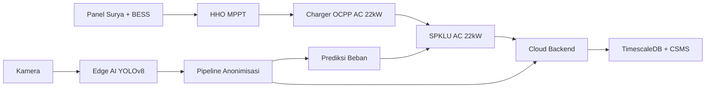

# PROPOSAL RIIM KOMPETISI 2026
**FOKUS RISET:** Elektronika dan Informatika / Energi
**JUDUL:** Pengembangan Sistem IoT-Edge Terintegrasi untuk SPKLU AC 22kW Berbasis Solar Hybrid dan Prediksi Beban Cerdas Menggunakan YOLOv8 dengan Pipeline Anonimisasi: Integrasi HHO MPPT dan Charger OCPP Komersial untuk Mendukung Ekosistem EV Rendah Karbon di Indonesia

**KETUA PERISET:** Prof. Dr. Subiyanto
**ANGGOTA PERISET:**
1. Bagaskoro Saputro, S.Kom., M.Kom. — Ilmu Komputer / IoT dan Sistem Cerdas (BINUS University)
2. Mario Norman Syah, S.T., M.T. — Teknik Elektro / Power Electronics dan Konversi Energi
3. Adhe Lingga Dewi, S.Si., M.Si. — Ilmu Komputer / IoT dan Sensor
4. Abdurrakhman Hamid Al-Azhari — Teknik Elektro / Embedded System dan Power Electronics (UNNES)
5. Yashella Tirana, S.Kom. — Information Systems / User Experience dan Sistem Informasi (BINUS University)
6. Dr. Turnad Lenggo Ginta — Teknik Mesin / Kebijakan Energi

**NAMA UNIT KERJA – INSTANSI PENGUSUL:** Universitas Negeri Semarang (UNNES)
**BADAN RISET DAN INOVASI NASIONAL**
**TAHUN 2026**

---

## HALAMAN PENGESAHAN

### LEMBAR PENGESAHAN
**PROPOSAL RISET DAN INOVASI UNTUK INDONESIA MAJU (RIIM) KOMPETISI**

**Tema** : Elektronika dan Informatika / Energi

1. **Judul Proposal** : Pengembangan Sistem IoT-Edge Terintegrasi untuk SPKLU AC 22kW Berbasis Solar Hybrid dan Prediksi Beban Cerdas Menggunakan YOLOv8 dengan Pipeline Anonimisasi: Integrasi HHO MPPT dan Charger OCPP Komersial untuk Mendukung Ekosistem EV Rendah Karbon di Indonesia

2. **Ketua Periset** :
   a. Nama Lengkap : Prof. Dr. Subiyanto, ST, MT
   b. NIP/NIK : 132309137
   c. Jabatan : Guru Besar (Professor)
   d. Institusi Periset : Universitas Negeri Semarang (UNNES)
   e. Unit Kerja Periset : Fakultas Teknik, Program Studi Teknik Elektro
   f. Alamat : Jl. Sekaran, Gunungpati, Semarang 50229
   g. No. HP/WA : [No. HP/WA]
   h. Email : subiyanto@mail.unnes.ac.id

3. **Mitra Riset** : Pengelola Kampus/Mall/PLN UID/Startup EV
   **Alamat Mitra Riset** : [Alamat Mitra]
   **Peran Mitra Riset** : Co-funding, penyedia lahan uji coba, pengguna akhir hasil riset

4. **Anggota Periset** :
   | No | Nama | Institusi | No. HP/WA | Email |
   |---|---|---|---|---|
   | 1 | Bagaskoro Saputro, S.Kom., M.Kom. | BINUS University | [HP/WA] | bagaskoro.saputro@binus.ac.id |
   | 2 | Mario Norman Syah, S.T., M.T. | UNNES | [HP/WA] | mario.norman@mail.unnes.ac.id |
   | 3 | Adhe Lingga Dewi, S.Si., M.Si. | BINUS University | [HP/WA] | adhe.dewi@binus.ac.id |
   | 4 | Abdurrakhman Hamid Al-Azhari | UNNES | [HP/WA] | abdurrakhman.hamid@mail.unnes.ac.id |
   | 5 | Yashella Tirana, S.Kom. | BINUS University | [HP/WA] | yashella.tirana@binus.ac.id |
   | 6 | Dr. Turnad Lenggo Ginta | BRIN | [HP/WA] | turnad.lenggo.ginta@brin.go.id |

5. **Keluaran** :
   | No | Uraian | Tahun 1 | Tahun 2 |
   |---|---|---|---|
   | 1 | Publikasi pada jurnal internasional Q3 | 1 KTI under review | 1 KTI accepted + 1 KTI under review |
   | 2 | Paten sederhana | 1 draf paten terdaftar | 1 paten sederhana terdaftar |
   | 3 | Prototipe | TKT 4 (fungsional di lab) | TKT 6 (terpasang & beroperasi) |

6. **Pendanaan** :
   | No | Tahapan | Usulan Anggaran | Dana Pendamping | Total Anggaran |
   |---|---|---|---|---|
   | 1 | Tahun 1 | Rp [...] | Rp [...] | Rp [...] |
   | 2 | Tahun 2 | Rp [...] | Rp [...] | Rp [...] |

Dengan ini menyatakan bahwa proposal yang diajukan bersifat orisinil dan belum pernah memperoleh pendanaan dari lembaga/sumber dana lain, serta tidak mengandung plagiasi.

**Menyetujui, Kepala Unit Kerja / Pimpinan Institusi Pengusul,** | **Tempat, dd-mm-yy Ketua Periset,**
---|---

---

## ABSTRAK
Penelitian ini mengembangkan prototipe sistem manajemen SPKLU AC 22kW berbasis arsitektur IoT-Edge terintegrasi untuk lokasi parkir publik dwell-time tinggi (kampus, kantor, mall, hotel), dengan integrasi solar hybrid dan HHO MPPT. Permasalahan strategis yang diangkat adalah ketergantungan grid PLN, fragmentasi vendor, ketiadaan prediksi okupansi yang patuh privasi, serta belum adanya integrasi charger OCPP komersial dengan edge-AI untuk prediksi beban. Solusi mencakup: (1) CSMS terbuka dengan bridge OCPP 1.6J dan Modbus ke MQTT, (2) Edge-AI YOLOv8 untuk deteksi okupansi dengan anonimisasi real-time (frame blurring + metadata-only, kepatuhan UU PDP), (3) integrasi solar hybrid dengan MPPT HHO (99.53% efisiensi) dan charger OCPP AC 22kW komersial, (4) smart EMS tiga-level dengan prediksi ANN/LSTM 15-60 menit, dan (5) pipeline AI diproses 100% di edge device tanpa mengirim data biometrik ke cloud. Penelitian diperkuat oleh track record tim: fast charger E2W (Subiyanto et al., 2026), bifacial PV (Widiyawati et al., 2026), HHO MPPT (Aprilianto et al., 2025), IoT multi-sensor ESP32 (Dewi et al., 2024), kalibrasi sensor (Dewi et al., 2025), dan kebijakan low-carbon (Farabi, Ginta et al., 2025). Target: TKT 3→6, 3 unit pilot, 2 KTI Q3, 1 paten, dataset publik.
**Kata Kunci:** SPKLU, AC 22kW, OCPP 1.6J, MQTT, YOLOv8, Edge AI, Solar Hybrid, HHO MPPT, ANN, UU PDP, TKT 3-6

---

## PENDAHULUAN

### 1. Latar Belakang
Indonesia menargetkan 2 juta mobil listrik dan 13 juta motor listrik pada 2030 (Perpres 55/2019, PP 28/2025). Namun, 73% SPKLU dikuasai PLN dengan fokus DC fast charging yang mahal. Charger AC 22kW menawarkan CAPEX terjangkau dan cocok untuk pola parkir 3-4 jam. Tiga hambatan utama: (1) ketergantungan penuh pada grid, (2) ekosistem vendor tertutup (vendor lock-in), (3) ketiadaan prediksi okupansi yang patuh privasi.

Penelitian Ibezim et al. (2026) menunjukkan konfigurasi solar hybrid mencapai 30-50% reduksi kebutuhan baterai dan LCOE USD 0.08-0.15/kWh. Dari sisi kebijakan, Farabi, Ginta et al. (2025) mengkonfirmasi kontribusi pengembangan energi pada reduksi emisi Indonesia.

Tim periset UNNES memiliki rekam jejak terdepan: Subiyanto et al. (2026) — fast charger E2W berbasis intelligent control; Widiyawati et al. (2026) — bifacial PV gain 25-30%; Aprilianto et al. (2025) — HHO MPPT 99.53%; Syah et al. (2024) — pengendali PID untuk DC-DC converter. Dari sisi IoT, Dewi et al. (2024) telah membangun sistem monitoring udara berbasis ESP32 multi-sensor dengan cloud platform, serta studi kalibrasi sensor MQ (Dewi et al., 2025) dan ANN untuk prediksi time-series (Dewi et al., 2024) — membuktikan kapabilitas dalam pengembangan IoT gateway, validasi sensor, dan model prediktif. Dari sisi sistem informasi dan machine learning, Tirana & Sfenrianto (2023) meneliti faktor kepuasan pengguna aplikasi platform digital.

### 2. Rumusan Masalah dan Hipotesis Solusi
**Rumusan Masalah:**
(1) Bagaimana merancang arsitektur IoT-Edge yang mengintegrasikan OCPP 1.6J, Modbus inverter, MPPT HHO, dan charger OCPP komersial dalam satu sistem solar hybrid?
(2) Bagaimana mengimplementasikan pipeline edge-AI YOLOv8 dengan anonimisasi real-time untuk prediksi okupansi 15-60 menit (MAPE <15%) tanpa mengirim data biometrik ke cloud, serta menjamin kepatuhan UU PDP No. 27/2022?
(3) Bagaimana mengintegrasikan hierarchical EMS tiga-level (PI-FLC + ANN/LSTM) dengan HHO MPPT dan smart load balancing berbasis irradiance, SoC, tarif TOU?
(4) Apakah prototipe sistem layak diuji pada skala pilot TKT 5-6 di 3 lokasi parkir publik dwell-time tinggi?

**Hipotesis Solusi:**
Arsitektur modular edge gateway dengan pola `OCPP/Modbus → MQTT Bridge` + YOLOv8 anonimisasi real-time akan menurunkan latensi <200ms, MAPE <15%, utilisasi solar ≥35%, dan strain puncak grid ≥20%. Integrasi charger OCPP komersial + MPPT HHO memberikan efisiensi energi sistem >94% dan MPPT >99%. Pipeline edge 100% lokal menjamin zero biometric storage.

### 3. State of the Art dan Kebaruan
CSMS komersial masih tertutup dengan biaya lisensi tinggi dan bersifat reaktif. Penggunaan kamera untuk prediksi di ruang publik terkendala regulasi privasi. MPPT konvensional (P&O/INC) <95% efisiensi.

Kebaruan penelitian:
1. **MPPT HHO** — 99.53% efisiensi (Aprilianto et al., 2025)
2. **Solar PV Bifacial** — 25-30% rear gain (Widiyawati et al., 2026)
3. **Privacy-by-Design Edge Vision** — YOLOv8 + anonimisasi real-time, metadata-only, zero biometric storage/transmission
4. **IoT-ESP32 Multi-sensor Gateway** — Berbasis pengalaman monitoring udara IoT (Dewi et al., 2024)
5. **Sensor Calibration Methodology** — Validasi akurasi sensor untuk metering SPKLU (Dewi et al., 2025)
6. **Predictive EMS with ANN** — Prediksi beban 15-60 menit menggunakan ANN/LSTM, didukung studi komparasi fungsi ANN (Dewi et al., 2024)
7. **Bridge OCPP-WS → MQTT** untuk charger AC 22kW yang tidak mendukung native MQTT
8. **Integrasi Charger OCPP Komersial dengan Edge-AI** — Menggabungkan CSMS terbuka dan prediksi beban cerdas pada charger AC 22kW yang sudah tersertifikasi dan beredar di pasaran
9. **Potensi Deteksi Anomali Visual** — Tim periset memiliki pengalaman dalam pengembangan model deteksi berbasis machine learning/image processing yang dapat dikembangkan untuk monitoring SPKLU

### 4. Tujuan dan Sasaran Riset
**Tujuan Umum:** Mengembangkan prototipe CSMS interoperabel berbasis OCPP-MQTT + Edge-AI YOLOv8 untuk charger AC 22kW hybrid off-grid yang patuh privasi.

**Tujuan Khusus:**
(1) Menguji akurasi metering, stabilitas koneksi, performa load balancing, dan keamanan data di lab & lapangan
(2) Memvalidasi pipeline AI edge terhadap akurasi prediksi, latensi inferensi, dan audit kepatuhan PDP
(3) Mengintegrasikan charger OCPP komersial, MPPT HHO, dan solar hybrid dalam satu platform IoT-Edge
(4) Menyusun SOP, API terbuka, dan blueprint operasional untuk hilirisasi

**Sasaran:** TKT 3→6 dalam 2 tahun, 2 KTI Q3, 1 Paten terdaftar, 3 unit pilot.

---

## PETA JALAN DAN NILAI STRATEGIS
| Periode | Target TKT | Kegiatan Inti | Luaran Utama |
|---------|------------|---------------|--------------|
| **Tahun 1 (2026)** | 3 → 4 | Desain arsitektur, CSMS Go & EMQX, YOLOv8 + anonimisasi, integrasi charger OCPP + HHO MPPT, setup TimescaleDB + RLS, uji lab (QoS, akurasi billing, efisiensi MPPT) | 1 prototipe lab, 1 draf Paten, 1 KTI under review (Q3) |
| **Tahun 2 (2027)** | 5 → 6 | Instalasi 3 unit mitra, monitoring 3 bulan, validasi switching solar-grid, kalibrasi load balancing, SOP & SDK rilis | 3 unit terpasang, 1 Paten terdaftar, 2 KTI accepted/under review, 1 SOP + policy brief |

**Nilai Strategis:** Riset menjawab kebutuhan SPKLU terjangkau, interoperabel, dan ramah grid. Integrasi solar hybrid + HHO MPPT menurunkan ketergantungan grid, sementara penggunaan charger OCPP komersial mempercepat adopsi tanpa perlu mengembangkan hardware charger dari nol. Edge-AI anonim membuka standar etis baru untuk IoT publik. Pipeline privacy-by-design menjadi referensi nasional kepatuhan UU PDP.

---

## KERANGKA BERPIKIR

Masalah utama yang dihadapi SPKLU AC 22kW saat ini adalah tidak adanya prediksi beban cerdas, ketergantungan penuh pada grid, serta potensi pelanggaran privasi pada sistem monitoring visual. Kerangka berpikir riset ini menghubungkan lima komponen kunci:

1. **Solar Hybrid + HHO MPPT + Charger OCPP**: Panel surya + BESS sebagai sumber mandiri, dengan MPPT HHO untuk efisiensi energi maksimum dan charger AC 22kW OCPP komersial sebagai unit pengisian daya.
2. **IoT-Edge untuk Prediksi Beban**: YOLOv8 dijalankan pada edge device (Jetson/RPi 5) untuk mendeteksi okupansi area parkir secara real-time, digunakan sebagai input prediksi beban SPKLU dan optimasi alokasi daya.
3. **Pipeline Anonimisasi**: Seluruh data visual yang tertangkap kamera dianonimkan secara real-time (frame blurring, metadata-only) sebelum dikirim ke cloud, memastikan kepatuhan terhadap UU PDP tanpa mengorbankan fungsi prediktif.
4. **Cloud Backend & TimescaleDB**: CSMS Go sebagai server manajemen charging, EMQX untuk broker MQTT, TimescaleDB untuk data time-series, dan Redis untuk caching, dengan Row-Level Security dan TOTP 2FA.
5. **Potensi Deteksi Anomali Visual**: Tim memiliki pengalaman dalam pengembangan model deteksi berbasis machine learning/image processing yang dapat dieksplorasi untuk lapisan keamanan tambahan pada sistem monitoring SPKLU.

Keterkaitan: Kamera → Edge AI YOLOv8 → Anonimisasi → Prediksi beban → EMS → Charger OCPP + HHO → SPKLU. Seluruh alur data dari sensor hingga cloud dirancang dengan prinsip privacy-by-design dan efisiensi energi end-to-end.

## METODOLOGI
Pendekatan: Research & Development Iteratif dengan validasi teknis dan uji lapangan terbatas.

**Work Packages (WP):**
- **WP1 Arsitektur & Backend:** CSMS Go, EMQX WS→MQTT, PostgreSQL/TimescaleDB/Redis, RLS & TOTP 2FA
- **WP2 Edge-AI & Anonimisasi:** YOLOv8 untuk deteksi okupansi, pipeline anonymisasi real-time (frame blurring, metadata-only), optimasi TensorRT/OpenVINO pada Jetson/RPi 5
- **WP2a Deteksi Anomali Visual (Eksplorasi):** Studi awal potensi deteksi misleading visual pada sistem monitoring SPKLU berbasis machine learning/image processing, sebagai pengembangan riset lanjutan
- **WP3 Integrasi Solar Hybrid + Charger OCPP + MPPT:** PV array 4-100 kWp bifacial, BESS LFP/NMC, charger AC 22kW OCPP 1.6J komersial, MPPT HHO, hierarchical EMS tiga-level dengan ANN/LSTM untuk prediksi 15-60 menit
- **WP4 Validasi Lab:** QoS 0/1/2, akurasi MeterValues, failover, uji beban 50 charger, audit keamanan & PDP, validasi kalibrasi sensor (metodologi Dewi et al., 2025)
- **WP5 Pilot & Evaluasi:** Instalasi 3 unit mitra, monitoring real-time, kalibrasi revenue-share, SOP, diseminasi

**Detail Metodologi Tahun 1:** Fokus desain arsitektur, firmware gateway, integrasi charger OCPP-MPPT-YOLOv8, validasi lab. Data simulator OCPP, energy logger, log inferensi edge. Analisis: compliance OCPP 1.6J, packet loss/latency, MAPE prediksi, audit privasi, efisiensi MPPT.

**Teknik Pengumpulan Data:** Telemetri charger, log inverter solar, metadata okupansi anonim, log inferensi edge.
**Teknik Analisis:** MAPE <15%, latency <200ms, akurasi kWh ±1%, uptime ≥95%, efisiensi sistem >94%, MPPT >99%, verifikasi zero raw-image storage.

---

## JANGKA WAKTU PELAKSANAAN RISET
24 bulan (2 tahun), terbagi dalam 2 periode evaluasi tahunan.

---

## LUARAN DAN INDIKATOR KINERJA
| Luaran | Status Luaran Tahun 1 | Status Luaran Tahun 2 |
|--------|----------------------|----------------------|
| Jurnal Internasional (min. Q3) | 1 KTI under review | 1 KTI accepted + 1 KTI under review |
| Kekayaan Intelektual | 1 draf Paten Sederhana (Hybrid EMS + Edge-AI + OCPP Bridge) | 1 Paten Sederhana terdaftar di DJKI |
| Prototipe | TKT 4 (fungsional di lab) | TKT 6 (terpasang & beroperasi di 3 lokasi mitra) |

**Indikator Kinerja Kegiatan Tahun 1:**
| No | Indikator | Target |
|----|-----------|--------|
| 1 | KTI | 100% — 1 naskah jurnal Q3 under review (arsitektur OCPP-MQTT bridge + YOLOv8 anonim + HHO MPPT) |
| 2 | KI | 100% — 1 draf klaim Paten Sederhana (metode prediksi beban berbasis okupansi edge + OCPP bridge + EMS) |

**Indikator Kinerja Kegiatan Tahun 2:**
| No | Indikator | Target |
|----|-----------|--------|
| 1 | KTI | 100% — 1 accepted (validasi pilot) + 1 under review (optimasi hybrid load balancing) |
| 2 | KI | 100% — 1 Paten terdaftar, 1 SOP instalasi & maintenance, 1 policy brief interoperabilitas & privasi |

---

## JADWAL KEGIATAN
**TAHUN/PERIODE 1**
| No | Aktivitas | Deskripsi | Waktu |
|----|-----------|-----------|-------|
| 1 | Desain Arsitektur & Setup Infrastruktur | CSMS Go, EMQX, DB schema, algoritma hybrid load balancing, integrasi charger OCPP + MPPT HHO | Bulan ke-1–3 |
| 2 | Integrasi Multi-Protokol & OCPP-MPPT | Bridge OCPP-WS & Modbus→MQTT, simulator, uji kompatibilitas charger OCPP, uji MPPT HHO | Bulan ke-4–6 |
| 3 | Pengembangan Edge-AI & Anonimisasi | YOLOv8, pipeline metadata-only, optimasi TensorRT/OpenVINO, integrasi kamera | Bulan ke-5–7 |
| 3a | Deteksi Anomali Visual (Eksplorasi) | Studi awal potensi deteksi misleading visual berbasis ML/image processing untuk monitoring SPKLU | Bulan ke-5–8 |
| 4 | Smart EMS & Prediksi ANN/LSTM | Hierarchical EMS tiga-level, ANN/LSTM prediksi 15-60 menit, load balancing | Bulan ke-6–8 |
| 5 | Validasi Lab & Kalibrasi | QoS, akurasi billing, beban 50 charger, audit PDP, validasi kalibrasi sensor | Bulan ke-9–11 |
| 6 | Publikasi & Paten Tahun 1 | KTI, draf paten, audit internal | Bulan ke-10–12 |

**TAHUN/PERIODE 2**
| No | Aktivitas | Deskripsi | Waktu |
|----|-----------|-----------|-------|
| 1 | Persiapan Pilot & MoU Mitra | Koordinasi lokasi, instalasi listrik & panel surya, provisioning charger | Bulan ke-1–2 |
| 2 | Instalasi & Pilot Lapangan | 3 unit, monitoring 3 bulan, kalibrasi billing & switching solar-grid | Bulan ke-3–8 |
| 3 | Evaluasi, SOP & Diseminasi | Analisis utilisasi, SOP, SDK, policy brief, publikasi jurnal | Bulan ke-9–12 |

---

## ANGGARAN
*(Struktur mengikuti Sublampiran IV RIIM. Semua komponen patuh ketentuan: ≤10% modal, tanpa honor tim, tanpa APC jurnal, fokus bahan/uji/lapangan)*

| Komponen Biaya | Indikator Kinerja | Volume | Frekuensi | Harga Satuan (Rp) | Satuan | Jumlah | LPDP | Mitra |
|---------------|-------------------|--------|-----------|-------------------|--------|--------|------|-------|
| **A. Pengadaan Bahan** | | | | | | | | |
| A.1 Prototipe & Pengembangan | Prototipe lab TKT 4 | | | | | | | |
| 1. Panel Surya Bifacial 500Wp + Inverter Hybrid | Integrasi solar hybrid | 4 | 1 | [Harga] | unit | [Isi] | 100% | 0% |
| 2. BESS LFP 48V 100Ah + BMS | Energy storage | 2 | 1 | [Harga] | set | [Isi] | 100% | 0% |
| 3. NVIDIA Jetson / Raspberry Pi 5 + Kamera | Edge-AI YOLOv8 | 3 | 1 | [Harga] | set | [Isi] | 100% | 0% |
| 4. ESP32 Dev Kit + Sensor PZEM-004T + DHT11 | IoT gateway & metering | 5 | 1 | [Harga] | set | [Isi] | 100% | 0% |
| 5. Charger AC 22kW OCPP 1.6J Komersial | Unit charging OCPP siap pakai | 3 | 1 | [Harga] | unit | [Isi] | 100% | 0% |
| 6. Enclosure IP65 + Kabel Power + Type 2 Socket | Integrasi fisik & konektor | 3 | 1 | [Harga] | paket | [Isi] | 100% | 0% |
| **Sub Total A.1** | | | | | | | **[Isi]** | **0%** |
| A.2 Pengujian & Validasi | Laporan uji | | | | | | | |
| 1. Sewa Cloud Server (Fly.io/Supabase/EMQX) | Hosting CSMS & time-series | 12 | 1 | [Harga] | bulan | [Isi] | 100% | 0% |
| 2. Sewa Simulator OCPP & Energy Logger | Validasi protokol & metering | 6 | 1 | [Harga] | bulan | [Isi] | 100% | 0% |
| **Sub Total A.2** | | | | | | | **[Isi]** | **0%** |
| **Sub Total A** | | | | | | | **[Isi]** | **0%** |
| **B. Honor Tenaga Lapangan** | Instalasi & monitoring | 72 | 1 | 150.000 | OH | [Isi] | 100% | 0% |
| **Sub Total B** | | | | | | | **[Isi]** | **0%** |
| **C. Perjalanan Dinas** | Validasi lapangan | | | | | | | |
| 1. Transportasi & Akomodasi (Semarang–Mitra) | Uji konektivitas & instalasi | 9 | 2 | [SBM] | trip | [Isi] | 100% | 0% |
| 2. Uang Harian Perjalanan | Kegiatan lapangan | 18 | 2 | [SBM] | OH | [Isi] | 100% | 0% |
| **Sub Total C** | | | | | | | **[Isi]** | **0%** |
| **TOTAL BIAYA TAHUN 1** | | | | | | **[Isi]** | **100%** | **0%** |

*(Tahun 2 mengikuti struktur serupa dengan penyesuaian volume pilot & publikasi)*

---

## DAFTAR PUSTAKA
1. Subiyanto, S., Aprilianto, R.A., Syah, M.N., Saputro, B., et al. (2026). High-Performance Electric Two-Wheeler Fast Charger Based on Intelligent Control Algorithm. *JAMRIS*, 20(2), 175-184. https://doi.org/10.14313/jamris-2026-030
2. Widiyawati, E., Subiyanto, S., Ridloah, S., Sunarko, B., Saputro, B., et al. (2026). Ray Tracing-Based Modeling of Bifacial Photovoltaic Systems in Greenhouse Agrivoltaics. *JTP Lampung*, 15(2), 510-524. https://doi.org/10.23960/jtepl.v15i2.510-524
3. Aprilianto, R.A., Subiyanto, Syah, M.N., & Nugroho, D.B. (2025). HHO MPPT for PV-Battery Systems Under Partial Shading Conditions. *IEEE ISMEE 2025*. https://doi.org/10.1109/ISMEE68179.2025.11473059
4. Easterline, L.M., Putri, A.A.-Z.R., Atmaja, P.S., Dewi, A.L., & Prasetyo, A. (2024). Smart Air Monitoring with IoT-based MQ-2, MQ-7, MQ-8, and MQ-135 Sensors using NodeMCU ESP32. *Procedia Computer Science*, 245, 815-824. https://doi.org/10.1016/j.procs.2024.10.308
5. Dewi, A.L., Adi, C.G.S., & Prasetyo, A. (2025). Datsheet-based Calibration Study of the MQ-135 Sensors for Carbon Dioxide (CO2) and MQ-8 Sensors for Hydrogen (H2). *Engineering Research Express*. https://doi.org/10.1088/2631-8695/adbcc6
6. Dewi, A.L., Adi, C.G.S., Prasetyo, A., & Sari, R.K. (2024). Comparison of Training Function, Adaption Learning Function, and Transfer Function of Hidden Layers in Artificial Neural Network in Weather Prediction. *Proc. ICIMTech 2024*.
7. Farabi, A., Kurniadi, A.P., Salim, Z., Ginta, T.L., et al. (2025). Promoting a Low-carbon Indonesia: How Energy Consumption and Financial Development Shape its Path. *IJEEP*, 15(5), 114-126. https://doi.org/10.32479/ijeep.18292
8. Syah, M.N., Aprilianto, R.A., Suryanto, A., & Al-Azhari, A.H. (2025). Hybrid Renewable Energy Microgrid Design with AI-Based Energy Management. *IEEE IES 2025*.
9. Syah, M.N., Aprilianto, R.A., & Suryanto, A. (2024). PID Controller Enhancement of Interleaved Buck Converter for DC-DC Conversion. *IEEE ICT-PEP 2024*.
10. Aprilianto, R.A., Syah, M.N., & Suryanto, A. (2024). Novel High Gain Modified SEPIC Converter for Renewable Energy Applications. *IEEE ICT-PEP 2024*.
11. Ibezim, O., Prasad, K., & Kilby, J. (2026). Intelligent Hybrid Solar–Wind Off-Grid EV Charging Stations: A Techno-Economic Assessment. *Electronics*, 15(11), 2253. https://doi.org/10.3390/electronics15112253
12. Singla, P., Boora, S., & Singhal, P. (2024). Design and Simulation of 4 kW Solar Power-Based Hybrid EV Charging Station. *Scientific Reports*, 14, 7336. https://doi.org/10.1038/s41598-024-56833-5
13. Erdemir, D., & Dincer, I. (2023). Solar-Driven Charging Station with Liquid CO2 Storage. *Journal of Energy Storage*, 73(C), 109080. https://doi.org/10.1016/j.est.2023.109080
14. He, L., & Wu, Z. (2024). Hybrid Solar-Wind Fast Charging Station with Demand Response. *Renewable Energy*, 237(C), 121843. https://doi.org/10.1016/j.renene.2024.121843
15. Open Charge Alliance. (2022). *OCPP 1.6J specification*. https://openchargealliance.org
16. Jocher, G., et al. (2023). *Ultralytics YOLOv8*. https://github.com/ultralytics/ultralytics
17. Tirana, Y., & Sfenrianto. (2023). Factors on Mobile Application User Satisfaction in the Largest Indonesian Internet Service Provider (ISP). *CommIT Journal*, 17(2), 199-208. https://journal.binus.ac.id/index.php/commit/article/view/8518
18. Peraturan Pemerintah No. 28 Tahun 2025 tentang Percepatan Pengembangan dan Pemanfaatan KBLBB.
19. Undang-Undang No. 27 Tahun 2022 tentang Perlindungan Data Pribadi.
20. Peraturan Presiden No. 55 Tahun 2019 tentang Percepatan Program KBLBB.

---

## DAFTAR RIWAYAT HIDUP (DRH) TIM PERISET

### 1. Prof. Dr. Subiyanto, ST, MT — Ketua Periset
| Item | Detail |
|------|--------|
| **NIP** | 132309137 |
| **Institusi** | Universitas Negeri Semarang (UNNES) |
| **Jabatan Fungsional** | Guru Besar (Professor) — terhitung 1 Desember 2020 |
| **Program Studi** | Teknik Elektro, Fakultas Teknik |
| **Bidang Keahlian** | Intelligent Systems Electrical Engineering, Power Electronics, Artificial Intelligence |
| **S1** | Teknik Elektro — Universitas Diponegoro (Undip) |
| **S2** | Teknik Elektro — Universitas Gadjah Mada (UGM) |
| **S3** | Electrical, Electronic & Systems Engineering — Universiti Kebangsaan Malaysia (UKM) |
| **SINTA ID** | 257687 |
| **Google Scholar** | https://scholar.google.com/citations?user=TcmKHJgAAAAJ |
| **Email** | subiyanto@mail.unnes.ac.id |
| **Publikasi Utama (2024-2026)** | IBC Fast Charger (JAMRIS 2026), Microgrid AI (IEEE IES 2025), PID IBC (IEEE ICT-PEP 2024), Electric Bus Scheduling (Majalah Ilmiah Teknologi Elektro 2024) |

### 2. Bagaskoro Saputro, S.Kom., M.Kom. — Anggota Periset
| Item | Detail |
|------|--------|
| **Institusi** | BINUS University |
| **Program Studi** | Computer Science, School of Computer Science, Kampus Semarang |
| **Bidang Keahlian** | IoT, Sistem Cerdas, Signal Processing, Machine Learning, Electric Vehicle |
| **S1** | Elektronika dan Instrumentasi — Universitas Gadjah Mada (UGM) |
| **S2** | Ilmu Komputer — Universitas Gadjah Mada (UGM) |
| **SINTA ID** | 6869233 |
| **Google Scholar** | https://scholar.google.com/citations?user=wJSoTIMAAAAJ |
| **Email** | bagaskoro.saputro@binus.ac.id |
| **Publikasi Utama (2026)** | Co-author IBC Fast Charger (JAMRIS 2026, DOI: 10.14313/jamris-2026-030); Co-author Bifacial PV Modeling (JTP Lampung 2026, DOI: 10.23960/jtepl.v15i2.510-524) |

### 3. Mario Norman Syah, S.T., M.T. — Anggota Periset
| Item | Detail |
|------|--------|
| **Institusi** | Universitas Negeri Semarang (UNNES) |
| **Program Studi** | Pendidikan Teknik Elektro, Fakultas Teknik |
| **Bidang Keahlian** | Power Electronics, MPPT, DC-DC Converters, Microgrid, Control System, Renewable Energy |
| **S1** | Pendidikan Teknik Elektro — Universitas Negeri Semarang (UNNES) |
| **S2** | Teknik Elektro — Universitas Gadjah Mada (UGM) |
| **SINTA ID** | 6869196 |
| **Google Scholar** | https://scholar.google.com/citations?user=Ao9DaAkAAAAJ |
| **Email** | mario.norman@mail.unnes.ac.id |
| **Publikasi Utama (2024-2026)** | IBC Fast Charger (JAMRIS 2026), HHO MPPT (ISMEE 2025, DOI: 10.1109/ISMEE68179.2025.11473059), Microgrid Optimization (IEEE IES 2025), PID IBC (IEEE ICT-PEP 2024), Novel High Gain SEPIC (ICT-PEP 2024), Interleaved Bidirectional DC-DC Converter (ICPEA 2022), Fast MPPT Dynamic Scaling P&O (2025), Techno-economic Feasibility Study (Techné 2025) |

### 4. Abdurrakhman Hamid Al-Azhari — Anggota Periset
| Item | Detail |
|------|--------|
| **Institusi** | Universitas Negeri Semarang (UNNES) |
| **Program Studi** | Pendidikan Teknik Elektro, Fakultas Teknik |
| **Bidang Keahlian** | Electrical Engineering, Embedded System, IC Design, RF Design, Microelectronics, Power Electronics |
| **S1** | Pendidikan Teknik Elektro — Universitas Negeri Semarang (UNNES) |
| **SINTA ID** | 6869198 |
| **Scopus** | 3 articles, H-Index 2 |
| **Google Scholar** | 15 articles, H-Index 3 |
| **Email** | abdurrakhman.hamid@mail.unnes.ac.id |
| **Publikasi Utama (2024-2026)** | Co-author IBC Fast Charger (JAMRIS 2026); Co-author Microgrid Karimunjawa (IEEE IES 2025); Co-author BLDC Predictive Control (ICVEE 2024) |

### 5. Adhe Lingga Dewi, S.Si., M.Si. — Anggota Periset
| Item | Detail |
|------|--------|
| **Institusi** | BINUS University |
| **Program Studi** | Computer Science, School of Computer Science, Kampus Semarang |
| **Bidang Keahlian** | IoT, Sensors, Artificial Neural Network, Computational Physics, Photonic |
| **S1** | Fisika — Universitas Negeri Semarang (UNNES) |
| **S2** | Ilmu Komputer — Universitas Diponegoro (UNDIP) |
| **SINTA ID** | 6838447 |
| **Scopus** | 12 articles, H-Index 3 |
| **Google Scholar** | 46 articles, H-Index 5 |
| **Email** | adhe.dewi@binus.ac.id |
| **Publikasi Utama (2024-2026)** | Smart Air Monitoring IoT ESP32 (Procedia CS 2024, DOI: 10.1016/j.procs.2024.10.308 — corresponding author); Sensor Calibration MQ-135/8 (Eng. Res. Express 2025 — first author); ANN Weather Prediction (ICIMTech 2024 — first author); Workload & Stress Monitoring IoT GSR (Procedia CS 2025); #DEBITAAPPS ML Diabetes (E3S 2026 — first author); Breast Cancer DNN (AIP 2026) |

### 6. Yashella Tirana, S.Kom. — Anggota Periset
| Item | Detail |
|------|--------|
| **Institusi** | BINUS University |
| **Program Studi** | Information Systems Management, BINUS Graduate Program |
| **Bidang Keahlian** | Information Systems, User Satisfaction, Chatbot Effectiveness, Machine Learning, Image Processing |
| **S1** | Bisnis Digital — BINUS University |
| **SINTA ID** | 6998018 |
| **Google Scholar** | https://scholar.google.com/citations?user= |
| **Email** | yashella.tirana@binus.ac.id |
| **Publikasi Utama (2023-2026)** | Factors on Mobile App User Satisfaction (CommIT Journal 2023); Model Deteksi Misleading Visual Review (Hibah BINUS 2026) |

### 7. Ir. Turnad Lenggo Ginta, ST, MT, PhD — Anggota Periset
| Item | Detail |
|------|--------|
| **Institusi** | Badan Riset dan Inovasi Nasional (BRIN) |
| **Unit Kerja** | Research Center for Manufacturing Technology of Production Machinery |
| **Bidang Keahlian** | Machine Learning, Welding Technology, Precision Machining, Metal Casting, Surface Treatment, Energy Policy |
| **Scopus ID** | 26435862600 |
| **Scopus** | 77 documents, H-Index 17, Cited by 1,082 |
| **Google Scholar** | Cited by 1,686, H-Index 21, i10-Index 32 |
| **Email** | turnad.lenggo.ginta@brin.go.id |
| **Publikasi Utama Relevan** | Promoting a Low-carbon Indonesia (IJEEP 2025, DOI: 10.32479/ijeep.18292); PLTS Distributed Generation Lhokseumawe (2023); Optimization Briquette Performance (Eng. J. 2024); Additively Manufactured Inconel 718 (J. Mech. Eng. 2024) |

---

## SUB LAMPIRAN 2 — DATA MANAGEMENT PLAN (DMP)

### 1. Metadata
| Item | Isian |
|------|-------|
| **1.1 Judul Riset** | Pengembangan Sistem IoT-Edge Terintegrasi untuk SPKLU AC 22kW Berbasis Solar Hybrid dan Prediksi Beban Cerdas Menggunakan YOLOv8 dengan Pipeline Anonimisasi: Integrasi HHO MPPT dan Charger OCPP Komersial untuk Mendukung Ekosistem EV Rendah Karbon di Indonesia |
| **1.2 Durasi Riset** | Mulai: 01-01-2026 — Akhir: 31-12-2027 |
| **1.3 Ketua Tim Riset** | nama: Prof. Dr. Subiyanto, ST, MT; afiliasi: Universitas Negeri Semarang; e-mail: subiyanto@mail.unnes.ac.id; no HP: [No. HP] |
| **1.4 Subjek Riset** | Engineering, Computer and Information Sciences |
| **1.5 Deskripsi Riset** | Riset mengembangkan prototipe SPKLU AC 22kW berbasis solar hybrid dengan prediksi beban YOLOv8, pipeline anonimisasi edge-AI, MPPT HHO, dan charger OCPP komersial untuk meningkatkan TKT 3→6 dalam 2 tahun |
| **1.6 Sumber Dana Riset** | RIIM Kompetisi — BRIN/LPDP |

### 2. Tipe Data
| Jenis Data | Deskripsi | Format File |
|------------|-----------|-------------|
| Telemetri charger | Log OCPP 1.6J (session ID, meter start/stop, kWh, timestamp) | JSON, CSV |
| Metadata okupansi anonim | Bounding-box agregat, timestamp, estimasi durasi parkir (tanpa citra mentah) | JSON |
| Log inferensi edge | Frame count, objek terdeteksi per kelas, latensi inferensi, suhu GPU | CSV |
| Log inverter solar | Data Modbus (tegangan PV, arus, daya, iradiasi) | CSV |
| Data iradiasi | Sensor irradiance harian (W/m²) | CSV |
| Log EMS | Switching solar/grid, SOC BESS, alokasi daya | JSON, CSV |
| Metrik utilisasi | Durasi charging per sesi, okupansi area, throughput harian | CSV |

### 3. Penyimpanan dan Pengamanan Data
| Item | Isian |
|------|-------|
| **3.1 Tempat penyimpanan** | Layanan cloud terenkripsi (Fly.io/Supabase Pro), backup harian; Infrastruktur repositori institusi (UNNES); Tidak ada penyimpanan citra/video mentah |
| **3.2 Waktu deposit ke RIN** | 12/2027 (maksimal 1 bulan sebelum tahun terakhir kegiatan riset) |

### 4. Pengelolaan Privasi dan Kerahasiaan Data
| Item | Isian |
|------|-------|
| **Data pribadi/sensitif?** | Ya — data visual kamera area parkir mengandung citra individu dan plat nomor kendaraan |
| **Penanganan** | Anonim — pipeline 100% di edge: frame blurring + metadata-only; zero biometric storage/transmission; plakat consent di lokasi; klirens etik riset sesuai Perka BRIN No. 22/2022 & UU PDP No. 27/2022 |

---

## SUB LAMPIRAN 4 — FORMAT PERAN TIM PERISET

| No | Nama | Peran dalam Riset | Kompetensi Pendukung | URL Scopus |
|----|------|-------------------|---------------------|------------|
| 1 | Prof. Dr. Subiyanto, ST, MT | Ketua; perancang arsitektur sistem, integrasi MPPT HHO, solar hybrid, dan charger OCPP; pengawasan integrasi edge-AI dan power electronics | Intelligent Systems Electrical Engineering, Power Electronics, AI; Guru Besar Teknik Elektro UNNES | [Scopus] |
| 2 | Bagaskoro Saputro, S.Kom., M.Kom. | Anggota; pengembangan backend CSMS Go, EMQX broker, REST API, TimescaleDB/PostgreSQL, Row-Level Security, TOTP 2FA | Embedded Systems, IoT Architecture, Backend Development, Cybersecurity; Dosen BINUS University | [Scopus] |
| 3 | Mario Norman Syah, S.T., M.T. | Anggota; perancangan BESS, sizing PV, integrasi MPPT HHO dan charger OCPP, uji lab power converter | Power Electronics, Photovoltaic Systems, Energy Storage | [Scopus] |
| 4 | Abdurrakhman Hamid Al-Azhari | Anggota; implementasi firmware ESP32, kalibrasi sensor, uji coba komunikasi OCPP/MQTT | IoT, Embedded Systems, Sensor Integration | [Scopus] |
| 5 | Adhe Lingga Dewi, S.Si., M.Si. | Anggota; validasi sensor dan kalibrasi metode pengukuran, analisis data time-series metrik utilisasi | IoT, Sensors, ANN, Computational Physics; Dosen BINUS University | [Scopus] |
| 6 | Yashella Tirana, S.Kom. | Anggota; analisis faktor kepuasan pengguna dan evaluasi UX dashboard MyPLN, kontribusi pada studi awal deteksi anomali visual berbasis ML/image processing | Information Systems, User Satisfaction, ML, Image Processing; Dosen BINUS University | [Scopus] |
| 7 | Dr. Turnad Lenggo Ginta | Anggota; advis eksternal hilirisasi dan kebijakan energi rendah karbon, analisis dampak lingkungan | Machine Learning, Welding Technology, Energy Policy; Peneliti BRIN | 26435862600 |

---

## SURAT PERNYATAAN AKTIF KEDINASAN

Yang bertanda tangan di bawah ini:

| | |
|---|----|
| Nama | Prof. Dr. Subiyanto, ST, MT |
| NIP | 132309137 |
| Jabatan | Guru Besar, Fakultas Teknik, Universitas Negeri Semarang |
| Alamat | Jl. Sekaran, Gunungpati, Semarang 50229 |
| No. HP/WA | [No. HP] |
| Email | subiyanto@mail.unnes.ac.id |

Dengan ini menyatakan bahwa saya aktif menjalankan tugas kedinasan sebagai Dosen/Peneliti di Universitas Negeri Semarang dan bersedia melaksanakan kegiatan riset yang berjudul:

**"Pengembangan Sistem IoT-Edge Terintegrasi untuk SPKLU AC 22kW Berbasis Solar Hybrid dan Prediksi Beban Cerdas Menggunakan YOLOv8 dengan Pipeline Anonimisasi: Integrasi HHO MPPT dan Charger OCPP Komersial untuk Mendukung Ekosistem EV Rendah Karbon di Indonesia"**

sesuai dengan proposal yang diajukan dalam skema RIIM Kompetisi BRIN.

Demikian surat pernyataan ini dibuat dengan sebenarnya untuk digunakan sebagaimana mestinya.

| Tempat, dd-mm-yy Yang menyatakan, |
|---|
|    **Prof. Dr. Subiyanto, ST, MT** NIP 132309137 |

*Dokumen ini merupakan integrasi dari proposal2.md (IoT-Edge SPKLU AC 22kW + YOLOv8), hybrid-solar-panel.md (technical spec off-grid solar), dan publikasi tim periset — diformat ulang mengikuti sistematika Sublampiran I Pedoman RIIM.*
